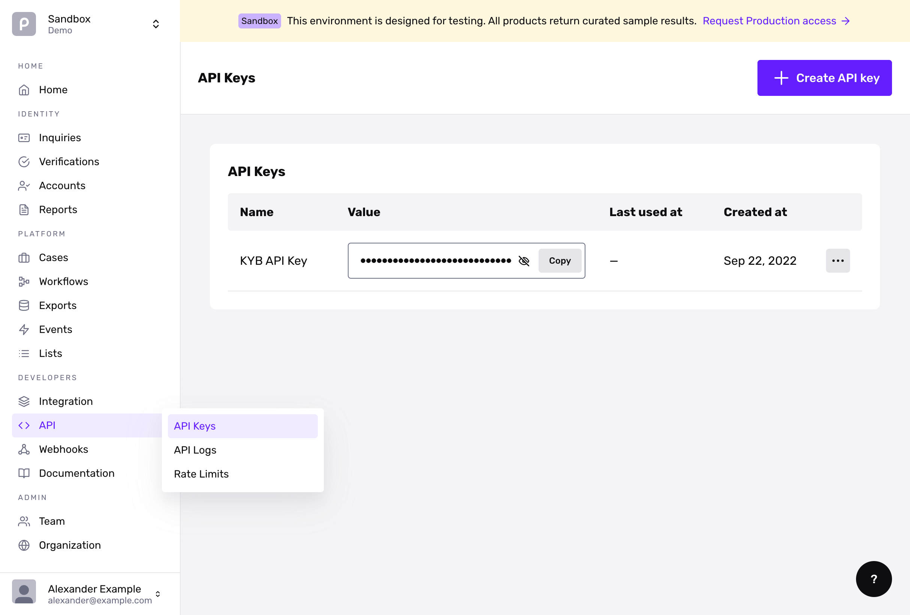

# API Keys

To access the Persona API, you’ll need an API key. Each environment has its own API key; select the API key for the specific environment you would like to use.

## Getting an API Key

### Sandbox

[Sign up](https://withpersona.com/dashboard/signup) to get immediate access to a sandbox API key and start evaluating the API with sample data.

### Production

When you’re ready to use the API in production using live data, please [contact us](https://app.withpersona.com/dashboard/contact-us).

### Already have an account?

If you already have an account in the Dashboard, you can [find your API keys in the API Keys Section](https://app.withpersona.com/dashboard/api-keys).

Your API keys carry many privileges, so be sure to keep them secure! Do not share your secret API keys in publicly accessible areas such as GitHub, client-side code, and so forth.

### Testing the API

You can test the API resources directly in this reference by providing your production or sandbox API key.

If you click on “Documentation” in the dashboard, the API examples will pre-fill with your sandbox key.

*Click on "Documentation" to pre-fill the API examples with your Sandbox key*

## Permissions

Each API key can be configured with specific permissions in order to limit read or write access to specific API resources. This list can change at any time and should not be considered to be exhaustive. You can configure permissions for your API key in the Dashboard by going to [API > API Keys > Edit > Permissions](https://app.withpersona.com/dashboard/api-keys).

| Permission | Description |
| --- | --- |
| `account.read` | Read [Accounts](./api-reference/accounts.md) |
| `account.write` | Create/Update [Accounts](./api-reference/accounts.md) |
| `api_log.read` | Read [API Logs](./api-reference/api-logs.md) |
| `api_key.write` | Create/Update [API Keys](./api-reference/api-keys.md) (Disabled by default) |
| `api_key.read` | Read [API Keys](./api-reference/api-keys.md) (Disabled by default) |
| `api_key.scim` | Use for SCIM Integrations (Disabled by default) |
| `case.read` | Read [Cases](./api-reference/cases.md) |
| `case.write` | Create/Update [Cases](./api-reference/cases.md) |
| `document.read` | Read [Documents](./api-reference/documents.md) |
| `document.write` | Create/Update [Documents](./api-reference/documents.md) |
| `event.read` | Read [Events](./api-reference/events.md) |
| `inquiry.read` | Read [Inquiries](./api-reference/inquiries.md) |
| `inquiry.write` | Create [Inquiries](./api-reference/inquiries.md) |
| `list.read` | Read [Lists](./api-reference/lists.md) |
| `list.write` | Create/Update [Lists](./api-reference/lists.md) |
| `report.read` | Read [Reports](./api-reference/reports.md) |
| `report.write` | Create/Update [Reports](./api-reference/reports.md) |
| `txn.read` | Read [Transactions](./api-reference/transactions.md) |
| `txn.write` | Create/Update [Transactions](./api-reference/transactions.md) |
| `user_audit_log.read` | Read [User Audit Logs](./api-reference/user-audit-logs.md) |
| `verification.read` | Read [Verifications](./api-reference/verifications.md) |
| `verification.write` | Create/Update [Verifications](./api-reference/verifications.md) |
| `webhook.read` | Read [Webhooks](./api-reference/webhooks.md) |
| `webhook.write` | Create/Update [Webhooks](./api-reference/webhooks.md) |
| `workflow.trigger` | Trigger [Workflows](./api-reference/workflows.md) |
