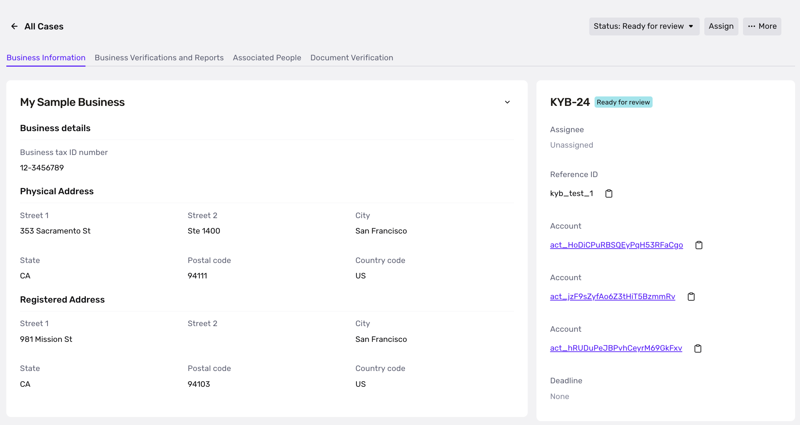
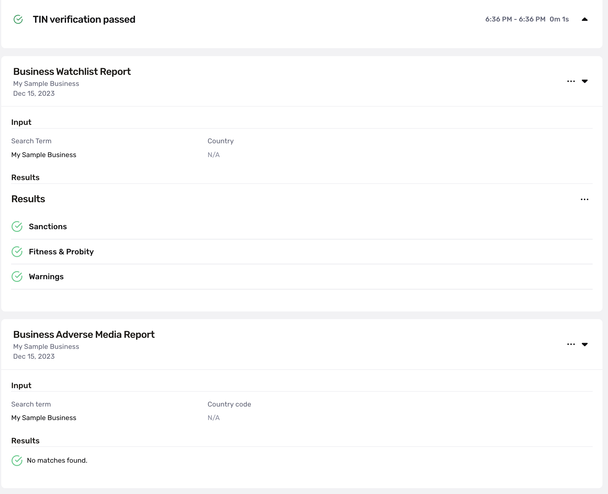
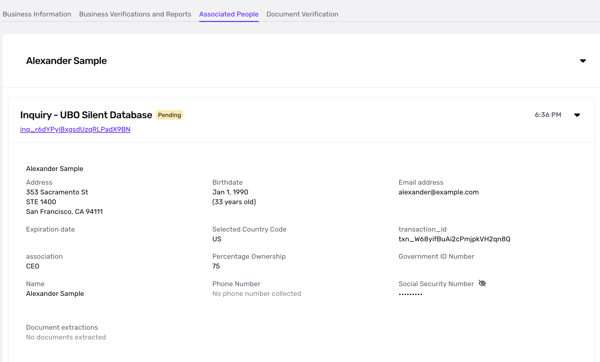
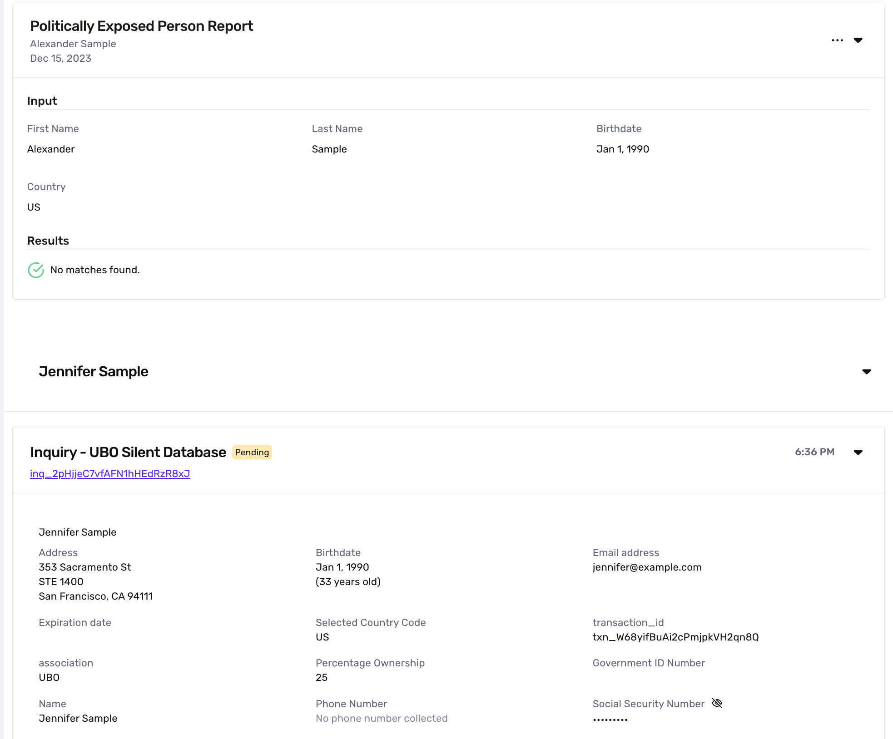

# 

Integration Guide: KYB via API

## Solution overview

-   Silently orchestrates Persona’s suite of [Know Your Business](https://withpersona.com/solutions/know-your-business) features, including running reports and verifying Business Owners
-   Can be configured to support a variety of countries and Owner verification types

## Pre-integration

-   [ ]  Make sure your organization is set up with the requisite transaction and workflows! Reach out to your Persona team for support with this.
-   [ ]  Review the intended flow with your Persona team and confirm which reports and verification checks will be run
-   [ ]  Think about if you will be incorporating manual review on the business or are looking for a fully automated interaction (Persona can accommodate for either)

## Integration steps

### 1\. Create the Transaction

-   Please ensure you’re including the `reference_id` property under the `attributes` object: this will be the value you use to identify the business in your own internal systems
-   Use your Production API key to create Production transactions, and your Sandbox API key to create Sandbox transactions

#### Transaction fields

Whether or not these fields are required will depend on your configuration of required and non-required inputs for each country.

| Field | Type | Required | Description |
| --- | --- | --- | --- |
| associated\_people | Array of Associated Person objects | false | Here’s where you’ll define the UBOs, directors, or other people associated with the business so they can undergo a KYC verification. |
| business\_name | String | true | The business’s name |
| business\_tax\_identification\_number | String | true | The business’s Tax Identification Number (e.g EIN) |
| business\_physical\_address | Address object | false | The business’s physical address |
| business\_registered\_address | Address object | true | The business’s incorporation or registered address |
| documents | Array of Files | false | Any business documents you’d like to verify |
| debug | String | false | For Sandbox verifications only: set as `passed` to pass verifications or `failed` to force-fail the verifications. By default, the verifications will pass. |

#### Associated Person object fields

Depending on your setup, you will either include all the information necessary to run a silent Database verification on every Associated Person (“DB Only”), or you will provide their name and email to the transaction and Persona will email them a link to verify themselves (“Inquiry only”).

| Field | Type | Required? | Description |
| --- | --- | --- | --- |
| account\_reference\_id | String | false | Your unique identifier for the user |
| name\_first | String | true | First Name |
| name\_last | String | true | Last name |
| name\_middle | String | false | Middle name. May be used in reports, but not in the verifications themselves |
| percentage\_ownership | Float | false | The percentage of the company the individual owns |
| association | String | false | Freeform text field to represent this individual’s association to the business |
| birthdate | Date | DB only | Birthdate, in the format of `YYYY-MM-DD` |
| address | Address object | DB only | An address object |
| tax\_identification\_number | String | DB only | Tax Identification Number (e.g SSN) |
| email\_address | String | Inquiry only | Email address |
| phone\_number | String | false | Phone number |

#### Address object fields

| Field | Type | Description |
| --- | --- | --- |
| street\_1 | String | Address street 1 |
| street\_2 | String | Address street 2 |
| city | String | Address city |
| postal\_code | String | Address postal code |
| subdivision | String | Address subdivision (state). Abides by [ISO 3166-2 standards](https://en.wikipedia.org/wiki/ISO_3166-2). |
| country\_code | String | 2-letter country code. See Persona’s list of supported countries [in your dashboard](https://app.withpersona.com/dashboard/resources/coverage-map/database). |

#### Sample cURL commands

You can use send your business data over in `application/json` or `multipart/form-data` formats. If you’re uploading any business documents, we recommend using a `multipart/form-data` style of request.

You’ll need to add in your own values for the following: `<api_token>`, `transaction_type_id`, `reference_id`, and the `email_address` fields for the associated people.

```
curl -X POST https://api.withpersona.com/api/v1/transactions \
-H "Content-Type: application/json" \
-H 'Authorization: Bearer <api-token>' \
-d '{
  "data": {
    "attributes": {
      "transaction_type_id": "<your transaction ID>",
      "reference_id": "<your internal ID to identify the business>",
      "fields": {
        "associated_people": [
          {
            "name_first": "Alexander",
            "name_last": "Sample",
            "percentage_ownership": 75,
            "email_address": "<your email>",
            "association": "CEO",
            "birthdate": "1990-01-01",
            "address": {
              "street_1": "353 Sacramento Street",
              "street_2": "STE 1400",
              "city": "San Francisco",
              "subdivision": "CA",
              "postal_code": "94111",
              "country_code": "US"
            },
            "tax_identification_number": "111111111"
          },
          {
            "name_first": "Jennifer",
            "name_last": "Sample",
            "email_address": "<your email>",
            "association": "UBO",
            "percentage_ownership": 25,
            "birthdate": "1990-02-02",
            "address": {
              "street_1": "201 Post St",
              "city": "San Francisco",
              "subdivision": "CA",
              "postal_code": "94108",
              "country_code": "US"
            },
            "tax_identification_number": "222222222"
          }
        ],
        "business_name": "My Sample Business",
        "business_tax_identification_number": "12-3456789",
        "business_physical_address": {
          "street_1": "353 Sacramento Street",
          "street_2": "STE 1400",
          "city": "San Francisco",
          "subdivision": "CA",
          "postal_code": "94111",
          "country_code": "US"
        },
        "business_registered_address": {
          "street_1": "981 Mission St",
          "street_2": "",
          "city": "San Francisco",
          "subdivision": "CA",
          "postal_code": "94103",
          "country_code": "US"
        },
        "documents": [
          {
           "filename": "proof_of_address.pdf",
           "data": "<base64 encoded string of the file>"
          }
        ]
      }
    }
  }
}'
```

### 2\. Listen for the Transaction status

We recommend listening to the `transaction.status-updated` webhook ([docs](../../../webhooks.md)) to know when to proceed with the business. You can alternatively make an API call to fetch the transaction ([docs](../../transactions/retrieve-a-transaction.md))

#### Transaction statuses

Below are the default statuses that Persona includes in a KYB Transaction. You can make your own modifications as it fits your use case. To view and edit these statuses, click “… > Custom Statuses” on your transaction type’s page

| Status name | Description |
| --- | --- |
| `created` | Transaction has been created. |
| `approved` | Transaction has been approved: you can proceed with the business. |
| `declined` | Transaction has been declined: verifications unsuccessful or business otherwise declined. |
| `needs_review` | Transaction is awaiting manual review. |
| `errored` | Transaction has errored. |

---

## KYB Case and manual review

Many KYB flows include some level of manual review. Persona streamlines manual review with our [Cases](https://withpersona.com/product/cases) product: every KYB transaction will create a case where you can view all of the business’s verifications, reports, and associated people information all in once place. You can Approve or Decline a case from there, and that decision will reflect back on the transaction via Persona’s orchestration engine (workflows).

   
