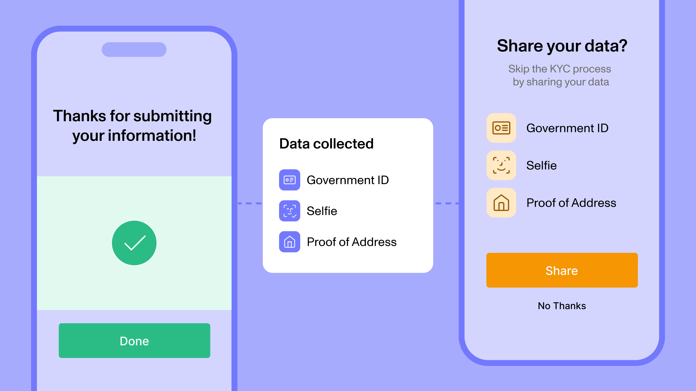

# Connect

Cross-Organization Data Sharing

##### Open Beta

Connect is in **Open Beta**. The information in this guide is subject to change during the beta period. Please reach out to your Persona account team or [connect@withpersona.com](mailto:connect@withpersona.com) to request access or additional information.

Connect streamlines the identity verification process by letting Persona organizations share end-user data with one another. Organizations can create Share Tokens, which other organizations can use to copy and verify an end user’s data.

---

## Connect Overview

Connect is Persona’s solution for cross-organization data sharing. Use Connect to grant partner organizations access to an end user’s data by creating a Share Token from their completed Inquiry. Partner organizations can redeem the Share Token to copy and verify the end user’s data. Persona will automatically complete an Inquiry with the end user’s data and verification results inside the partner organization’s Persona environment.

Share Tokens are scoped to an Inquiry and Organization, letting organizations decide exactly whose data to share and with whom. Organizations can verify shared end-user data against any Inquiry Template they pick.

---

## Why Connect?

Connect lets partner organizations reduce end-user onboarding friction by streamlining identity verification. When two or more partner organizations need to verify the same end user, they can use Connect to share the end user’s data with each other directly. This eliminates the need for the end user to provide the same data to multiple organizations redundantly.

Organizations can verify shared end user data against any Inquiry Template they choose, giving them flexibility to verify the end user’s data against their own compliance standards. Redeeming Share Tokens gives organizations full ownership and control over the end user’s data and verification results, critical for meeting compliance requirements. Organizations can use Connect via API, Workflows, or Dashboard.

### Key Benefits

User Experience

Streamline the end user’s experience by sharing their data across organizations, reducing friction and improving conversion.

Dynamic Templates

Verify the end user’s data against any Inquiry Template to meet your unique compliance requirements.

Data Ownership

Both organizations can fully own and control separate copies of the end user’s data and verification results, critical for meeting compliance requirements.

Flexible Approaches

Organizations can use Connect via API, Workflows, or Dashboard, giving them flexibility to build an integration that works for them.

---

## Key Concepts

### Source Organization

The Persona customer that shares an end user’s data with its data sharing partner.

### Destination Organization

The Persona customer that receives an end user’s data from its data sharing partner.

### Connections

Sharing data requires setting up a Connection with your partner organization. The Source Organization creates the Connection by indicating which Destination Organization they would like to share data with, and what types of data they would like to share. The Destination Organization activates the Connection, after which the Source and Destination Organizations are ready to share data.

### Share Tokens

Share Tokens allow one Persona organization to securely access another organization’s end-user data. A Source Organization can create a Share Token to share a completed Inquiry, which includes PII, photos, and documents (e.g., name, selfie, government ID). The Destination Organization redeems the Share Token to automatically copy and verify the end user’s data within its own Persona environment.

---

## Integration Options

Organizations can use Connect via API, SDK, Workflows, or Dashboard. While API and SDK integrations are most common, some customers prefer to create and redeem Share Tokens via automated Workflows. Also, customers may also create or redeem Share Tokens via the Persona Dashboard, helpful for testing and one-off data shares.

---

## End User Consent

Both the Source Organization and the Destination Organization are responsible for obtaining end-user consent before sharing data. In practice, organizations typically address this requirement in two ways:

1.  Updating their Terms of Service and/or Privacy Policy to notify users of data-sharing.
2.  Giving users a clear choice to opt in or out before any data sharing takes place.

---

## Pricing

Source Organizations pay no additional fees to create Share Tokens. Destination Organizations pay their standard unit rates when redeeming Share Tokens to re-run Verifications. If Destination Organizations redeem Share Tokens but choose to copy Verifications instead, they pay a flat rate.

---

## Product Access

If you’re interested in Connect, please reach out to your Persona account team or [connect@withpersona.com](mailto:connect@withpersona.com) to request access or additional information.

To use Connect in Production, customers must sign a one-time agreement with Persona through their Order Form. Both the Source Organization and the Destination Organization are required to sign the agreement with Persona (however, each agreement is executed separately). The agreement is role-agnostic – it applies equally whether the customer is acting as the Source or the Destination.

---

## Connect Roadmap

Interested in our roadmap? Please reach out to your Persona account team or [connect@withpersona.com](mailto:connect@withpersona.com).

Persona’s roadmap for cross-organization data sharing includes:

-   **Cloning Verifications**: We plan to support cloning Verifications from Share Tokens. Currently, we only support using Share Tokens to re-run Verifications.
-   **Prefilling Inquiries**: We plan to support prefilling Inquiries with Share Tokens. Prefilled Inquiries collect the end user’s data sharing consent explicitly, and collect only net-new data by skipping data the end user has already provided.

---

## FAQs

### How can I get access to Connect?

Connect is in **Open Beta**. Please reach out to your Persona account team or [connect@withpersona.com](mailto:connect@withpersona.com) to request access or additional information.

### Who can I share data with?

You can exchange data with any Persona customer with whom you have an `active` Connection.

### Do both organizations need to be Persona customers?

Yes, both the Source Organization and the Destination Organization must be Persona customers in order to share data with Connect.

### How does pricing work?

Source Organizations pay nothing to create Share Tokens. Destination Organizations pay their standard unit rates to re-revify shared end user data, and a flat fee to clone existing verification data. See [Pricing](./connect.md#pricing) for more information.

### How does end user consent work?

Both organizations are responsible for notifying users about data sharing practices and giving users a clear choice to opt in to or out of data sharing. See [End-User Consent](./connect.md#end-user-consent) for more information.

### What can I do with a Share Token?

Destination Organizations can use Share Tokens to copy and re-verify end user data. Alternatively, Destination Organizations can clone existing verifications if they do not want to re-run verifications. See [Redeeming Share Tokens](./redeeming-share-tokens.md) for more information.

### How can I exhange a Share Token with a partner organization?

Typically, the Source Organization sends the Share Token to the Destination Organization’s API or SDK. Organizations can also exchange Share Tokens automatically using Persona Workflows.

### How can I test my integration?

To test Connect, you can create and redeem Share Tokens using a Connection to your own Persona Organization. Alternatively, you can exchange Share Tokens with a partner Organization in Sandbox.
