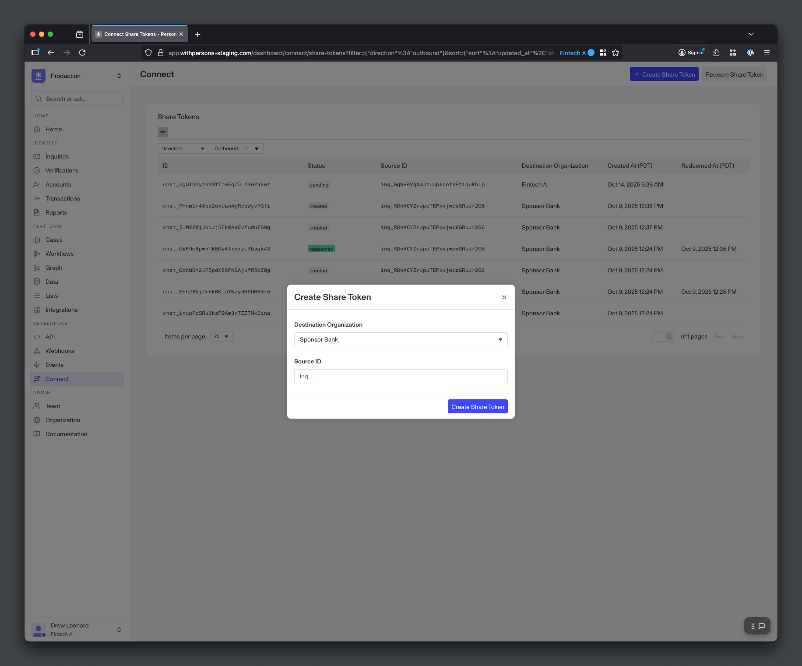

# Creating Share Tokens

Create Share Tokens for Destination Organizations

##### Open Beta

Connect is in **Open Beta**. The information in this guide is subject to change during the beta period. Please reach out to your Persona account team or [connect@withpersona.com](mailto:connect@withpersona.com) to request access or additional information.

Source Organizations can create Share Tokens to share end user data from completed Inquiries with data sharing partners (Destination Organizations). The Destination Organization can use the Share Token to copy and verify the end user’s data.

Source Organizations can create Share Tokens via API, Dashboard, or Workflows.

---

## Creating Share Tokens via API

To create a Share Token via API, the Source Organization provides the Connection ID and an Inquiry ID. The `connection-id` specifies which partner organization can access the specified `source-id`, and only that partner organization is able to redeem the created Share Token. The `source-id` must be an Inquiry ID.

```
curl -X POST https://api.withpersona.com/api/v1/connect/share-tokens \
  -H "Authorization: Bearer <token>" \
  -H "Content-Type: application/json" \
  -d '{
    "data": {
      "attributes": {
        "connection-id": "cxn_ABC123",
        "source-id": "inq_ABC123"
      }
    }
  }'
```

```
{
  "data": {
    "type": "connect/share-token",
    "id": "cnst_ABC123",
    "attributes": {
      "status": "created",
      "created-at": "2025-10-14T22:36:51.907Z",
      "updated-at": "2025-10-14T22:36:51.907Z",
      "pending-at": null,
      "redeemed-at": null,
      "expires-at": null
    },
    "relationships": {
      "connect-connection": {
        "data": {
          "type": "connect/connection",
          "id": "cxn_ABC123"
        }
      },
      "creator": {
        "data": { "type": "api-key", "id": "api_ABC123" }
      },
      "source": {
        "data": { "type": "inquiry", "id": "inq_ABC123" }
      }
    }
  }
}
```

---

## Creating Share Tokens via Dashboard

Source Organizations can also create Share Tokens using their Dashboard under the Connect > Share Tokens page. This can be helpful for testing and one-off data shares. Creating the Share Token requires selecting a Connection and providing an Inquiry ID. Only the specified Destination Organization will be able to redeem the Share Token, and the Source ID must be an Inquiry ID.


*Create a Share Token*

---

## Creating Share Tokens via Workflows

Source Organizations can use [Workflows](./workflows.md) to automate Share Token creation. For example, the Source Organization can use a Workflow to automatically create a Share Token upon Inquiry completion. Similarly, the Destination Organization can use a Workflow to automatically redeem the created Share Token. This can be helpful for integrating into Connect with minimal developement work.

If you’re interested in using Workflows to automate Share Token creation, please reach out to your Persona account team or [connect@withpersona.com](mailto:connect@withpersona.com) for additional information.

---

## Exchanging Share Tokens

After creating a Share Token, the Source Organization can send it to the Destination Organization using the Destination Organization’s API or SDK, or another secure channel. Alternatively, the Destination Organization can use a Workflow to automatically get notified about and redeem Share Tokens when they are created.
