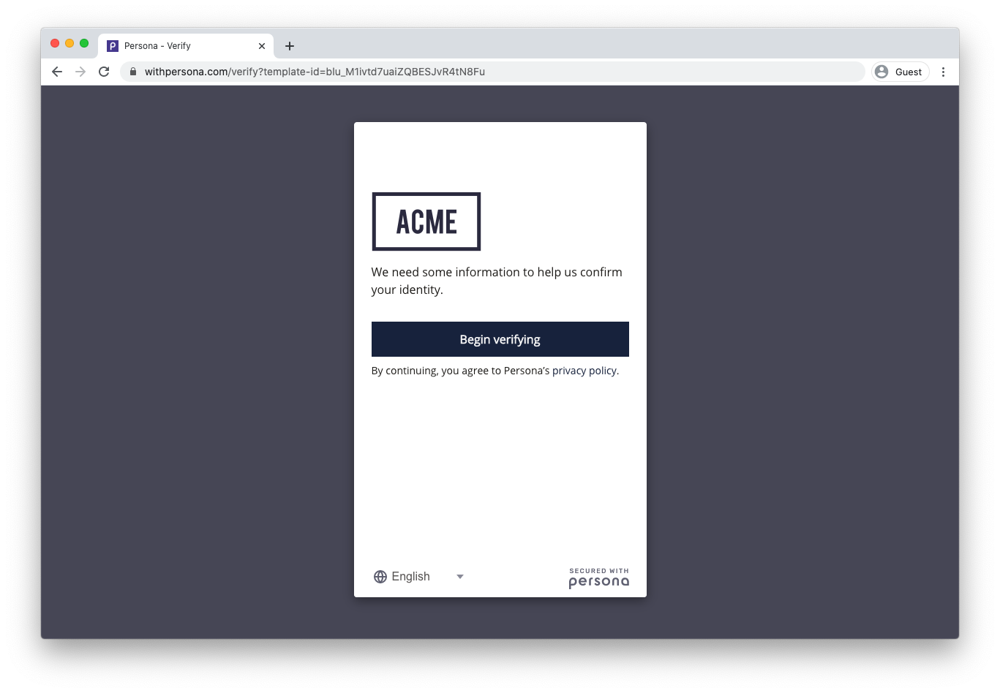

# Hosted Flow Integration

[Sending data to Persona](./choosing-an-integration-method.md)[Inquiries (Client-side integrations)](./inquiries.md)[Integration Methods](./hosted-flow.md)

# Hosted Flow Integration

The hosted flow allows teams to verify individuals through the Persona flow without spending time on development. The hosted flow is a full window experience that provides a secure, elegant inquiry flow. It is hosted by Persona but its branding and theming is fully customizable. It is an optimized flow that enables you to begin verifying individuals now without any engineering effort.

You can send someone a hosted flow link to securely collect their information. Information in the created inquiry will show up in the Dashboard.

