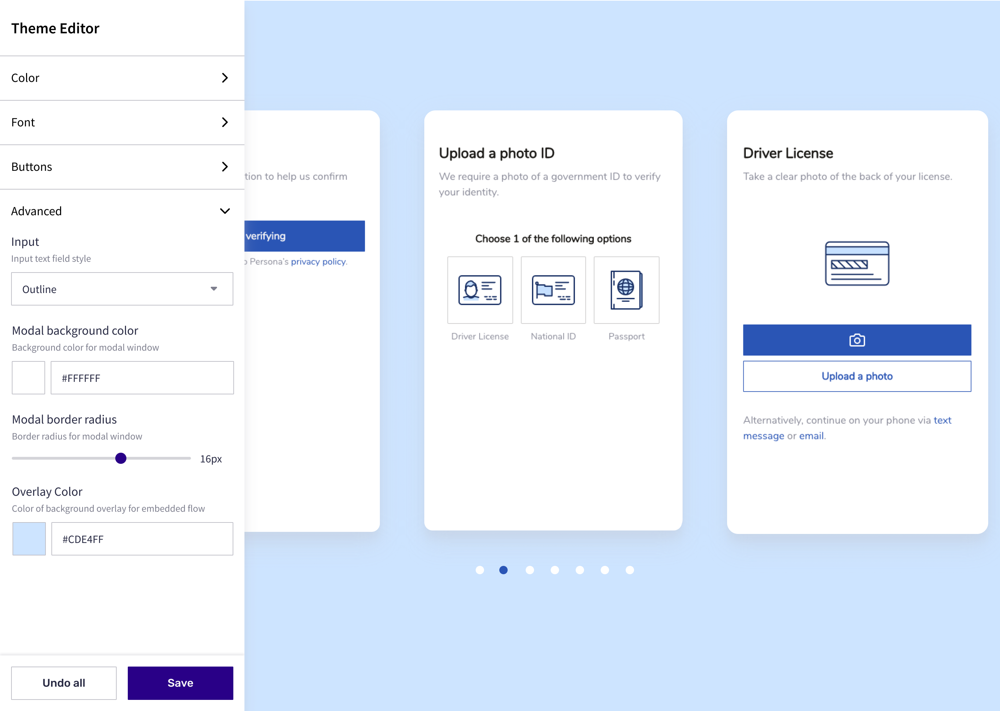

# Inquiry Theming

[Sending data to Persona](./choosing-an-integration-method.md)[Inquiries (Client-side integrations)](./inquiries.md)[Model References](./model-lifecycle.md)

# Inquiry Theming

A theme is the way to create an inquiry flow that looks and feels like your brand, reducing friction and confusion for end users. A theme is like a layer of paint that can be applied to an inquiry template.

Themes can be managed in the Dashboard with Persona’s visual editor. Update your theme and preview the changes in realtime to see exactly what end users see on each screen of the flow. See the detailed [tutorial](https://help.withpersona.com/articles/6SIHupp847yaEuVMucKAff/tutorial-configure-a-theme-with-flow-editor/) for information on using the editor.

Please [contact us](https://app.withpersona.com/dashboard/contact-us) if there are theming options you need but are not yet available.

#### Mobile SDK theming

To manage cross-client themes on the Mobile SDKs via the Dashboard, you must be on [v2+](./mobile-sdks.md). Otherwise, you will need to maintain different themes across web, Android, and iOS.

If you migrated to v2, please see our guides for [Android](./migrating-android-theming-from-client-to-server.md) and [iOS](./migrating-ios-theming-from-client-to-server.md) to then migrate your theming.
