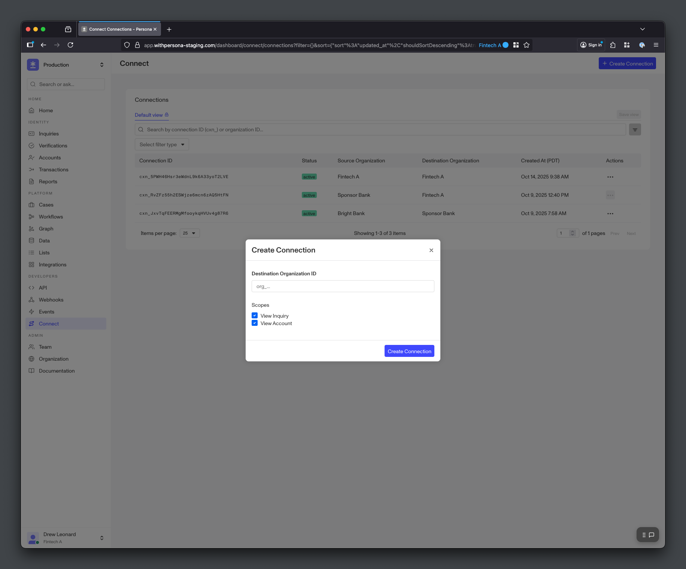
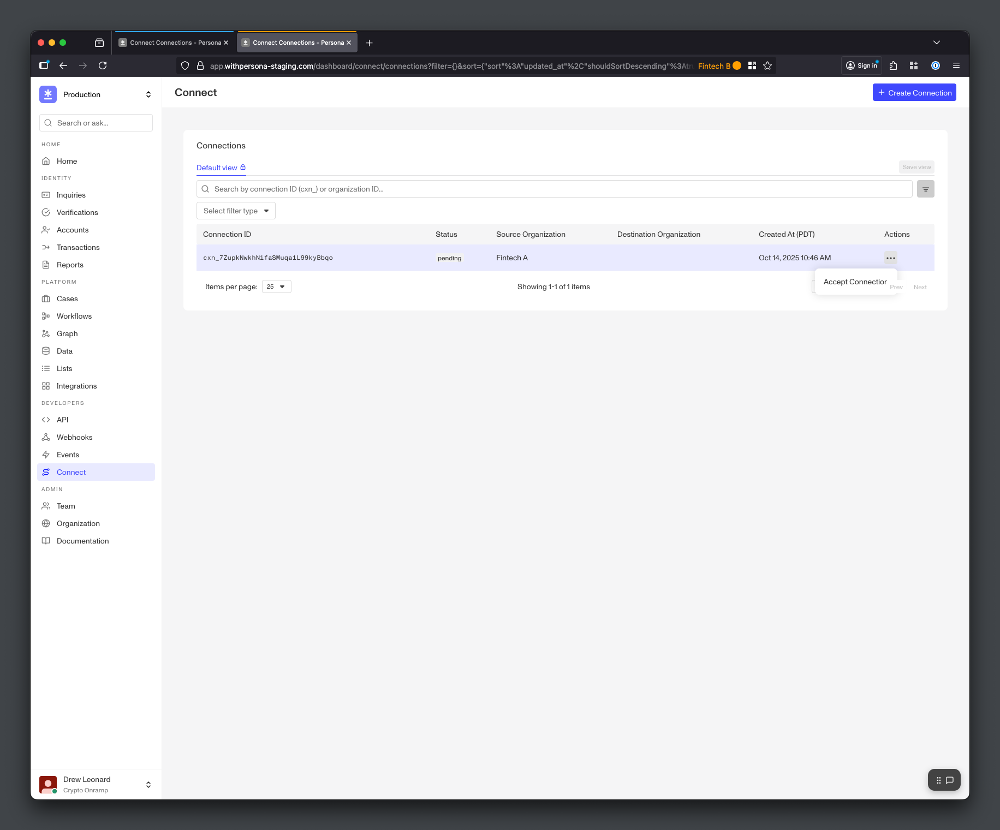

# Managing Connections

Manage Connections with data sharing partners

##### Open Beta

Connect is in **Open Beta**. The information in this guide is subject to change during the beta period. Please reach out to your Persona account team or [connect@withpersona.com](mailto:connect@withpersona.com) to request access or additional information.

Sharing data requires setting up a Connection with your partner organization. The “Source Organization” creates the Connection by indicating which “Destination Organization” they would like to share data with, and what types of data they would like to share. The Destination Organization activates the Connection, after which the Source and Destination Organizations are ready to share data.

The Source Organization creates the Connection to the Destination Organization only once. Organizations with multiple data sharing partners will have multiple Connections (one Connection per data sharing partner). Connections are one-directional – data sharing pairs that would like to share data in both directions will use two Connections.

The Source Organization _creates_ the Connection, and the Destination Organization _activates_ it. Destination Organizations cannot create the Connection, and Source Organizations cannot activate it.

---

## Step 1: Create the Connection

The Source Organization can create the Connection via Dashboard or API. The Source Organization uses the Destination Organization’s `Organization ID` (available in the Destination Organization’s Dashboard under Organization > Information) to create the Connection.

### Creating Connections via Dashboard

Source Organizations can use the Dashboard’s Connect > Connections page to create Connections.


*Create a Connection*

### Creating Connections via API

Alternatively, Source Organizations can create Connections with the Connect API.

```
curl -X POST https://api.withpersona.com/api/v1/connect/connections \
  -H "Authorization: Bearer <token>" \
  -H "Content-Type: application/json" \
  -d '{
    "data": {
      "attributes": {
        "destination-organization-id": "org_DEF456",
        "name": "Partner Connection"
      }
    }
  }'
```

```
{
  "data": {
    "type": "connect/connections",
    "id": "cxn_ABC123",
    "attributes": {
      "token": "cxn_ABC123",
      "name": "Partner Connection",
      "status": "active",
      "organization-id": "org_ABC123",
      "destination-organization-id": "org_DEF456",
      "scopes": ["inquiry.read", "account.read"],
      "creator-id": "api_ABC123",
      "creator-type": "api-key",
      "created-at": "2018-06-01T00:00:00.000Z",
      "updated-at": "2018-06-01T00:00:00.000Z"
    }
  }
}
```

---

## Step 2: Activate the Connection

After the Source Organization creates the Connection, the Destination Org can activate it. The Connection must be `Active` for the Source and Destination Organizations to share data.

Destination Organizations can use the Dashboard’s Connect > Connections page to activate Connections.


*Activate a Connection*

---

## Deactivation and Reactivation

Both the Source Organization and Destination Organization can deactivate a Connection (making the Connection `Inactive`). To reactivate an `Inactive` Connection, the Source Organization must move the Connection back to `Pending`, and the Destination Organization must move the Connection back to `Active`.
