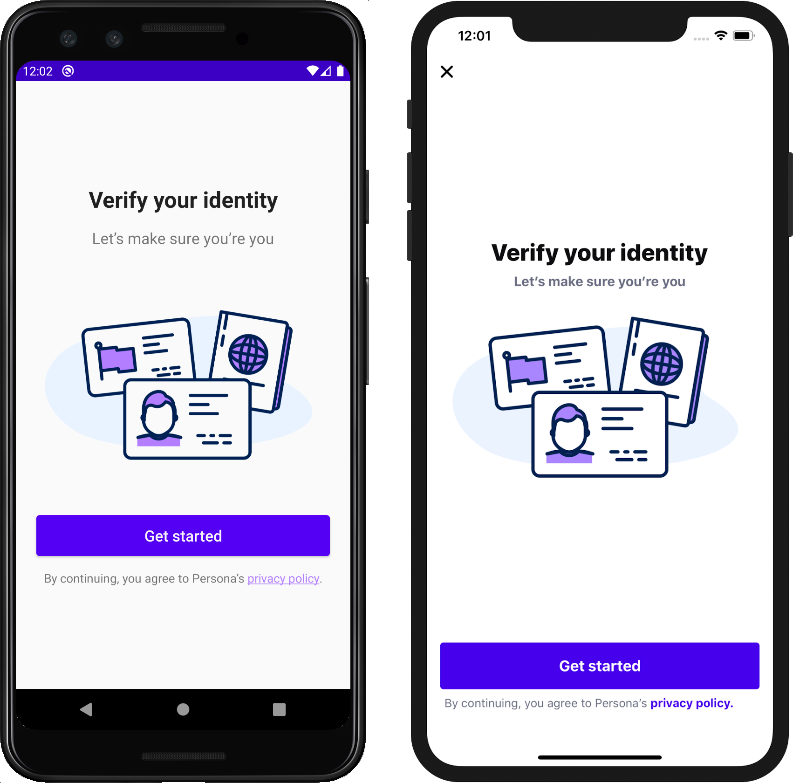

# Mobile Integration

[Sending data to Persona](./choosing-an-integration-method.md)[Inquiries (Client-side integrations)](./inquiries.md)[Integration Methods](./hosted-flow.md)

# Mobile Integration

Verify individuals with a native iOS and Android experience.

Integrate the Persona Inquiry flow directly into your Android or iOS app with our native SDKs. Get up and running with a theme-able Inquiry flow with a few lines of code. If you’re ready to get started, check out our technical documentation for [Android](./android-sdk-v2-integration-guide.md), [iOS](./ios-sdk-v2-integration-guide.md), and [React Native](./react-native-sdk-v2-integration-guide.md).

See below for an example:

*Example Native Android and iOS usage*
