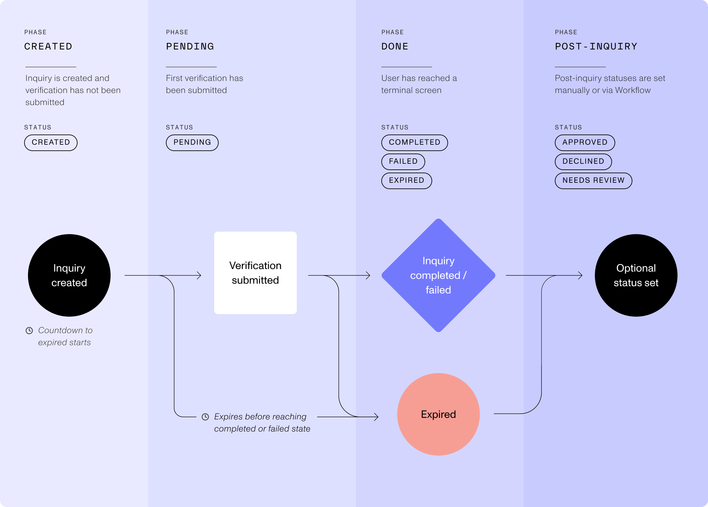

# Inquiry Model Lifecycle

[Sending data to Persona](./choosing-an-integration-method.md)[Inquiries (Client-side integrations)](./inquiries.md)[Model References](./model-lifecycle.md)

# Inquiry Model Lifecycle

An inquiry wraps a single interaction with one of your end users. This guide explains the various stages and statuses that an inquiry can move through from its creation to conclusion. Together, these stages make up what we call the Inquiry Model Lifecycle. There are four phases in the lifecycle, some of which include multiple statuses.

## Statuses

The _status_ of an inquiry defines where an end user is in the inquiry process. Each status change can trigger a configured [webhook](./webhooks.md).

See the diagram below to understand the possible statuses:

### Status changes

In general, the status of an inquiry can change when:

1.  Your end user proceeds through their inquiry: for example, as they start a verification or complete the flow.
2.  Post-inquiry workflows run and apply business logic to automatically mark an inquiry as “approved”, “declined”, or “needs review”.
3.  Your organization’s members manually change the status of an inquiry.
4.  The inquiry expires.

### Events

Every inquiry status change creates an event. You can use these events to trigger other actions, like running a Persona workflow.

The table below summarizes all statuses and their associated events:

| Phase | Status | Event Name | Status Description |
| --- | --- | --- | --- |
| `Created` | `created` | `inquiry.created` | Set when the inquiry is first created. |
| `Pending` | `pending` | `inquiry.started` | Set when the end user submits a document or begins a verification. |
| `Done` | `completed` | `inquiry.completed` | Set when end user reaches the Completed screen. |
| `Done` | `failed` | `inquiry.failed` | Set when end user reaches the Failed screen. |
| `Done` | `expired` | `inquiry.expired` | Set when inquiry exceeds 24hrs, or configured duration, after inquiry created. |
| `Post-Inquiry` | `approved` | `inquiry.approved` | Set via post-inquiry processes or manual update. |
| `Post-Inquiry` | `needs review` | `inquiry.marked-for-review` | Set via post-inquiry processes or manual update. |
| `Post-Inquiry` | `declined` | `inquiry.declined` | Set via post-inquiry processes or manual update. |

Learn more about inquiry statuses in our [Help Center](https://help.withpersona.com/articles/5KwYh8Uw7M9z6059vP0aWl/).

## Phases

### What’s the difference between Done & Post-Inquiry?

The “Done” phase describes the inquiry as being “done” from the perspective of the end user. All inquiries will end up at some point in the Done phase (with a status of either **Completed**, **Failed**, or **Expired**).

The “Post-Inquiry” phase is an optional phase that happens after the user is “done”. The provided statuses here—**Approved**, **Needs Review**, & **Declined**—let you mark decisions you might make about the inquiry after the user is done.

When selecting which events, and thus statuses, to configure in your [webhooks](./webhooks.md) we strongly recommend configuring both `approved` & `declined` as they are the most actionable for your own systems.
