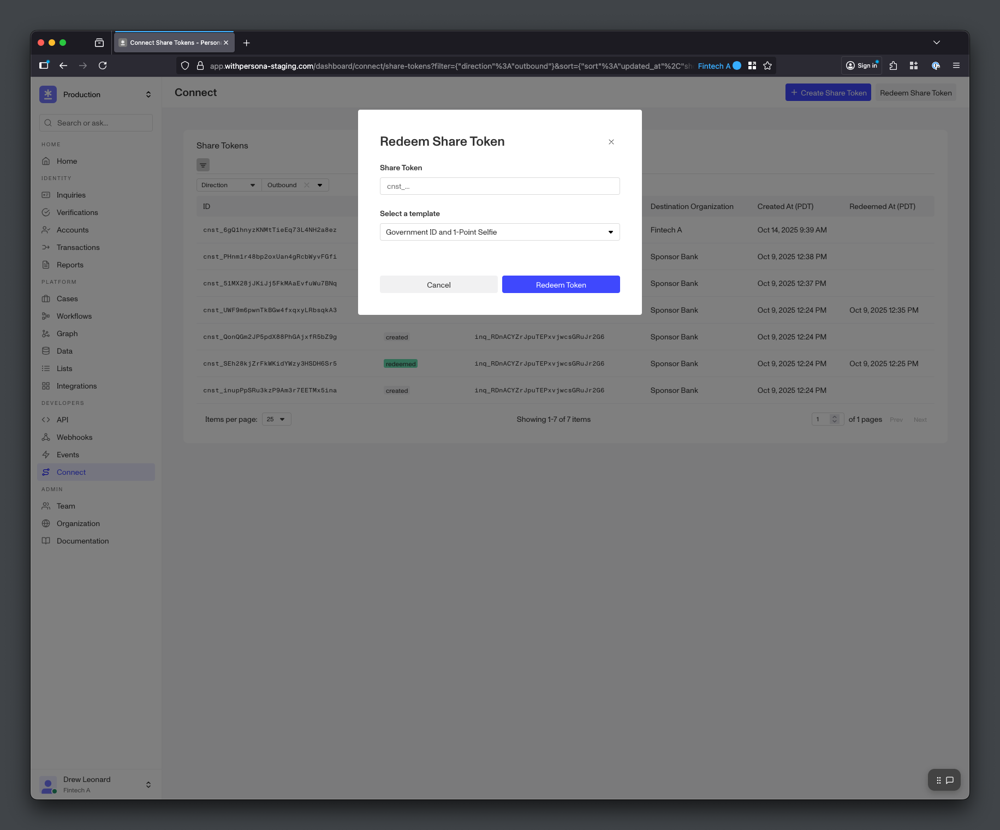

# Redeeming Share Tokens

Redeem Share Tokens from Source Organizations

##### Open Beta

Connect is in **Open Beta**. The information in this guide is subject to change during the beta period. Please reach out to your Persona account team or [connect@withpersona.com](mailto:connect@withpersona.com) to request access or additional information.

Destination Organizations can redeem Share Tokens from their data sharing partners (Source Organizations) to copy and verify an end user’s data. Redeeming a Share Token automatically runs an Inquiry in the Destination Organization’s Persona environment. This process verifies the end user’s data against the Destination Organization’s requirements, running any Verifications and Reports required by the Inquiry.

Destination Organizations can redeem Share Tokens via API, Dashboard, or Workflows.

---

## Redeeming Share Tokens via API

Destination Organizations can use the Connect API to redeem Share Tokens. The `/redeem` endpoint automatically runs the Inquiry provided in `destination-id` in the Destination Organization’s Persona environment.

The `/redeem` endpoint’s `destination-id` requires an Inquiry ID. To get an Inquiry ID, you can [create an Inquiry](./api-reference/inquiries/create-an-inquiry.md) before redeeming the Share Token. The `inquiry-template-id` used to create the Inquiry determines which Inquiry Template to use when using the `/redeem` endpoint to re-verify the user’s data from the Share Token.

```
curl -X POST https://api.withpersona.com/api/v1/connect/share-tokens/cnst_ABC123/redeem \
  -H "Authorization: Bearer <token>" \
  -H "Content-Type: application/json" \
  -d '{
    "data": {
      "attributes": {
        "destination-id": "inq_XYZ789"
      }
    }
  }'
```

```
{
  "data": {
    "type": "connect/share-token",
    "id": "cnst_ABC123",
    "attributes": {
      "status": "pending",
      "source-id": "inq_ABC123",
      "created-at": "2025-10-14T22:36:51.907Z",
      "updated-at": "2025-10-14T22:39:23.224Z",
      "pending-at": "2025-10-14T22:39:23.213Z",
      "redeemed-at": null,
      "expires-at": null
    },
    "relationships": {
      "destination": {
        "data": { "type": "inquiry", "id": "inq_XYZ789" }
      }
    }
  }
}
```

---

## Redeeming Share Tokens via Dashboard

Destination Organizations can also redeem Share Tokens using their Dashboard under the Connect > Share Tokens page. This can be helpful for testing and one-off data shares. Redeeming the Share Token requires providing the Share Token and selecting an Inquiry Template.


*Redeem a Share Token*

---

## Redeeming Share Tokens via Workflows

Destination Organizations can use [Workflows](./workflows.md) to automate Share Token redemption. For example, the Destination Organization can use a Workflow to automatically redeem a Share Token upon creation by the Source Organization. This can be helpful for integrating into Connect with minimal developement work.

If you’re interested in using Workflows to automate Share Token creation, please reach out to your Persona account team or [connect@withpersona.com](mailto:connect@withpersona.com) for additional information.

---

## Viewing Redeemed Share Tokens

Once the Share Token is `redeemed`, the destination Inquiry will have the end user’s data and verification results attached. This gives the Destination Organization full access to end user’s KYC data. The Destination Organization can view the destination Inquiry in their dashboard, as well as fetch it via API.

---

## Redeeming Logic

### Share Token Statuses

Share Tokens can have the following statuses:

-   `created`: Share Token is new, and the Destination Organization can redeem it
-   `pending`: Share Token redemption is currently processing
-   `redeemed`: Share Token redemption has finished processing
-   `expired`: Share Token is expired and unable to be redeemed

### Destination Inquiry Statuses

Once the Share Token is `redeemed`, the destination Inquiry will have either reached a terminal status (e.g., `completed`) or gotten stuck (`created` or `pending`). The destination Inquiry will reach a terminal status if the source Inquiry has all of the fields that the destination Inquiry requires (e.g., PII, images, documents). Note that the specific terminal status depends on the Destination Organization’s Inquiry Template.

The destination Inquiry will get stuck with status `created` or `pending` if the destination Inquiry requires any fields that the source Inquiry does _not_ have. For example, if the destination Inquiry Template requires a Proof of Address document, but the source Inquiry only collected Government ID and Selfie – the destination Inquiry will get stuck. See below for details on how to handle [stuck Inquiries](./redeeming-share-tokens.md#stuck-inquiries).

The Destination Organization can fetch the destination Inquiry to check its status once the Share Token has finished processing and is `redeemed`.

### Stuck Inquiries

Preventing stuck Inquiries requires aligning the Source Organziation’s and Destination Organization’s Inquiry Templates as closely as possible. For example, if the Destination Organization’s Inquiry Template collects a Proof of Address document, the Source Organization’s Inquiry Template will also need to collect that document for destination Inquiries to automatically reach a terminal status.

To handle cases where Inquiries do get stuck, Persona recommends providing end users with a fallback flow: users can resume stuck Inquiries, or complete a new Inquiry altogether.

### Redeeming Latency

Share Token redemptions are asynchronous. Completion time depends on the Destination Organization’s Inquiry Template. A simple example is that an Inquiry Template with many Verification types will take longer to run Inquiries than a template with fewer.
