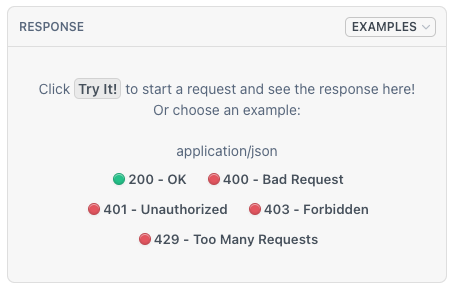

# Response Body

Each Persona API response body contains a set of resources, and attributes of each resource.

You can specify the exact resources and attributes to return in each response, using the `include` and `fields` request parameters.

## Terminology

Each Persona API returns a set of resources, and attributes of each resource.

-   A **resource** means an entity, such as an inquiry, inquiry template, account, verification, etc.
-   An **attribute** is a piece of information about a resource. For example, an inquiry has attributes like `status`, `reference-id`, `created-at`, etc.

## Response schema

Each API response follows the [JSON:API specification](https://jsonapi.org/). Each response body is a single JSON-encoded object with the following keys:

| Key name | Always present? | Value |
| --- | --- | --- |
| `data` | Y | Attributes of the primary resource |
| `included` | N | Attributes of related resources. Use the `include` query parameter to specify related resources (or none) to be included in this list. |
| `meta` | N | Other information, usually about the action being performed |

The `included` and `meta` fields are added to the response when relevant.

### Default behavior

By default, each API returns all attributes of:

-   The _**primary resource**_: the entity that is fetched or changed
-   _Some, none, or all_ of the primary resource’s _**related resources**_

For example, the Retrieve Inquiry API returns an inquiry (the primary resource), and can also return entities like the account, verifications, and inquiry template associated with that inquiry (some of the related resources).

If the default response does not include the data you want—or includes too much—you can use the `include` and `fields` request parameters to customize the response. See below for details.

### Example responses

View sample responses for each API on its reference page:



See [Understanding a Persona API payload](./integration-guide-understanding-a-persona-api-payload.md) for a detailed walkthrough of example responses.

## View all related resources

Each primary resource may have related resources that can be included in the response.

The `data.relationships` object lists all available related resources. By default, this `relationships` object is returned in every response.

Each relationship can be one-to-one or one-to-many. A one-to-one relationship contains a single object, and a one-to-many relationship contains an array of objects. Each object contains the `type` and `id` of the related resource.

For example, here is the `relationships` object for a fetched inquiry:

```
# GET https://api.withpersona.com/api/v1/inquiries/{inquiry-id}

{
  "data": {
    "type": "inquiry",
    "id": "inq_XXXXXXXXXXXXX",
    "attributes": {
      "status": "completed",
      "...": "..."
    },
    "relationships": {
      "account": {
        "data": {
          "type": "account",
          "id": "act_XXXXXXXXXXXXX"
        }
      },
      "template": {
        "data": null
      },
      "inquiry-template": {
        "data": {
          "type": "inquiry-template",
          "id": "itmpl_XXXXXXXXXXXXX"
        }
      },
      "inquiry-template-version": {
        "data": {
          "type": "inquiry-template-version",
          "id": "itmplv_XXXXXXXXXXXXX"
        }
      },
      "transaction": {
        "data": null
      },
      "reviewer": {
        "data": null
      },
      "reports": {
        "data": []
      },
      "verifications": {
        "data": [
          {
            "type": "verification/government-id",
            "id": "ver_XXXXXXXXXXXXX01"
          },
          {
            "type": "verification/government-id",
            "id": "ver_XXXXXXXXXXXXX02"
          },
          {
            "type": "verification/selfie",
            "id": "ver_XXXXXXXXXXXXX03"
          }
        ]
      },
      "sessions": {
        "data": [
          {
            "type": "inquiry-session",
            "id": "iqse_XXXXXXXXXXXXX01"
          },
          {
            "type": "inquiry-session",
            "id": "iqse_XXXXXXXXXXXXX02"
          }
        ]
      },
      "documents": {
        "data": [
          {
            "type": "document/government-id",
            "id": "doc_XXXXXXXXXXXXX01"
          },
          {
            "type": "document/government-id",
            "id": "doc_XXXXXXXXXXXXX02"
          }
        ]
      },
      "selfies": {
        "data": [
          {
            "type": "selfie/profile-and-center",
            "id": "self_XXXXXXXXXXXXX"
          }
        ]
      }
    }
  }
}
```

Note that:

-   This inquiry does not have an associated `transaction`, `reviewer`, or `reports`, so these values are null or empty.
-   The `account` relationship is an example of a one-to-one relationship. It contains a single object.
-   The `verifications` relationship is an example of a one-to-many relationship. The contains an array of objects.

## Specify related resources

Use the `include` query parameter to specify which related resources to return in the `included` array.

| Use case | Syntax | Example |
| --- | --- | --- |
| Include related resources | List one or more relationships separated by commas | `?include=verifications,account,sessions` |
| Exclude all related resources | Use `include` with an empty value | `?include=` |
| Include nested related resources | Use dot syntax (one level at most) | `?include=inquiry-template.latest-published-version` |

**Limitations:**

-   Only one level of nesting is allowed. I.e. `?include=foo.bar` is allowed, but not `?include=foo.bar.baz`
-   The `include` parameter cannot be used on “list all” endpoints.

#### Example requests with `include`

View the sample request in the each tab:

###### Include verifications only

###### Exclude all related resources

###### Include a nested resource

**Parameter:**

`?include=verifications`

**Request:**

```
GET https://api.withpersona.com/api/v1/inquiries/{inquiry-id}?include=verifications
```

**Response:**

`data` contains an inquiry, and `included` contains all its verifications.

No other related resources are returned.

```
{
  "data": {
    "type": "inquiry",
    "id": "inq_XXXXXXXXXXXXX",
    "attributes": {
      "status": "completed",
      "reference-id": "asdf",
      "created-at": "2023-07-11T18:46:39.000Z",
      "...": "..."
    },
    "relationships": {
      "...": "..."
    }
  },
  "included": [
    {
      "type": "verification/government-id",
      "id": "ver_XXXXXXXXXXXXX01",
      "attributes": {
        "status": "failed",
        "created-at": "2023-07-11T20:09:50.000Z",
        "...": "..."
      },
      "relationships": {
        "...": "..."
      }
    },
    {
      "type": "verification/government-id",
      "id": "ver_XXXXXXXXXXXXX02",
      "attributes": {
        "status": "failed",
        "created-at": "2023-07-11T20:10:15.000Z",
        "...": "..."
      },
      "relationships": {
        "...": "..."
      }
    }
  ]
}
```

## Specify attributes

Use the `fields` query parameter to specify which attributes should be returned for a given resource type. This lets you retrieve only the data you need.

| Use case | Syntax | Example |
| --- | --- | --- |
| Return specific attributes | `?fields[TYPE]=attribute1,attribute2` | `?fields[inquiry]=status,created-at` |
| Return specific nested fields | Use dot syntax for keys within `fields` | `?fields[inquiry]=status,fields.name-first,fields.name-last` |
| Limit attributes on both primary and related resources | Add `fields[TYPE]` for each resource type | `?fields[inquiry]=status&fields[verification/government-id]=status` |

**Notes:**

-   `TYPE` is the resource type, e.g. `inquiry`, `verification/government-id`, `account`.
-   Attribute names are any keys found under `data.attributes` in the API response.

#### Example requests with `fields`

View the sample request in each tab:

###### Return only inquiry status

###### Return specific nested fields

**Parameter:**

`?fields[inquiry]=status`

**Request:**

```
GET https://api.withpersona.com/api/v1/inquiries/{inquiry-id}?fields[inquiry]=status
```

**Response:**

```
{
  "data": {
    "type": "inquiry",
    "id": "inq_XXXXXXXXXXXXX",
    "attributes": {
      "status": "completed"
    }
  }
}
```

## Using `fields` and `include` together

You can combine `include` and `fields` in the same request, and use `fields` to control attributes on both primary and related resources.

For example, the following request returns:

-   The inquiry with only its `status` attribute
-   All related verifications with only their `status` and `created-at` attributes

**Parameter:**

```
?include=verifications
&fields[inquiry]=status
&fields[verification]=status
```

**Request:**

```
GET https://api.withpersona.com/api/v1/inquiries/{inquiry-id}?include=verifications&fields[inquiry]=status&fields[verification]=status
```

**Response:**

```
{
  "data": {
    "type": "inquiry",
    "id": "inq_XXXXXXXXXXXXX",
    "attributes": {
      "status": "completed"
    }
  },
  "included": [
    {
      "type": "verification/government-id",
      "id": "ver_XXXXXXXXXXXXX01",
      "attributes": {
        "status": "failed",
        "created-at": "2023-07-11T18:47:46.000Z"
      }
    },
    {
      "type": "verification/government-id",
      "id": "ver_XXXXXXXXXXXXX02",
      "attributes": {
        "status": "passed",
        "created-at": "2023-07-11T18:48:33.000Z"
      }
    },
    {
      "type": "verification/selfie",
      "id": "ver_XXXXXXXXXXXXX03",
      "attributes": {
        "status": "passed",
        "created-at": "2023-07-11T18:48:54.000Z"
      }
    }
  ]
}
```

## Why limit returned data?

Using `include` and `fields` to request only the data you need has multiple benefits:

-   **Reduced data transfer:** By excluding attributes you don’t need, you minimize the amount of data flowing into your system.
-   **Avoid PII transfer:** Some resources, like inquiries, have attributes that contains PII. You can restrict the returned data to avoid fetching PII when you don’t need it.
-   **Faster responses:** When you specify only the fields you need, Persona can retrieve and return data more quickly.
