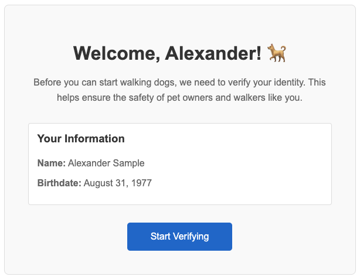

# Tutorial: Embedded Flow with Inquiry Template

[Sending data to Persona](./choosing-an-integration-method.md)[Inquiries (Client-side integrations)](./inquiries.md)[Integration Methods](./hosted-flow.md)[Embedded Flow](./embedded-flow.md)[Getting Started](./quickstart-embedded-flow.md)

# 

Tutorial: Embedded Flow with Inquiry Template

An Embedded Flow embeds Persona’s verification UI directly into your website as an iframe.

There are [two ways to use Embedded Flow](./choosing-an-integration-method.md#embedded-flow-web-sdk):

1.  **Generate inquiries from an inquiry template** (Minimal code required)
2.  **Pre-create inquiries via API** (More code required)

This guide walks you through the first method: generating inquiries from an inquiry template.

You will:

-   Create a web page that shows a user onboarding flow
-   Configure a button to open a Persona verification via Embedded Flow
-   Test that your flow works
-   View inquiry results via API
-   (optional) Set up and receive webhook alerts about changes to the inquiry

##### Alternative: Pre-create inquiries

Generating inquiries from an inquiry template (the method shown in this guide) is the fastest way to implement Embedded Flow. However, due to [limitations of this method](./tutorial-embedded-flow-inquiry-template.md#limitations-of-this-approach), we recommend you pre-create inquiries in production. To learn how, see [Tutorial: Pre-create inquiries for Embedded Flow](./tutorial-embedded-flow-precreate.md).

## Prerequisites

You’ll need:

-   A Persona account
-   Python installed locally
    -   This guide shows how to host an HTML page on `localhost` using Python, but you can adapt the setup to another language.

Before you start, you should:

-   Understand what an [inquiry](./inquiries.md) is
-   Sign into the [Persona dashboard](https://help.withpersona.com/articles/3QGnmQLLnykxUkPl1wIdLT/) and switch into your [Sandbox environment](./environments.md)

## Scenario

A user named Alexander Sample just joined your dog walking app as a dog walker. You want to verify his identity to ensure the safety of users on your service.

Alexander’s user ID in _your_ app is “usr\_ABC123”. During account signup in your app, he stated his birthdate is August 31, 1977.

## Step 1: Create an inquiry template

Every inquiry is created from an [inquiry template](./inquiry-templates.md), which defines details like the specific verification logic and UI text and branding of that inquiry. You can think of inquiry templates as a mold that lets you create many inquiries.

Persona offers a suite of [solutions](https://help.withpersona.com/solutions/all-solutions/) that include preconfigured inquiry templates. In this tutorial, use the “KYC” solution to verify your dog walkers.

**Follow [these instructions](https://help.withpersona.com/articles/67J7FurQtIgwxkWWvUropu/)** to add the “KYC” solution to your Sandbox environment.

## Step 2: Locate the inquiry template ID

Find the ID of the newly-created inquiry template.

In the Persona dashboard, navigate to **Inquiries** > **Templates**. Find the “KYC” template in the list of inquiry templates, and note the value in the `ID` field. The value should begin with `itmpl_`.

## Step 3: Create the web page

Now, set up the user onboarding page that will display the verification flow to Alexander.

1.  Create a new directory called `embedded-flow-demo/`.
    
2.  Inside that directory, create a file called `onboarding.html` with the following code:
    

```
<!DOCTYPE html>
<html>
<head>
  <title>Complete Your Profile - Dog Walker</title>
  <style>
    body {
      font-family: Arial, sans-serif;
      max-width: 600px;
      margin: 50px auto;
      padding: 20px;
      text-align: center;
    }
    .container {
      border: 1px solid #ddd;
      border-radius: 8px;
      padding: 40px;
      background-color: #f9f9f9;
    }
    h1 {
      color: #333;
      margin-bottom: 10px;
    }
    p {
      color: #666;
      line-height: 1.6;
      margin-bottom: 30px;
    }
    button {
      background-color: #0066cc;
      color: white;
      border: none;
      padding: 15px 40px;
      font-size: 16px;
      border-radius: 5px;
      cursor: pointer;
    }
    button:hover {
      background-color: #0052a3;
    }
    .user-info {
      background-color: #fff;
      border: 1px solid #ddd;
      border-radius: 4px;
      padding: 15px;
      margin-bottom: 30px;
      text-align: left;
    }
    .user-info h3 {
      margin-top: 0;
      color: #333;
    }
    .user-info p {
      margin: 8px 0;
    }
  </style>
</head>
<body>
  <div class="container">
    <h1>Welcome, Alexander 🐕</h1>
    <p>
      Before you can start walking dogs, we need to verify your identity.
      This helps ensure the safety of pet owners and walkers like you.
    </p>

    <div class="user-info">
      <h3>Your Information</h3>
      <p><strong>Name:</strong> Alexander Sample</p>
      <p><strong>Birthdate:</strong> August 31, 1977</p>
    </div>

    <button id="verify-button">Start Verifying</button>
  </div>
  <div>
    <p>Debug info:</p>
    <p id="debug-info"></p>
  </div>

  <script>
    // Button doesn't work yet - we'll add Persona integration next.
    document.getElementById('verify-button').addEventListener('click', () => {
      alert('Verification flow will go here');
    });
  </script>
</body>
</html>
```

```
# cd to the directory
cd embedded-flow-demo/

# start a local server
python -m http.server 8000
```

You should see the onboarding flow for our newly-registered dog walker:



Right now, the “Start Verifying” button doesn’t work. You’ll wire it up in Step 5.

## Step 4: Add the Persona Web SDK

The web page code does not yet contain the Persona SDK. Let’s add it.

1.  In the `<head>` section of `onboarding.html`, add the following lines right after the closing `</style>` tag:

```
<script src="https://cdn.withpersona.com/dist/persona-vX.Y.Z.js" crossorigin="anonymous"></script>
<meta charset="UTF-8" />
<meta name="viewport" content="width=device-width, initial-scale=1" />
```

2.  In the code you added, replace `X.Y.Z.` in the CDN URL with the latest version of the SDK. Check the [SDK changelog](./embedded-flow-changelog.md) for the latest version.
    -   For example, if the latest version is 5.4.0: `https://cdn.withpersona.com/dist/persona-v5.4.0.js`

##### Alternative: npm

You can also install the SDK as an [npm package](https://www.npmjs.com/package/persona).

## Step 5: Make the button open the Persona flow

Right now, if you click “Start Verifying”, you see an alert. Make the button trigger a Persona verification flow instead.

1.  Locate the following lines in the HTML:

```
<script>
// Button doesn't work yet - we'll add Persona integration next.
document.getElementById('verify-button').addEventListener('click', () => {
    alert('Verification flow will go here');
});
</script>
```

2.  Replace those lines with the following code:

```
<script>
// In this demo, we hardcode Alexander's user information.
// In a real implementation, this information should come from your internal systems.
let userId = 'usr_ABC123';
let userFields = {
    name_first: "Alexander",
    name_last: "Sample",
    birthdate: "1977-08-31",
}

document.getElementById('verify-button').addEventListener('click', () => {
    const client = new Persona.Client({
        templateId: "itmpl_XXXXXXXXXXXXX",
        environmentId: "env_XXXXXXXXXXXXX",
        referenceId: userId,
        fields: userFields,
        onReady: () => client.open(),
        onCancel: ({ inquiryId, sessionToken }) => {
            // For demonstration purposes, we will just log to the console.
            console.log('An inquiry was cancelled. ID: ' + inquiryId);
        },
        onError: (error) => {
            // For demonstration purposes, we will just log to the console.
            console.log('An error occurred:', error)
        },
        onEvent: (name, metadata) => {
            if (name === 'start') {
                // For demonstration purposes, we will just log to the console.
                const inquiryId = metadata.inquiryId;
                console.log('Starting inquiry with ID: ' + inquiryId);
            }
        },
        onComplete: ({ inquiryId, status, fields }) => {
            // Inquiry completed. For demonstration purposes, we will show a debug message in the UI.
            document.getElementById('debug-info').innerText = 'Completed inquiry with ID: ' + inquiryId + ' \n\nWrite down this ID for Step 9.';

            // Here, you could also send a request to your backend to log the completion.

            // Clean up the client to avoid memory leaks.
            client.destroy();
        },
    });
});
</script>
```

3.  In the code, fill in the following values:
    -   **templateId**: Replace `itmpl_XXXXXXXXXXXXX` with your inquiry template ID from Step 2.
    -   **environmentId**: Replace `env_XXXXXXXXXXXXX` with the ID of the Persona [environment](./environments.md) you’re using. In this tutorial, we’re using your Sandbox environment. Here’s how to [find the ID of your environment](https://help.withpersona.com/articles/2phMvmqqOPVr6q50vQ9Sfh/).

### About the code

This code creates a new Persona web client (`new Persona.Client({...})`). Note that:

-   A new inquiry is created when `new Persona.Client({...})` is invoked.
-   You must provide a `templateId` at minimum. If you don’t provide an environment ID, by default your production environment is used.
-   [Callbacks](./embedded-flow-client-callbacks.md), like `onComplete` and `onError`, let you coordinate your app’s UI with changes in the Persona UI. Do not rely on them for up-to-date data about the state of the inquiry. Use webhooks (Step 6) for logic that depends on inquiry state.

This code demonstrates two best practices for initiating inquiries:

-   **Pass a [reference ID](./reference-ids.md)**: “usr\_ABC123” is set as the `reference-id`. A reference ID lets you tag an inquiry as being associated with a particular end user. Persona recommends using the user’s UID from your internal systems.
-   **[Prefill inquiry fields](./inquiry-fields.md#prefilling-inquiry-fields)**: We prefill the inquiry with information we know about Alexander: his first name, last name, and birthdate. Providing this information helps streamline the verification experience for Alexander, and helps increase your confidence that his information is valid.

## Step 6: Set up a webhook (optional)

You can receive notifications when any inquiry’s state changes. For example, you can be alerted when any inquiry is started by a user, or when any inquiry is completed. See the [full list of inquiry events](./model-lifecycle.md#events) you can be alerted about.

To receive automatic notifications:

1.  Create a webhook endpoint (for a sample server, see [Webhook quickstart](./quickstart-webhooks.md))
2.  In the dashboard, navigate to **Webhooks** > **Webhooks**.
3.  Add your endpoint URL
4.  Select the following “Enabled events”: `inquiry.started`, `inquiry.completed`, `inquiry.approved`, `inquiry.declined`, and `inquiry.failed`

For this tutorial, you can skip webhooks and view results in the dashboard.

## Step 7: Test the flow

In production, Alexander would click the “Start Verifying” button and complete verification on his own.

For this tutorial, you’ll complete the flow yourself as Alexander:

1.  Click “Start Verifying”. The Persona verification flow will open in a modal.
2.  Click through the verification steps.
    -   Do not enter real personal information, since this is Sandbox.
    -   Keep the “Pass verifications” toggle enabled (visible at the bottom of the flow) to simulate passing all the checks.
3.  After you complete the flow, note the inquiry ID printed to the “Debug info” section of the page. You’ll use it in Step 9.

The inquiry ID will look like `inq_XXXXXXXXXXXXX`.

## Step 8: (optional) Inspect webhook events

If you set up the webhook in Step 6, check your server logs. You should see events from `inquiry.started`, `inquiry.completed`, and `inquiry.approved`.

Note: If you want to receive the `inquiry.failed` event, you can reload the page and click “Start Verifying” again. Then click through the verification flow, this time with the “Pass verifications” toggle _disabled_.

## Step 9: View inquiry results via API

Now that you’ve completed the inquiry, take a look at the results. Note that because this inquiry was created in Sandbox, some of the data will be demo data.

Retrieve the inquiry details:

```
curl https://api.withpersona.com/inquiries/inq_XXXXXXXXXXXXX \
-X GET \
-H "Authorization: Bearer YOUR_API_KEY" \
-H "Content-Type: application/json" \
-H "Persona-Version: 2025-10-27"

# Replace:
# - YOUR_API_KEY with your API key
# - inq_XXXXXXXXXXXXX with the inquiry ID from Step 7
```

The response includes:

-   `data.attributes.reference-id`: The reference ID you provided
-   `data.attributes.status`: Should be `approved`
-   `data.attributes.fields`: Prefilled and collected data

Note that:

-   The final status of your inquiry is `approved` instead of `completed` because the KYC solution includes Workflows that automatically approve passing inquiries. See the Next Steps section to learn more.
-   Because this inquiry was created in Sandbox, much of the data will be null or empty. Keep in mind you’ll see different outputs in Production.

**Alternative: View in Dashboard** You can also view results in the dashboard at **Inquiries** > **All Inquiries**. See [this Help Center guide](https://help.withpersona.com/articles/nqBDRxxIjiIvnOwsCpri6/) for details.

## Summary

In this tutorial, you:

-   Created a web page that shows a step in a user onboarding flow
-   Added the Persona Web SDK
-   Configured a button click to open a Persona verification in a modal (Embedded Flow)
-   Tested the complete flow
-   (Optional) Received alerts about changes to the inquiry, via webhook
-   Retrieved inquiry results via API

This is a complete Embedded Flow integration that creates inquiries using an inquiry template.

### Limitations of this approach

This implementation is simple, but has drawbacks:

-   **Users may create duplicate inquiries**: Each time a user clicks “Start Verifying”, a new inquiry is created. If they click multiple times, they will create multiple inquiries, which create noise in your data.
-   **Users can’t resume inquiries**: If a user reloads the page mid-flow, they must start over with a new inquiry.
-   **Users can spoof information**: Since the client is providing the user information (user ID and user fields), this information could be spoofed by the user.

To address these issues, Persona recommends you pre-create inquiries on your server in production. See [Tutorial: Pre-create inquiries for Embedded Flow](./tutorial-embedded-flow-precreate.md) to learn how.

## Next steps

Enhance this integration:

-   **Pre-create inquiries**: Complete [the next tutorial](./tutorial-embedded-flow-precreate.md) to learn how Persona recommends you deploy Embedded Flow in production.
-   **Subscribe to additional events**: Understand the different [inquiry events](./model-lifecycle.md#events) you can be alerted about, and the difference between the “Done” and “Post-inquiry” phases.
-   **Learn webhook best practices**: In production, you’ll need to handle duplicate events and [other issues](./webhooks-best-practices.md).

Explore further:

-   **Explore the KYC solution**: The [KYC solution](https://help.withpersona.com/articles/2OOWdhAoEeVrMRKRFENneW/) includes two [Workflows](./workflows.md) and a [Case](./cases.md) template. In this tutorial, the Workflows seamlessly ran in the background and changed the final status of your inquiry from `completed` to `approved`.
-   **Explore other integration methods:** Try Hosted Flow if you’re looking to distribute verification flows as links. See [Choosing an integration method](./choosing-an-integration-method.md).
