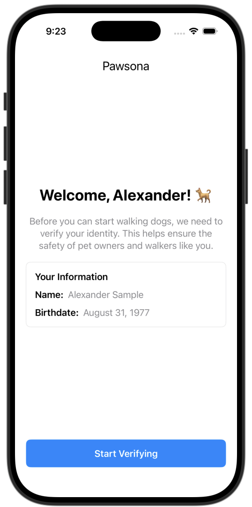
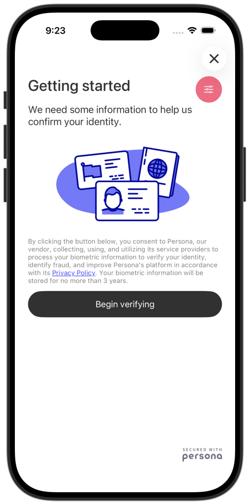
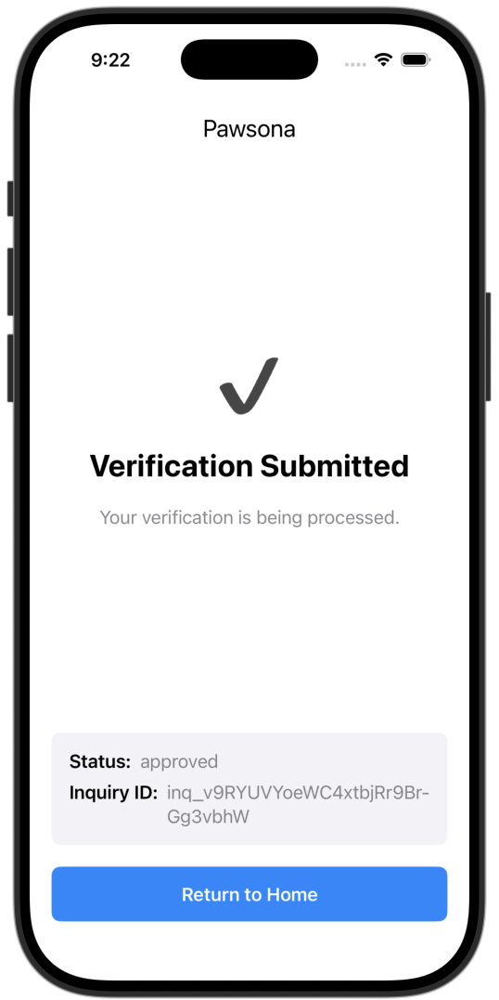

# Tutorial: Pre-create inquiries for iOS

[Sending data to Persona](./choosing-an-integration-method.md)[Inquiries (Client-side integrations)](./inquiries.md)[Integration Methods](./hosted-flow.md)[Mobile](./mobile-sdks.md)[iOS](./tutorial-ios-sdk-precreate.md)

# 

Tutorial: Pre-create inquiries for iOS

The Persona iOS SDK lets you integrate identity verification directly into your native iOS app.

There are [two ways to use the iOS SDK](./choosing-an-integration-method.md#mobile-sdk):

1.  **Generate inquiries from an inquiry template** (Minimal code required)
2.  **Pre-create inquiries via API** (More code required)

This guide walks you through the second method: pre-creating inquiries via API. This is the method we recommend you use in production.

You will:

-   Create a backend server with an endpoint that:
    -   Creates inquiries with prefilled user data
    -   Checks for existing inquiries to avoid duplicates
    -   Enables the user to resume partially-completed inquiries by providing a session token
-   Create an iOS app that:
    -   Retrieves an inquiry ID from the backend for the current user
    -   Displays the Persona verification flow using the inquiry ID

##### Production note

The sample code in this guide illustrates an approach that we recommend in production.

However, for demonstration purposes, the code itself is simplified and not production-ready. For example, it does not include:

-   Authentication
-   Fetching real user information from a database
-   Error handling and retry logic
-   Monitoring

##### Alternative: Generate inquiries from template

Pre-creating inquiries (the method shown in this guide) is recommended for production use. However, if you’re looking for the fastest way to test the iOS SDK, see the [inquiry template approach](./ios-sdk-v2-integration-guide.md#build-and-launch-the-inquiry).

## Prerequisites

You’ll need:

-   A Persona account with a [Sandbox API key](./api-keys.md)
-   macOS with Xcode installed
-   Python 3.7+ installed locally (for the backend server)
    -   This guide provides sample backend code in Python, but you can adapt it to any language.
-   Basic SwiftUI knowledge
    -   This guide provides sample iOS code using SwiftUI, but you can adapt it to UIKit.

Before you start, you should:

-   Understand what an [inquiry](./inquiries.md) is
-   Sign into the [Persona dashboard](https://help.withpersona.com/articles/3QGnmQLLnykxUkPl1wIdLT/) and switch into your [Sandbox environment](./environments.md)

## Scenario

A user named Alexander Sample just joined your dog walking app as a dog walker. You want to verify his identity to ensure the safety of users on your service.

Alexander’s user ID in _your_ app is “usr\_ABC123”. During account signup in your app, he stated his birthdate is August 31, 1977.

## Step 1: Create an inquiry template

Every inquiry is created from an [inquiry template](./inquiry-templates.md), which defines details like the specific verification logic and UI text and branding of that inquiry. You can think of inquiry templates as a mold that lets you create many inquiries.

Persona offers a suite of [solutions](https://help.withpersona.com/solutions/all-solutions/) that include preconfigured inquiry templates. In this tutorial, use the “KYC” solution to verify your dog walkers.

**Follow [these instructions](https://help.withpersona.com/articles/67J7FurQtIgwxkWWvUropu/)** to add the “KYC” solution to your Sandbox environment.

## Step 2: Locate the inquiry template ID

Find the ID of the newly-created inquiry template.

In the Persona dashboard, navigate to **Inquiries** > **Templates**. Find the “KYC” template in the list of inquiry templates, and note the value in the `ID` field. The value should begin with `itmpl_`.

## Step 3: Create the backend API

Create a backend server with one endpoint that returns an inquiry for the current logged-in user. If the user has an in-progress inquiry, the backend will return that inquiry’s ID. Otherwise, the backend will create a new inquiry and return its ID.

This is the same backend from the [Embedded Flow Pre-create guide](./quickstart-embedded-flow-precreate.md).

1.  Create a new directory for the backend:

```
mkdir ios-demo-backend
cd ios-demo-backend
```

2.  Create `server.py` with the following code:

```
from flask import Flask, request, jsonify
from flask_cors import CORS
import requests
import os

app = Flask(__name__)
CORS(app)

PERSONA_API_KEY = os.environ.get('PERSONA_API_KEY')
PERSONA_API_URL = 'https://withpersona.com/api/v1'
PERSONA_VERSION = '2025-10-27'
INQUIRY_TEMPLATE_ID = 'itmpl_XXXXXXXXXXXXX'  # Replace with your template ID

def _get_persona_req_headers():
    return {
        'Authorization': f'Bearer {PERSONA_API_KEY}',
        'Content-Type': 'application/json',
        'Persona-Version': PERSONA_VERSION
    }

@app.route('/api/inquiries/get-or-create', methods=['POST'])
def get_or_create_inquiry():
    # In production, get user ID from your auth system
    user_id = 'usr_ABC123'

    # In production, fetch user data from your database
    user_data = {
        'name_first': 'Alexander',
        'name_last': 'Sample',
        'birthdate': '1977-08-31'
    }

    # Check for existing incomplete inquiry
    existing = find_incomplete_inquiry(user_id)

    if existing:
        inquiry_id = existing['id']
        status = existing['attributes']['status']

        print(f"Found existing inquiry {inquiry_id} with status: {status}")

        if status == 'pending':
            print("Inquiry is pending, generating session token to resume")
            session_token = create_session_token(inquiry_id)
            return jsonify({
                'inquiry_id': inquiry_id,
                'session_token': session_token
            })
        else:
            print("Inquiry is created, resuming without session token")
            return jsonify({
                'inquiry_id': inquiry_id,
                'session_token': None
            })
    else:
        print("No incomplete inquiry found, creating new one")
        inquiry_id = create_inquiry(user_id, user_data)
        return jsonify({
            'inquiry_id': inquiry_id,
            'session_token': None
        })

def find_incomplete_inquiry(user_id):
    """Find existing inquiry with status 'created' or 'pending'"""
    try:
        response = requests.get(
            f"{PERSONA_API_URL}/inquiries",
            params={
                'filter[reference-id]': user_id,
                'filter[status]': 'created,pending',
                'page[size]': 1
            },
            headers=_get_persona_req_headers()
        )
        response.raise_for_status()
        inquiries = response.json().get('data', [])
        return inquiries[0] if inquiries else None
    except Exception as e:
        print(f"Error finding inquiry: {e}")
        return None

def create_inquiry(user_id, user_data):
    """Create new inquiry via Persona API"""
    payload = {
        'data': {
            'attributes': {
                'inquiry-template-id': INQUIRY_TEMPLATE_ID,
                'reference-id': user_id,
                'fields': user_data
            }
        }
    }

    response = requests.post(
        f"{PERSONA_API_URL}/inquiries",
        json=payload,
        headers=_get_persona_req_headers()
    )
    response.raise_for_status()
    return response.json()['data']['id']

def create_session_token(inquiry_id):
    """Generate session token for resuming pending inquiry"""
    try:
        response = requests.post(
            f"{PERSONA_API_URL}/inquiries/{inquiry_id}/resume",
            json={'meta': {}},
            headers=_get_persona_req_headers()
        )
        response.raise_for_status()
        meta = response.json().get('meta', {})
        return meta.get('session-token')
    except Exception as e:
        print(f"Error creating session token: {e}")
        return None

if __name__ == '__main__':
    app.run(port=8000, debug=True)
```

In this code, replace `itmpl_XXXXXXXXXXXXX` with your inquiry template ID from Step 2.

3.  Create the `requirements.txt` file:

```
flask
flask-cors
requests
```

4.  Install required dependencies:

```
# Create a virtual environment
cd ios-demo-backend
python -m venv venv

# Activate the virtual environment
source venv/bin/activate

# Install dependencies
pip install -r requirements.txt
```

5.  Set your Persona Sandbox API key as an environment variable:

```
export PERSONA_API_KEY="your_sandbox_api_key_here"
```

6.  Start the server:

```
cd ios-demo-backend
python server.py
```

You should see:

```
* Running on http://127.0.0.1:8000
* Debug mode: on
```

Keep this terminal window open.

### About the backend code

The backend is identical to the Embedded Flow Pre-create guide. See [that guide’s explanation](./quickstart-embedded-flow-precreate.md#about-the-backend-code) for details on:

-   Finding incomplete inquiries
-   Resuming inquiries with session tokens
-   Securely prefilling the inquiry with user data and providing a reference ID

## iOS app architecture

In the next steps, you will construct the iOS app. Here’s how the pieces fit together:

**View Model:**

-   **OnboardingViewModel**: Communicates with the backend API and manages state used by the views

**Views:**

-   **OnboardingView**: The step in Alexander’s user onboarding flow that shows a “Start Verifying” button
-   **PersonaFlowPresenter**: View that wraps the Persona iOS SDK for use in SwiftUI. Is presented by OnboardingView.
-   **FinishedView**: The screen shown to Alexander after he completes verification
-   **ContentView**: View that provides simple logic to show OnboardingView versus FinishedView. Creates and owns the view model.

**UX flow:**

1.  Alexander taps “Start Verifying” in OnboardingView
2.  OnboardingViewModel calls backend API
3.  Backend returns inquiry ID (and session token if resuming pending inquiry)
4.  PersonaFlowPresenter presents Persona verification
5.  Alexander completes verification and sees FinishedView

Next, you’ll create the app and build the view model first, then the views.

## Step 4: Create iOS app with Persona SDK

Create a new iOS app that will display the Persona verification flow.

1.  Open Xcode and create a new iOS App project:
    
    -   Product Name: `Pawsona`
    -   Interface: SwiftUI
    -   Language: Swift
2.  Install the Persona iOS SDK using Swift Package Manager:
    
    -   In Xcode, go to **File** > **Add Package Dependencies**
    -   Enter the repository URL: `https://github.com/persona-id/inquiry-ios-2`
    -   Select “Up to Next Major Version” with the current version of the SDK
    -   Click **Add Package**

## Step 5: Create the view model

Create a new Swift file called `OnboardingViewModel.swift`:

```
import Foundation
import Combine
import Persona2

@MainActor
class OnboardingViewModel: ObservableObject {
    @Published var isLoading = false
    @Published var errorMessage: String?
    @Published var showPersonaFlow = false
    @Published var showSuccess = false
    @Published var inquiryId: String?
    @Published var sessionToken: String?
    @Published var completedInquiryId: String?
    @Published var completedInquiryStatus: String?

    // Replace with your backend URL
    // For iOS Simulator: use http://localhost:8000
    // For physical device: use your computer's IP address (e.g., http://192.168.1.100:8000)
    private let backendURL = "http://localhost:8000/api/inquiries/get-or-create"

    func startVerification() async {
        isLoading = true
        errorMessage = nil

        guard let url = URL(string: backendURL) else {
            errorMessage = "Invalid server URL"
            isLoading = false
            return
        }

        var request = URLRequest(url: url)
        request.httpMethod = "POST"
        request.setValue("application/json", forHTTPHeaderField: "Content-Type")

        do {
            let (data, _) = try await URLSession.shared.data(for: request)
            let response = try JSONDecoder().decode(InquiryResponse.self, from: data)

            inquiryId = response.inquiryId
            sessionToken = response.sessionToken
            showPersonaFlow = true
        } catch {
            errorMessage = "Failed to verify: \(error.localizedDescription)"
        }

        isLoading = false
    }

    func handleCompletion(inquiryId: String, status: String) {
        print("Verification completed. Inquiry ID: \(inquiryId), Status: \(status)")
        completedInquiryId = inquiryId
        completedInquiryStatus = status
        showPersonaFlow = false
        showSuccess = true
    }

    func handleCancellation() {
        print("User cancelled verification")
        showPersonaFlow = false
    }

    func handleEvent(_ event: InquiryEvent) {
        switch event {
        case .start(let startEvent):
            print("Inquiry started: \(startEvent.inquiryId) with session token: \(startEvent.sessionToken)")
        case .pageChange(let pageChangeEvent):
            print("Page changed to: \(pageChangeEvent.name)")
        default:
            print("Inquiry event: \(event)")
        }
    }

    func handleError(_ error: Error) {
        print("Verification error: \(error.localizedDescription)")
        showPersonaFlow = false
        errorMessage = "Verification failed. Please try again."
    }
}

struct InquiryResponse: Codable {
    let inquiryId: String
    let sessionToken: String?

    enum CodingKeys: String, CodingKey {
        case inquiryId = "inquiry_id"
        case sessionToken = "session_token"
    }
}
```

### About the view model

This view model handles the following tasks:

**Fetching inquiry from backend:** Your iOS app fetches an inquiry from your backend. This is the key part of the “Pre-create” approach:

```
func startVerification() {
    …
    // Call backend API
    var request = URLRequest(url: url)
    request.httpMethod = "POST"
    …

    // Parse response
    if let inquiryId = json["inquiry_id"] as? String {
        self.inquiryId = inquiryId
        self.sessionToken = json["session_token"] as? String
        self.showPersonaFlow = true
    }
}
```

**Handling callbacks:** The view model handles callbacks from the Persona SDK:

-   `handleCompletion`: Called when verification finishes successfully
-   `handleCancellation`: Called when user cancels the flow
-   `handleEvent`: Called when the flow starts or progresses to a new page
-   `handleError`: Called when an error occurs

These callbacks let you coordinate your app’s UI with changes in the Persona UI. Do not rely on them for up-to-date data about the state of the inquiry. Use webhooks (Step 11) for logic that depends on inquiry state.

**Storing and updating state:** The view model updates its state based on the Persona callbacks. This state is consumed by the views in our app:

```
    @Published var isLoading = false
    @Published var errorMessage: String?
    @Published var showPersonaFlow = false
    @Published var showSuccess = false
    @Published var inquiryId: String?
    @Published var sessionToken: String?
    @Published var completedInquiryId: String?
    @Published var completedInquiryStatus: String?
```

## Step 6: Create the onboarding screen

Now, create the onboarding screen that Alexander sees before he starts verification:



When you created the iOS app, a `ContentView` was generated. Replace the contents of `ContentView.swift` with the following code:

```
import SwiftUI
import Persona2

struct ContentView: View {
    @StateObject private var viewModel = OnboardingViewModel()

    var body: some View {
        if viewModel.showSuccess {
            FinishedView(
                inquiryId: viewModel.completedInquiryId ?? "",
                status: viewModel.completedInquiryStatus ?? ""
            )
        } else {
            OnboardingView(viewModel: viewModel)
        }
    }
}

struct ContentView_Previews: PreviewProvider {
    static var previews: some View {
        ContentView()
    }
}
```

Then create `OnboardingView.swift`:

```
import SwiftUI

struct OnboardingView: View {
    @ObservedObject var viewModel: OnboardingViewModel

    var body: some View {
        VStack(spacing: 0) {
            VStack(spacing: 20) {
                Text("Pawsona")
                    .font(Font.title2)

                Spacer()

                Text("Welcome, Alexander! 🐕")
                    .font(.title)
                    .fontWeight(.bold)
                    .foregroundColor(.primary)

                Text("Before you can start walking dogs, we need to verify your identity. This helps ensure the safety of pet owners and walkers like you.")
                    .font(.body)
                    .foregroundColor(.secondary)
                    .multilineTextAlignment(.center)
                    .fixedSize(horizontal: false, vertical: true)

                VStack(alignment: .leading, spacing: 12) {
                    Text("Your Information")
                        .font(.headline)
                        .foregroundColor(.primary)

                    InfoRow(label: "Name:", value: "Alexander Sample")
                    InfoRow(label: "Birthdate:", value: "August 31, 1977")
                }
                .frame(maxWidth: .infinity, alignment: .leading)
                .padding()
                .background(Color(UIColor.systemBackground))
                .cornerRadius(8)
                .overlay(
                    RoundedRectangle(cornerRadius: 8)
                        .stroke(Color(UIColor.separator), lineWidth: 1)
                )

                if let errorMessage = viewModel.errorMessage {
                    Text(errorMessage)
                        .font(.subheadline)
                        .foregroundColor(.white)
                        .padding()
                        .frame(maxWidth: .infinity)
                        .background(Color.red.opacity(0.8))
                        .cornerRadius(8)
                }

                Spacer()

                Button(action: {
                    Task {
                        await viewModel.startVerification()
                    }
                }) {
                    if viewModel.isLoading {
                        ProgressView()
                            .progressViewStyle(CircularProgressViewStyle(tint: .white))
                            .frame(maxWidth: .infinity)
                    } else {
                        Text("Start Verifying")
                            .fontWeight(.semibold)
                            .frame(maxWidth: .infinity)
                    }
                }
                .frame(height: 50)
                .background(viewModel.isLoading ? Color.gray : Color.blue)
                .foregroundColor(.white)
                .cornerRadius(8)
                .disabled(viewModel.isLoading)
            }
            .padding(20)
            .frame(maxWidth: .infinity, maxHeight: .infinity)
        }
        .background(
            PersonaFlowPresenter(
                isPresented: $viewModel.showPersonaFlow,
                inquiryId: viewModel.inquiryId ?? "",
                sessionToken: viewModel.sessionToken,
                onComplete: { inquiryId, status in
                    viewModel.handleCompletion(inquiryId: inquiryId, status: status)
                },
                onCancel: {
                    viewModel.handleCancellation()
                },
                onEvent: { event in
                    viewModel.handleEvent(event)
                },
                onError: { error in
                    viewModel.handleError(error)
                }
            )
        )
    }
}

struct InfoRow: View {
    let label: String
    let value: String

    var body: some View {
        HStack {
            Text(label)
                .fontWeight(.semibold)
                .foregroundColor(.primary)
            Text(value)
                .foregroundColor(.secondary)
        }
    }
}
```

### About OnboardingView

Note the following features of OnboardingView:

**“Start Verifying” button:** OnboardingView contains a “Start Verifying” button. When tapped, it triggers the view model to initiate the Persona verification flow:

```
Button(action: { viewModel.startVerification() }) {
    if viewModel.isLoading {
        ProgressView()
    } else {
        Text("Start Verifying")
    }
}
```

**Persona flow presentation:** After the view model gets an inquiry from the backend, it sets `showPersonaFlow` to `true`. The Persona flow is then presented:

```
        .background(
            PersonaFlowPresenter(
                isPresented: $viewModel.showPersonaFlow,
                ...
```



## Step 7: Create the Persona flow wrapper

The Persona SDK provides the `Inquiry` class, which has a `start` method that starts the verification flow as a modal:

```
final public func start(from viewController: UIViewController, animated: Bool = true)
```

As you can see from the method above, the Inquiry needs to be presented from a UIKit UIViewController. In SwiftUI, we must wrap a UIViewController within a `UIViewControllerRepresentable`. You’ll create this now.

Create `PersonaFlowPresenter.swift` with the following code:

```
// UIKit bridge for the Persona iOS SDK
import SwiftUI
import Persona2

struct PersonaFlowPresenter: UIViewControllerRepresentable {
    @Binding var isPresented: Bool
    let inquiryId: String
    let sessionToken: String?
    let onComplete: (String, String) -> Void
    let onCancel: () -> Void
    let onEvent: (InquiryEvent) -> Void
    let onError: (Error) -> Void

    func makeCoordinator() -> Coordinator {
        Coordinator(
            onComplete: onComplete,
            onCancel: onCancel,
            onEvent: onEvent,
            onError: onError
        )
    }

    func makeUIViewController(context: Context) -> UIViewController {
        let viewController = UIViewController()
        viewController.view.backgroundColor = .clear
        return viewController
    }

    func updateUIViewController(_ uiViewController: UIViewController, context: Context) {
        // Only present once - prevent re-presenting if SwiftUI re-renders
        guard isPresented && uiViewController.presentedViewController == nil else { return }

        let config = InquiryConfiguration(
            inquiryId: inquiryId,
            sessionToken: sessionToken
        )

        let inquiry = Inquiry(config: config, delegate: context.coordinator)
        DispatchQueue.main.async {
            inquiry.start(from: uiViewController)
        }
    }

    // MARK: - Coordinator (InquiryDelegate)

    @MainActor
    class Coordinator: NSObject, InquiryDelegate {
        let onComplete: (String, String) -> Void
        let onCancel: () -> Void
        let onEvent: (InquiryEvent) -> Void
        let onError: (Error) -> Void

        init(onComplete: @escaping (String, String) -> Void,
             onCancel: @escaping () -> Void,
             onEvent: @escaping (InquiryEvent) -> Void,
             onError: @escaping (Error) -> Void) {
            self.onComplete = onComplete
            self.onCancel = onCancel
            self.onEvent = onEvent
            self.onError = onError
        }

        func inquiryComplete(inquiryId: String, status: String, fields: [String : InquiryField]) {
            onComplete(inquiryId, status)
        }

        func inquiryCanceled(inquiryId: String?, sessionToken: String?) {
            onCancel()
        }

        func inquiryEventOccurred(event: InquiryEvent) {
            onEvent(event)
        }

        func inquiryError(_ error: Error) {
            onError(error)
        }
    }
}
```

### About the Persona flow wrapper

This wrapper integrates the Persona iOS SDK with SwiftUI. Note the following features:

**Uses a pre-created inquiry:** The SDK is initialized with `inquiryId` instead of a template ID. The session token is non-nil only when resuming pending inquiries:

```
        let config = InquiryConfiguration(
            inquiryId: inquiryId,
            sessionToken: sessionToken
        )

        let inquiry = Inquiry(config: config, delegate: context.coordinator)

        DispatchQueue.main.async {
            inquiry.start(from: uiViewController)
        }
```

Note that the code here doesn’t prefill user data or set a reference ID on the inquiry, because the backend already did that.

**Implements an InquiryDelegate:** The Persona SDK requires a delegate object that conforms to `InquiryDelegate` to receive completion, cancellation, event, and error callbacks. In PersonaFlowPresenter, the internal `Coordinator` class is this delegate:

```
class Coordinator: NSObject, InquiryDelegate {
        …
        func inquiryComplete(inquiryId: String, status: String, fields: [String : InquiryField]) {
            onComplete(inquiryId, status)
        }

        func inquiryCanceled(inquiryId: String?, sessionToken: String?) {
            onCancel()
        }

        func inquiryEventOccurred(event: InquiryEvent) {
            onEvent(event)
        }

        func inquiryError(_ error: Error) {
            onError(error)
        }
}
```

## Step 8: Create the finish screen

The final piece of iOS app code is the simple screen that’s shown after Alexander finishes the Persona verification:



Create a new Swift file called `FinishedView.swift`:

```
import SwiftUI

struct FinishedView: View {
    let inquiryId: String
    let status: String

    var body: some View {
        VStack(spacing: 20) {
            Text("Pawsona")
                .font(Font.title2)

            Spacer()

            Text("✔️")
                .font(.system(size: 60))

            Text("Verification Submitted")
                .font(.title)
                .fontWeight(.bold)
                .foregroundColor(.primary)
                .multilineTextAlignment(.center)

            Text("Your verification is being processed.")
                .font(.body)
                .foregroundColor(.secondary)
                .multilineTextAlignment(.center)

            Spacer()

            // Debug info
            VStack(alignment: .leading, spacing: 8) {
                HStack {
                    Text("Status:")
                        .fontWeight(.semibold)
                    Text(status)
                        .foregroundColor(.secondary)
                }

                HStack(alignment: .top) {
                    Text("Inquiry ID:")
                        .fontWeight(.semibold)
                    Text(inquiryId)
                        .foregroundColor(.secondary)
                        .lineLimit(nil)
                        .fixedSize(horizontal: false, vertical: true)
                }
            }
            .frame(maxWidth: .infinity, alignment: .leading)
            .padding()
            .background(Color(UIColor.secondarySystemBackground))
            .cornerRadius(8)

            Button(action: {
                // In production: navigate to home
                print("Navigate to home")
            }) {
                Text("Return to Home")
                    .fontWeight(.semibold)
                    .frame(maxWidth: .infinity)
            }
            .frame(height: 50)
            .background(Color.blue)
            .foregroundColor(.white)
            .cornerRadius(8)
        }
        .padding(20)
        .frame(maxWidth: .infinity, maxHeight: .infinity)
    }
}

struct FinishedView_Previews: PreviewProvider {
    static var previews: some View {
        FinishedView(inquiryId: "inq_12345", status: "completed")
    }
}
```

## Step 9: Add required iOS permissions

The Persona SDK requires a few [permissions](./ios-sdk-v2-integration-guide.md#permissions) you must prompt the user for.

1.  In your app settings, go to **Targets** > **Pawsona** > **Info**.
    
2.  Edit “Custom iOS Target Properties” to include the following settings:
    
    -   Camera permissions
        -   Key: “Privacy - Camera Usage Description”
        -   Value: “This app needs access to your camera to enable you to verify your identity.”
    -   Location permissions
        -   Key: “Privacy - Location When In Use Usage Description”
        -   Value: “This app may need access to your location to enable you to verify your identity.”

## Step 10: Configure the iOS app for your computer

There are a few settings needed in this demo app. These settings are NOT needed for a production app.

1.  Allow your iOS app to talk to your local backend. In the “Custom iOS Target Properties” (which you edited in the previous step), add the following setting:
    
    -   Key: “App Transport Security Settings” (Dictionary)
    -   Add Child: “Allows Local Networking - Local Networking Exception Usage”
2.  If you’re testing on a physical device (e.g. a real iPhone), you need to update the backend URL:
    
    1.  Find your computer’s IP address:
        
        -   On macOS: **System Settings** > **Network** > **Wi-Fi** > **Details** > **TCP/IP**
        -   Look for “IP Address” (e.g., `192.168.1.100`)
    2.  In `OnboardingViewModel.swift`, update the `backendURL`:
        
    
    ```
    // For iOS Simulator
    private let backendURL = "http://localhost:8000/api/inquiries/get-or-create"
    
    // For physical device (replace with your computer's IP)
    private let backendURL = "http://192.168.1.100:8000/api/inquiries/get-or-create"
    ```
    
    Make sure your iPhone and computer are on the same Wi-Fi network.
    

## Step 11: Set up a webhook (optional)

You can receive notifications when any inquiry’s state changes. For example, you can be alerted when any inquiry is started by a user, or when any inquiry is completed. See the [full list of inquiry events](./model-lifecycle.md#events) you can be alerted about.

To receive automatic notifications:

1.  Create a webhook endpoint (for a sample server, see [Webhook quickstart](./quickstart-webhooks.md))
2.  In the dashboard, navigate to **Webhooks** > **Webhooks**.
3.  Add your endpoint URL
4.  Select the following “Enabled events”: `inquiry.started`, `inquiry.completed`, `inquiry.approved`, `inquiry.declined`, and `inquiry.failed`

For this tutorial, you can skip webhooks and view results in the dashboard.

## Step 12: Test the complete flow

Build and run the app in Xcode. Then test the inquiry creation and resumption logic with different scenarios. When doing these manual tests:

-   Do not enter real personal information, since this is Sandbox.
-   Keep the “Pass verification” setting selected (set via the pink config menu on screen) to simulate passing all the checks.

**Scenario 1: Create new inquiry**

1.  Click “Start Verifying”
2.  Wait for the Persona modal to open
3.  Check backend logs for: `No incomplete inquiry found, creating new one`
4.  Close the modal without entering any information

**Scenario 2: Resume created inquiry**

1.  Restart the app
2.  Click “Start Verifying”
3.  Check backend logs for:
    -   `Found existing inquiry inq_XXXXXXXXXXXXX with status: created`
    -   `Inquiry is created, resuming without session token`
4.  Complete the government ID verification step
5.  Stop before completing the selfie verification
6.  Close the modal

**Scenario 3: Resume pending inquiry**

1.  Restart the app
2.  Click “Start Verifying”
3.  Check backend logs for:
    -   `Found existing inquiry inq_XXXXXXXXXXXXX with status: pending`
    -   `Inquiry is pending, generating session token to resume`
4.  Check that the Persona modal starts at the selfie verification step (government ID already completed)
5.  Complete the selfie verification

**Scenario 4: Create new inquiry after completion**

1.  Restart the app
2.  Click “Start Verifying”
3.  Check backend logs for: `No incomplete inquiry found, creating new one`
4.  Check that the Persona modal shows a new inquiry
5.  Do not complete this inquiry

## Step 13: (optional) Inspect webhook events

If you set up the webhook in Step 11, check your server logs. You should see events from `inquiry.started`, `inquiry.completed`, and `inquiry.approved`.

Note: If you want to receive the `inquiry.failed` event, open the verification flow again and select “Fail verification” in the debug menu (the pink config menu on screen). Then click through the verification flow.

## Step 14: View inquiry results

In the Persona dashboard:

1.  Navigate to **Inquiries** > **All Inquiries**
2.  Find Alexander’s inquiries (search by reference ID `usr_ABC123`)

You should see two inquiries if you tested all four scenarios above. Click on each to see their status and details. Note that because this inquiry was created in Sandbox, some of the data shown will be demo data.

You can also retrieve inquiry details via API. You’ll need the inquiry ID you see printed in the “Debug info” section of the UI. See [Retrieve an Inquiry](./api-reference/inquiries/retrieve-an-inquiry.md).

## Summary

You have built a backend API that:

-   Pre-creates inquiries securely on the backend
-   Prevents duplicate inquiries by checking for incomplete ones
-   Enables inquiries to be resumed with session tokens
-   Prefills user data securely on the backend

You also:

-   Built an iOS app that receives inquiry IDs from your backend and presents the Persona flow
-   Tested a whole inquiry lifecycle (create → resume → complete)

This is a complete example of how you can pre-create inquiries for a verification flow created with the Persona iOS SDK.

## Next steps

Enhance this integration:

-   [Full iOS SDK guide](./ios-sdk-v2-integration-guide.md)
-   [Set up webhooks](./webhooks-best-practices.md) with best practices for production
-   [Handle inquiry expiration](./inquiry-expiration.md) for inquiries not completed in time

Explore further:

-   [How the KYC solution works](https://help.withpersona.com/articles/2OOWdhAoEeVrMRKRFENneW/)
-   [Other integration methods](./choosing-an-integration-method.md)
