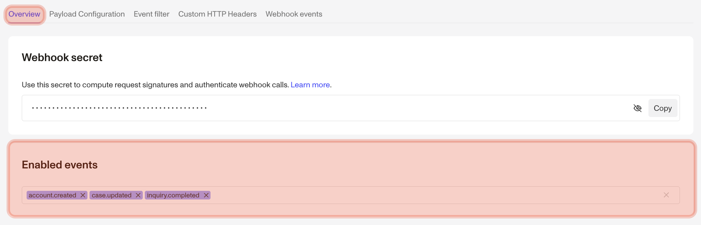
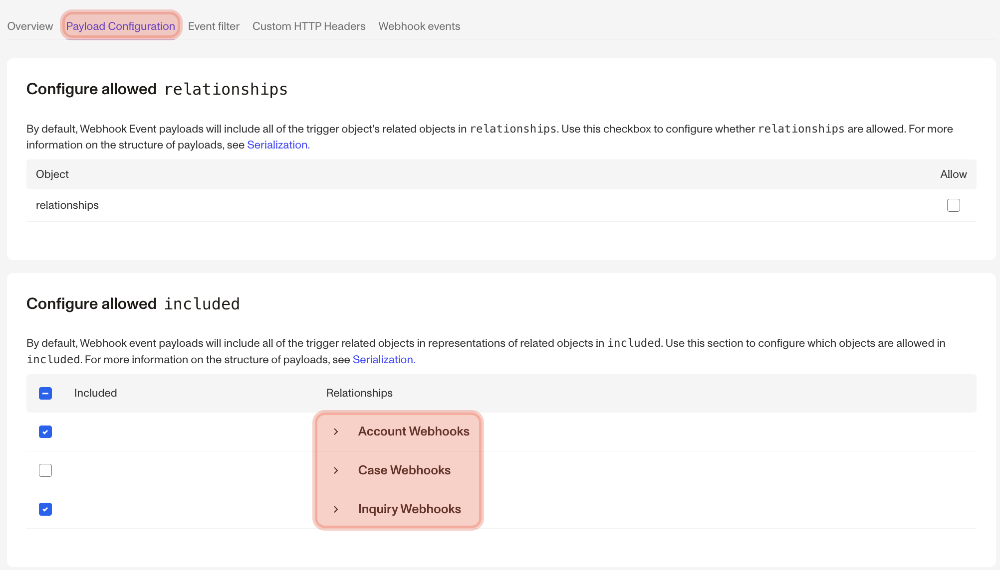
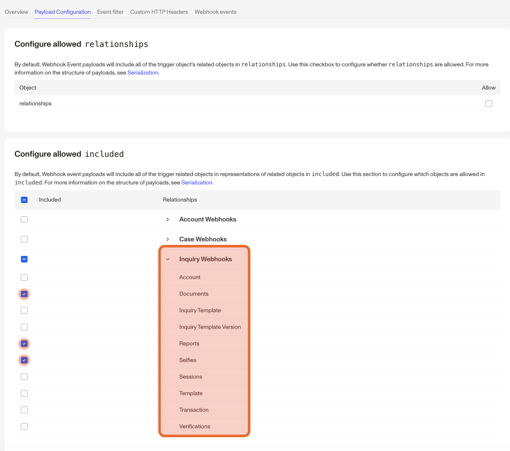
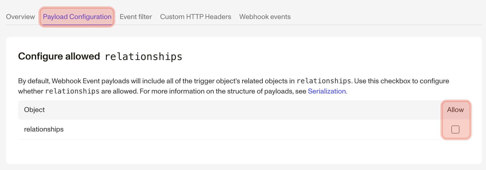

# Webhook Allowlists

Configure allowed information in Webhook Event payloads

If you want to control which information gets sent to your server via webhooks, you can configure allowlists via the Payload Configuration tab. To view and edit allowlist settings, visit your [Webhooks page](https://app.withpersona.com/dashboard/webhooks) in the Dashboard and click into a particular webhook to view its configuration.

## Included Allowlist

The Included Allowlist controls which related objects are present under the `included` key of the webhook payload. By default, Webhook Event payloads will NOT include the trigger object’s related objects in `included`. Configuration is per event type. For example, if your webhook is enabled for `account.created`, `case.updated`, and `inquiry.completed` events as so:



Then the Dashboard will display a corresponding Account, Case, and Inquiry Webhooks section in the Payload Configuration tab:



Allowlists allow you to granularly configure which specific objects you want in the `included` portion of a webhook event payload. Configuration of the allowlist is done by event type, this means that for whichever events your webhook is enabled to trigger on, you can pick specific relationships for the base object (e.g. Inquiry, Report, etc.) to allowlist.

### How it works

The top-level checkbox for each webhook section (e.g., Inquiry Webhooks) allows you to include all relationships or none. Each child checkbox corresponding to the relationships for an object lets you handpick which specific relationships you would like to allow in the `included` payload.

For more information on the structure of payloads, see [Response Body](./serialization.md).

### Example

Let’s say you have a Webhook with the `inquiry.approved` Event enabled. This would lead to the Inquiry Webhooks section being displayed in the Payload Configuration Tab.



The top-level checkbox for Inquiry Webhooks allows you to include all relationships or none. Each child checkbox corresponding to the relationships for an Inquiry allows you to handpick which specific relationships you would like to allow in the `included` payload.

This existing configuration would only include `document`, `reports`, and `selfie` objects for Inquiry Events. This means a triggered `inquiry.approved` event would result in the following payload under the `included` key:

```json
{
  "included": [
    {
      "type": "document/government-id",
      "id": "doc_qoULBi53y2JnxP67epzZv628FSYo",
      "attributes": { "..." : "..." },
      "relationships": { "..." : "..." }
    },
    {
      "type": "report",
      "id": "report_Abc123",
      "attributes": { "..." : "..." },
      "relationships": { "..." : "..." }
    },
    {
      "type": "selfie",
      "id": "selfie_XyZ789",
      "attributes": { "..." : "..." },
      "relationships": { "..." : "..." }
    }
  ]
}
```

## Relationship Allowlist

By default, Webhook Event payloads will include all of the trigger object’s related objects in `relationships`. You have the option of fully removing all `relationships` from webhook event payloads by deselecting the checkbox when viewing a webhook in your Dashboard.

#### Granular relationship configuration coming soon

More granular configuration options for relationships will be available in the future. Currently, this is an all-or-nothing option.

### Example

Let’s say you get the following information from a Webhook with the `inquiry.approved` [Event](./events.md) enabled:

```json
{
  "data": {
    "type": "event",
    "id": "evt_XGuYWp7WuDzNxie5z16s7sGJ",
    "attributes": {
      "name": "inquiry.approved",
      "payload": {
        "data": {
          "type": "inquiry",
          "id": "inq_XN8jxMoEhUeihzNypSaFKFfo",
          "attributes": {
            "status": "approved",
            "fields": {
              "birthdate": {
                "type": "date",
                "value": "1977-07-17"
              },
              "name-last": {
                "type": "string",
                "value": "Sample"
              },
              "name-first": {
                "type": "string",
                "value": "Alexander"
              }
            }
          },
          "relationships": {
            "account": {
              "data": {
                "type": "account",
                "id": "act_ABC123"
              }
            },
            "template": {
              "data": {
                "type": "template",
                "id": "tmpl_XYZ789"
              }
            }
          }
        }
      }
    }
  }
}
```



If you didn’t want to get any of the data in the `relationships` object, you could update your relationship allowlist to remove all relationships by deselecting the checkbox on the Payload Configuration screen in Dashboard, as shown above. The resulting payload would look like this:

```json
{
  "data": {
    "type": "event",
    "id": "evt_XGuYWp7WuDzNxie5z16s7sGJ",
    "attributes": {
      "name": "inquiry.approved",
      "payload": {
        "data": {
          "type": "inquiry",
          "id": "inq_XN8jxMoEhUeihzNypSaFKFfo",
          "attributes": {
            "status": "approved",
            "fields": {
              "birthdate": {
                "type": "date",
                "value": "1977-07-17"
              },
              "name-last": {
                "type": "string",
                "value": "Sample"
              },
              "name-first": {
                "type": "string",
                "value": "Alexander"
              }
            }
          }
        }
      }
    }
  }
}
```
