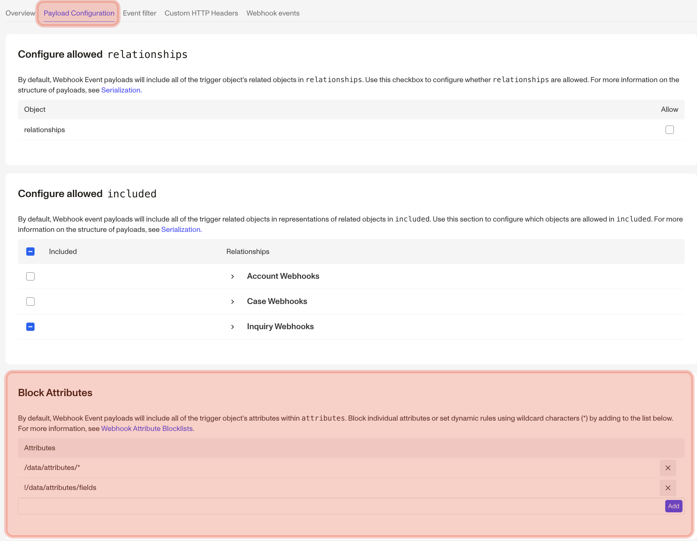

# Webhook Attribute Blocklists

Filter specific information from the payload for Webhook Events

If you don’t want certain information to get to your server via webhooks, you can configure blocklists via the Payload Configuration tab. To view and edit a particular blocklist, visit your [Webhooks page](https://app.withpersona.com/dashboard/webhooks) in the Dashboard and click into a particular webhook to view its configuration.



## Attribute Blocklist

In order to filter out individual attributes, you can add specific attributes to your Attribute Blocklist.

### Example

Let’s say you get the following information from a Webhook with the `inquiry.approved` [Event](./events.md) enabled:

```json
{
  "data": {
    "type": "event",
    "id": "evt_XGuYWp7WuDzNxie5z16s7sGJ",
    "attributes": {
      "name": "inquiry.approved",
      "payload": {
        "data": {
          "type": "inquiry",
          "id": "inq_XN8jxMoEhUeihzNypSaFKFfo",
          "attributes": {
            "status": "approved",
            "fields": {
              "birthdate": {
                "type": "date",
                "value": "1977-07-17"
              },
              "name-last": {
                "type": "string",
                "value": "Sample"
              },
              "name-first": {
                "type": "string",
                "value": "Alexander"
              },
              "..." : "..."
            },
            "...": "..."
          }
        }
      }
    }
  }
}
```

If you didn’t want to get the name of the individual, you could add `name-first` and `name-last` to your blocklist, and the resulting payload would look like this.

```json
{
  "data": {
    "type": "event",
    "id": "evt_XGuYWp7WuDzNxie5z16s7sGJ",
    "attributes": {
      "name": "inquiry.approved",
      "payload": {
        "data": {
          "type": "inquiry",
          "id": "inq_XN8jxMoEhUeihzNypSaFKFfo",
          "attributes": {
            "status": "approved",
            "fields": {
              "birthdate": {
                "type": "date",
                "value": "1977-07-17"
              },
              "..." : "..."
            },
            "...": "..."
          }
        }
      }
    }
  }
}
```

#### Attribute Blocklists only block data within `attributes`

The `relationships` and `included` hashes will still include object IDs and object types, even when using a blocklist.

## Simple syntax

In the example at the top the `name-first` and `name-last` use the simple syntax. If that key matches anything on any object, it will not be returned to you. You can also use a `*` which operates as a wildcard to match multiple values (e.g. `name-*` which matches `name-first` and `name-last`, or another common use is `address-*`).

```
email-address
birthdate
name-*
address-*
```

#### Attribute name blocklists are case-convention insensitive

Whether you’re using snake-case, kebab-case, or camel-case, the attributes will be blocked regardless of how your keys are inflected (e.g. `email-address`, `emailAddress`, or `email_address` will block all variants of the email address key).

## Fully qualified syntax

You might not always want to filter out a value, for example you might want the value when you retrieve the Verification but not the Inquiry. One way to accomplish this is to use the fully qualified path in the payload. In the original example, if you want to filter out the name for just Inquiries, your blocklist might look like this.

```
/data/attributes/fields/name-*?type=inquiry
```

The path uses each key on the JSON payload as a step in a URI-like path. The optional `type` parameter is how you can specify to which type of object the blocklist entry should apply.

**Exact match**

```
/data/attributes/birthdate
/included/attributes/email-address
```

**Wildcard match**

```
/data/attributes/fields/name-*
/included/attributes/fields/*-number
```

**Wildcard match on paths**

This can be used to block attributes from both `/data/` and `/included/`

```
/*/attributes/fields/phone-number
```

**With `type` parameter**

```
/data/attributes/fields/selected-country-code?type=inquiry
/included/attributes/fields/identification-class?type=case
```

## Blocklist exemptions

You can also exempt attributes from blocklists. Combined with wildcards (`*`), this can enable you to create allowlists of attributes instead. Note that exceptions always take precedence over blocklisted items, regardless of the order.

Blocklist exemptions are prefixed with an exclamation mark `!`. Exemptions support all of the options above including wildcards and the optional `type` parameter.

**Example**

```
/data/attributes/*

!/data/attributes/email-address
!/data/attributes/phone-number
!/data/attributes/name-*
!/data/attributes/address-*?type=inquiry
```

## Nested blocklist exemptions

If the attributes that you want to exempt from the blocklist are within nested JSON (i.e. anything within `data/attributes/fields`), you need to allow the nested JSON key, block everything _inside_ the nested JSON, and then exempt the attributes you want.

**Example**

```
/data/attributes/*

!/data/attributes/fields <-- allows `fields` (overrides the /data/attributes/* block above)
/data/attributes/fields/* <-- blocks everything within `fields`
!/data/attributes/fields/selected-country-code <-- allows `selected-country-code` within `fields`
```
