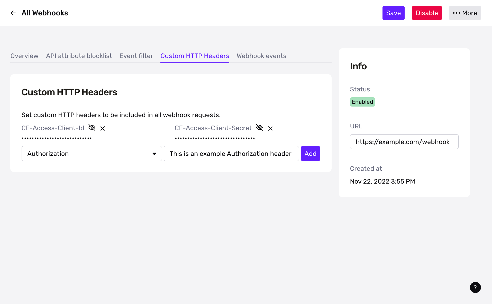
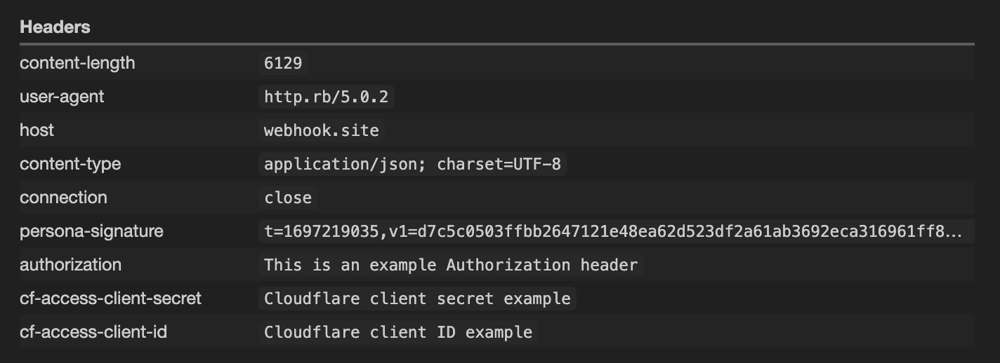

# Webhook Custom HTTP Headers

Set custom headers on webhook requests

#### Enterprise support

This feature is restricted to customers on the Enterprise plan. Please reach out to your Account Team or [contact us](https://app.withpersona.com/dashboard/contact-us) if you are interested in enabling and setting up this feature.

## Description

Webhook Custom HTTP Headers allow Developers to set static HTTP header key/values with their Webhook Events.

This can be configured via [Dashboard](https://withpersona.com/dashboard) and the [create](./api-reference/webhooks/create-a-webhook.md) or [update](./api-reference/webhooks/update-a-webhook.md) a Webhook APIs.

*setting custom HTTP headers in Dashboard*

*viewing custom HTTP headers*
