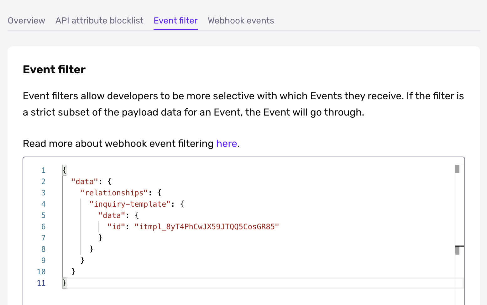

# Webhook Event Filters

Only have a subset of Events come through

#### Enterprise support

This feature is restricted to customers on the Enterprise plan. Please reach out to your Account Team or [contact us](https://app.withpersona.com/dashboard/contact-us) if you are interested in enabling and setting up this feature.



## Description

Webhook Event Filters allow developers to be more selective with which [Events](./events.md) they receive. If the filter is a strict subset of the `payload` data for an Event, the Webhook Event will go through. Otherwise, the Webhook Event will change to `skipped`.

## Examples

Note that the examples below assume a webhook configured with Kebab-case key inflection!

Let’s say that you only want `inquiry.complete` events that are related to specific Inquiry Templates.

On the Webhook create/edit modal, you’d put in JSON similar to the following:

```json
{
  "data": {
    "relationships": {
      "inquiry-template": {
        "data": {
          "id": "itmpl_abc123def456"
        }
      }
    }
  }
}
```

This would permit an event like the following, ensuring only `inquiry.complete` payloads associated with the correct template are triggered.

```json
{
  "data": {
    "type": "event",
    "id": "evt_Xzh192s6ZKyUVVf3L7Ynz82M",
    "attributes": {
      "name": "inquiry.completed",
      "payload": {
        "data": {
          "type": "inquiry",
          "id": "inq_J95Dw2iV4H9spDDCqCJNHS7b",
          "attributes": {
            "status": "completed",
            "...": "..."
          },
          "relationships": {
            "inquiry-template": {
              "data": {
                "type": "inquiry-template",
                "id": "itmpl_abc123def456"
              }
            },
            "...": "..."
          }
        }
      }
    }
  }
}
```

## Designing an event filter

If you look at the object in the `payload` of an [Event](./events.md), you might see something like this.

```json
{
  "data": {
    "type": "inquiry",
    "id": "inq_XN8jxMoEhUeihzNypSaFKFfo",
    "attributes": {
      "status": "completed",
      "reference-id": null,
      "...": "...",
      "fields": {
        "address-country-code": {
          "type": "string",
          "value": "US"
        },
        "...": "..."
      }
    },
    "relationships": {
      "inquiry-template": {
        "data": {
          "type": "inquiry-template",
          "id": "itmpl_abc123def456"
        }
      },
      "...": "..."
    }
  }
}
```

Decide on a particular value that you’re interested in. Let’s say it’s that the Inquiry had a country code of `US`. You’d then delete everything in the JSON object until only the key/value `"value": "US"` remained and all of the objects that contain it.

You would end up with the following filter for Inquiries with US addresses.

```json
{
  "data": {
    "attributes": {
      "fields": {
        "address-country-code": {
          "value": "US"
        }
      }
    }
  }
}
```

## Matching against arrays

To match against an array in your payload, make an array with the elements you want to check for.

Matching on Inquiries with a tag named “INBOUND” would look like this.

```json
{
  "data": {
    "attributes": {
      "tags": [
        "INBOUND"
      ]
    }
  }
}
```

If you wanted to only receive Events with an “INBOUND” and “CAMPAIGN ABC” tags, you’d make the following.

```json
{
  "data": {
    "attributes": {
      "tags": [
        "INBOUND",
        "CAMPAIGN ABC"
      ]
    }
  }
}
```

## `$or` operator

To allow for multiple criteria, use the `$or` operator. It can be used on a list of values or JSON object literals.

Value example:

```json
{
  "data": {
    "relationships": {
      "inquiry-template": {
        "data": {
          "id": {
            "$or": [
              "itmpl_abc123def456",
              "itmpl_ghi789jkl012"
            ]
          }
        }
      }
    }
  }
}
```

Hash example:

```json
{
  "data": {
    "relationships": {
      "$or": [
        {
          "inquiry-template": {
            "data": {
              "id": "itmpl_abc123def456"
            }
          }
        },
        {
          "template": {
            "data": {
              "id": "tmpl_foo999bar888"
            }
          }
        }
      ]
    }
  }
}
```
