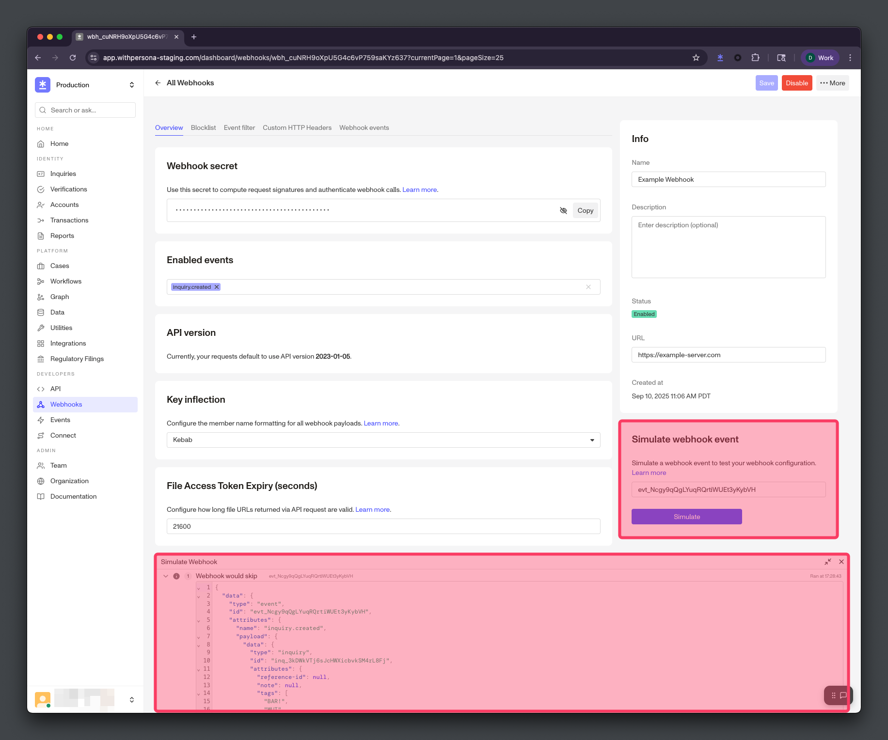

# Webhook Event Simulation

Test your Webhook's configurations

Simulating a Webhook Event lets you preview how your Webhook will behave for a specific Event without waiting for another Event to occur. Simulation uses the same serialization and business logic as actual Webhook Event delivery, making it helpful for testing Webhook configurations and debugging delivery issues.

## How simulation works

##### No actual delivery

Webhook Event simulation shows you previews of your Webhook Events based on your Webhook’s configurations. Simulation does not deliver actual Webhook Events to your Webhook’s server URL.

Webhook Event simulation displays a sample Webhook Event that mimics the real delivery process without sending an actual request to your endpoint. The simulation:

-   **Generates the payload** - Creates the exact payload that would be sent, based on serialization, [attribute blocklists](./webhook-attribute-blocklists.md), and API versioning.
-   **Applies business logic** - Checks if the Event is enabled for the Webhook and whether the payload would pass any configured [filters](./webhook-event-filters.md).
-   **Returns the outcome** - Shows you whether the Webhook Event would deliver or skip, without actually delivering the Webhook Event.

## Simulation outcomes

The simulation will return one of three outcomes:

-   **Webhook would deliver** - The Webhook Event is enabled and would successfully deliver to your endpoint.
-   **Webhook would skip** - The Webhook Event is enabled, but would skip due to configured [filters](./webhook-event-filters.md) not matching the payload.
-   **Event not enabled for Webhook** - The specified Event type is not enabled for this Webhook.

## How to simulate

1.  **Provide an event ID** - Provide a valid Event ID (can be found in your dashboard’s [events tab](https://app.withpersona.com/dashboard/events)) to simulate for your webhook.
2.  **Click simulate** - Click the Simulate button to run the simulation.
3.  **Review outcome** - Check the simulated Webhook Event’s payload, as well as whether it would deliver or skip.

