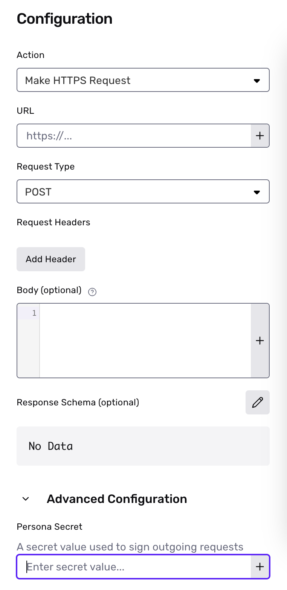

# Workflows Best Practices

## Checking signatures for `Make HTTPS Request` steps

When creating a `Make HTTPS Request` step, you can configure the step to provide a `Persona-Signature` header with an HMAC for all POST requests. This header can be used to check that a request is authentic and safe to process by comparing the value with your own digest, computed from the request body and a configurable secret value.

You can configure the secret value by expanding the Advanced Configuration setting when creating a new `Make HTTPS Request` step.

If you are already authenticating requests for webhooks to this endpoint, you can reuse the same code to validate signatures. If you do, you should also set the `Make HTTPS Request` step secret to be the same as your webhook secret to ensure signatures continue to be validated properly



The `Persona-Signature` header contains two comma-separated key-value pairs encoding information about the request. The first key-value pair will be in the form `t=<unix_timestamp>` and represents the unix time that the request was sent. The second key-value pair will be in the form `v1=<signature>`, where the signature is computed from the configured secret value and a dot-separated string composed of the unix timestamp joined with the request body.

Sample code for checking signatures:

```
t, v1 = request.headers['Persona-Signature'].split(',').map { |value| value.split('=').second }
computed_digest = OpenSSL::HMAC.hexdigest('SHA256', <YOUR_WORKFLOW_STEP_SECRET>, "#{t}.#{request.body.read}")

if v1 == computed_digest
  # Handle verified webhook event
end
```

#### Parsing JSON when Computing HMACs

In some languages, parsing the JSON may result in something that’s not equivalent to the event body. For example, JavaScript may round floats and reduce precision. We recommend using the raw event body when computing the HMAC.

## When to use Wait steps

[Wait steps](./workflows.md#asynchronous-activity) can result in workflow runs that take a long time to process. In order to prevent long running workflow runs, wait steps have a 30 day limit for their resolution time.

1.  **Wait on objects**: If the event(s) being waited on for the object do not occur within 30 days, the wait step will automatically resolve.
2.  **Wait for time**: The maximum amount of time allowed is 30 days.

If you have scenarios where you need to wait longer than 30 days, we recommend creating a workflow with a Scheduled trigger, and using the `Schedule Workflow Run` action.
