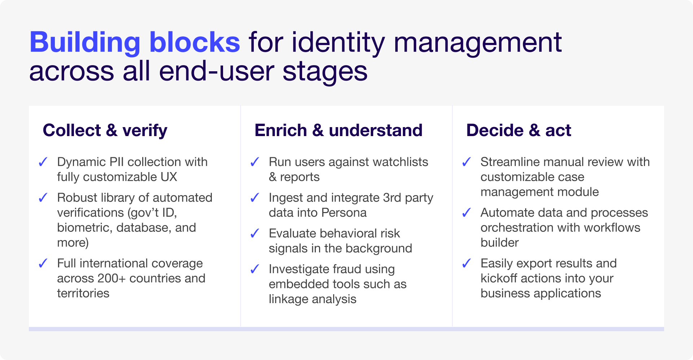
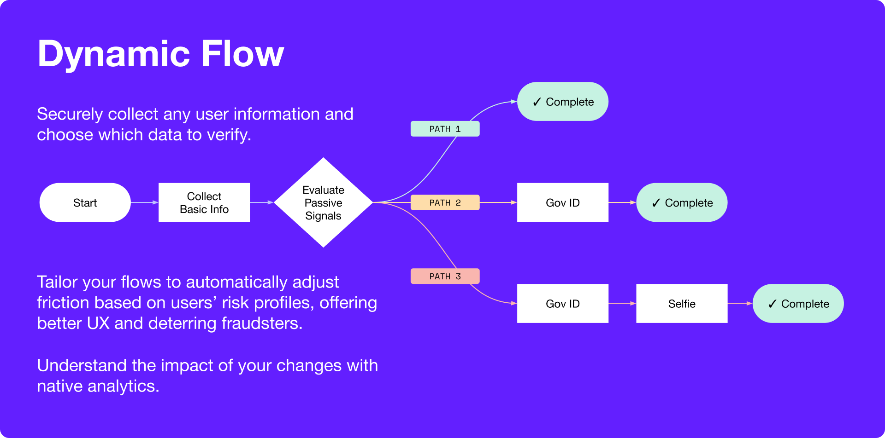
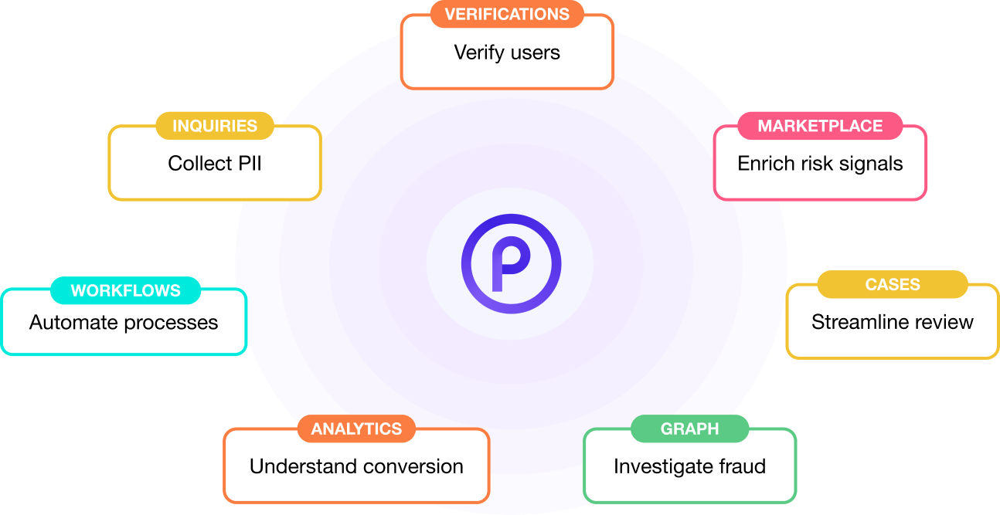

# Persona 101: The Comprehensive Identity Management Platform

[Video: Vimeo](https://player.vimeo.com/video/857507234)

# Persona 101: The comprehensive identity management platform

Persona is a comprehensive identity management platform with products that work like building blocks. You can configure them to suit your business needs and manage identities from end to end.

## Breaking down identity management

Persona breaks identity management down into its component parts, enabling you to build custom identity management processes that suit your operations. You can build multiple processes for different use cases and products.

With Persona, you can:

-   Dynamically collect PII (personally identifiable information) within customizable UI
-   Verify PII
-   Enrich PII
-   Analyze PII
-   Make decisions based on PII analyses
-   Integrate third-party data for additional insights
-   Evaluate behavioral risk signals and automate decisions using customizable workflows

### What’s dynamic data collection?

As Ed mentioned in the video above, Persona allows you to collect PII “dynamically.” This means that you can tell Persona to add friction to a flow when it detects risk, deterring fraudsters—all while keeping things easy for trusted end-users.

You can collect PII as often as needed throughout your product lifecycle. You can even configure Persona to automate real-time Verifications, analyses, risk evaluations, decisions, and other embedded tools whenever it collects new PII.

### Our platform at a glance

Persona powers all of your identity operations in **one** place. To learn more about every product we offer, see below.

<table style="border:none;border-collapse:collapse;"><colgroup><col width="370"><col width="333"></colgroup><tbody><tr style="height:0pt"><td style="border-left:solid #efefef 0.5pt;border-right:solid #efefef 0.5pt;border-bottom:solid #efefef 0.5pt;border-top:solid #efefef 0.5pt;vertical-align:top;padding:5pt 5pt 5pt 5pt;overflow:hidden;overflow-wrap:break-word;">
<strong>Inquiries</strong> (<a href="https://withpersona.com/product/dynamic-flow" style="text-decoration-line: none;"><strong>Dynamic Flow</strong></a> and <a href="https://withpersona.com/product/flow-editor" style="text-decoration-line: none;"><strong>Flow Editor</strong></a>)
</td><td style="border-left:solid #efefef 0.5pt;border-right:solid #efefef 0.5pt;border-bottom:solid #efefef 0.5pt;border-top:solid #efefef 0.5pt;vertical-align:top;padding:5pt 5pt 5pt 5pt;overflow:hidden;overflow-wrap:break-word;">
Securely collect PII through branded user flows and adjust friction based on real-time risk signals.
</td></tr><tr style="height:0pt"><td style="border-left:solid #efefef 0.5pt;border-right:solid #efefef 0.5pt;border-bottom:solid #efefef 0.5pt;border-top:solid #efefef 0.5pt;vertical-align:top;padding:5pt 5pt 5pt 5pt;overflow:hidden;overflow-wrap:break-word;">
<a href="https://withpersona.com/product/verifications/government-id" style="text-decoration-line: none;"><strong>Verifications</strong></a>
</td><td style="border-left:solid #efefef 0.5pt;border-right:solid #efefef 0.5pt;border-bottom:solid #efefef 0.5pt;border-top:solid #efefef 0.5pt;vertical-align:top;padding:5pt 5pt 5pt 5pt;overflow:hidden;overflow-wrap:break-word;">
Verify PII, selfies, and documents across 200+ countries and regions.
</td></tr><tr style="height:0pt"><td style="border-left:solid #efefef 0.5pt;border-right:solid #efefef 0.5pt;border-bottom:solid #efefef 0.5pt;border-top:solid #efefef 0.5pt;vertical-align:top;padding:5pt 5pt 5pt 5pt;overflow:hidden;overflow-wrap:break-word;">
<a href="https://withpersona.com/solutions/persona-marketplace" style="text-decoration-line: none;"><strong>Marketplace</strong></a>
</td><td style="border-left:solid #efefef 0.5pt;border-right:solid #efefef 0.5pt;border-bottom:solid #efefef 0.5pt;border-top:solid #efefef 0.5pt;vertical-align:top;padding:5pt 5pt 5pt 5pt;overflow:hidden;overflow-wrap:break-word;">
Build a more comprehensive picture of your users with our robust library of no-code partner integrations.
</td></tr><tr style="height:0pt"><td style="border-left:solid #efefef 0.5pt;border-right:solid #efefef 0.5pt;border-bottom:solid #efefef 0.5pt;border-top:solid #efefef 0.5pt;vertical-align:top;padding:5pt 5pt 5pt 5pt;overflow:hidden;overflow-wrap:break-word;">
<a href="https://withpersona.com/product/cases" style="text-decoration-line: none;"><strong>Cases</strong></a>
</td><td style="border-left:solid #efefef 0.5pt;border-right:solid #efefef 0.5pt;border-bottom:solid #efefef 0.5pt;border-top:solid #efefef 0.5pt;vertical-align:top;padding:5pt 5pt 5pt 5pt;overflow:hidden;overflow-wrap:break-word;">
Streamline case review with hyper-tailored case views and templates.
</td></tr><tr style="height:0pt"><td style="border-left:solid #efefef 0.5pt;border-right:solid #efefef 0.5pt;border-bottom:solid #efefef 0.5pt;border-top:solid #efefef 0.5pt;vertical-align:top;padding:5pt 5pt 5pt 5pt;overflow:hidden;overflow-wrap:break-word;">
<strong>Analytics</strong> (all products)
</td><td style="border-left:solid #efefef 0.5pt;border-right:solid #efefef 0.5pt;border-bottom:solid #efefef 0.5pt;border-top:solid #efefef 0.5pt;vertical-align:top;padding:5pt 5pt 5pt 5pt;overflow:hidden;overflow-wrap:break-word;">
Run analytics on all products in Persona’s dashboard to <a href="https://help.withpersona.com/articles/6wdZdwn9m4T8eY7EfqWRmB/" style="text-decoration-line: none;">understand conversion rates</a>, <a href="https://help.withpersona.com/articles/7BOHplbhL1eCKfX45iJgva/" style="text-decoration-line: none;">case review performance</a>, <a href="https://help.withpersona.com/articles/4EPdW2jxFFfKNM4jiQUBkn/" style="text-decoration-line: none;">verification pass rates</a>, and more.
</td></tr><tr style="height:0pt"><td style="border-left:solid #efefef 0.5pt;border-right:solid #efefef 0.5pt;border-bottom:solid #efefef 0.5pt;border-top:solid #efefef 0.5pt;vertical-align:top;padding:5pt 5pt 5pt 5pt;overflow:hidden;overflow-wrap:break-word;">
<a href="https://withpersona.com/product/graph" style="text-decoration-line: none;"><strong>Graph</strong></a>
</td><td style="border-left:solid #efefef 0.5pt;border-right:solid #efefef 0.5pt;border-bottom:solid #efefef 0.5pt;border-top:solid #efefef 0.5pt;vertical-align:top;padding:5pt 5pt 5pt 5pt;overflow:hidden;overflow-wrap:break-word;">
Uncover and proactively block fraud rings, from promo abuse to money laundering to duplicate accounts.
</td></tr><tr style="height:0pt"><td style="border-left:solid #efefef 0.5pt;border-right:solid #efefef 0.5pt;border-bottom:solid #efefef 0.5pt;border-top:solid #efefef 0.5pt;vertical-align:top;padding:5pt 5pt 5pt 5pt;overflow:hidden;overflow-wrap:break-word;">
<a href="https://withpersona.com/product/workflows" style="text-decoration-line: none;"><strong>Workflows</strong></a>
</td><td style="border-left:solid #efefef 0.5pt;border-right:solid #efefef 0.5pt;border-bottom:solid #efefef 0.5pt;border-top:solid #efefef 0.5pt;vertical-align:top;padding:5pt 5pt 5pt 5pt;overflow:hidden;overflow-wrap:break-word;">
Automate your identity management processes, making them as simple or as complex as you need them to be.
</td></tr></tbody></table>

Persona’s [Growth](../../landing/pricing.md) and [Enterprise plans](../../landing/pricing.md) provide access to implementation support that can help your team choose products and configure them to serve your business.

### Up next

We’ll explore how Elephant Credit, a fictitious company, uses Persona to perform KYC checks on their customers.

Track your progress

You must be logged into the Persona Dashboard to track your progress on this course. Once you’ve logged in, please refresh this page.

[

Login to Dashboard

](https://app.withpersona.com/dashboard)

Track your progress

You must be logged into the Persona Dashboard to track your progress on this course. Once you’ve logged in, please refresh this page.

[

Login to Dashboard

](https://app.withpersona.com/dashboard)

## Your course progress

[

Lesson 1

To do

4 min

Persona 101: The Comprehensive Identity Management Platform

](./persona-101/lesson-1.md)[

Lesson 2

To do

2 min

Persona's key concepts

](./persona-101/lesson-2.md)[

Lesson 3

To do

3 min

Inquiries overview

](./persona-101/lesson-3.md)[

Lesson 4

To do

4 min

Inquiries Flow Editor

](./persona-101/lesson-4.md)[

Lesson 5

To do

7 min

Demo - Inquiry Flow Editor

](./persona-101/lesson-5.md)[

Lesson 6

To do

5 min

What are Verification Checks?

](./persona-101/lesson-6.md)[

Lesson 7

To do

2 min

Accounts overview

](./persona-101/lesson-7.md)[

Lesson 8

To do

3 min

The Importance of KYC for marketplaces

](./persona-101/lesson-8.md)[

Lesson 9

To do

2 min

Incorrect extraction? Learn how to report it

](./persona-101/lesson-9.md)[

Lesson 10

To do

5 min

What are Reusuable Personas?

](./persona-101/lesson-10.md)
