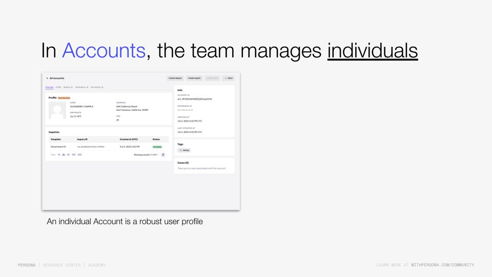
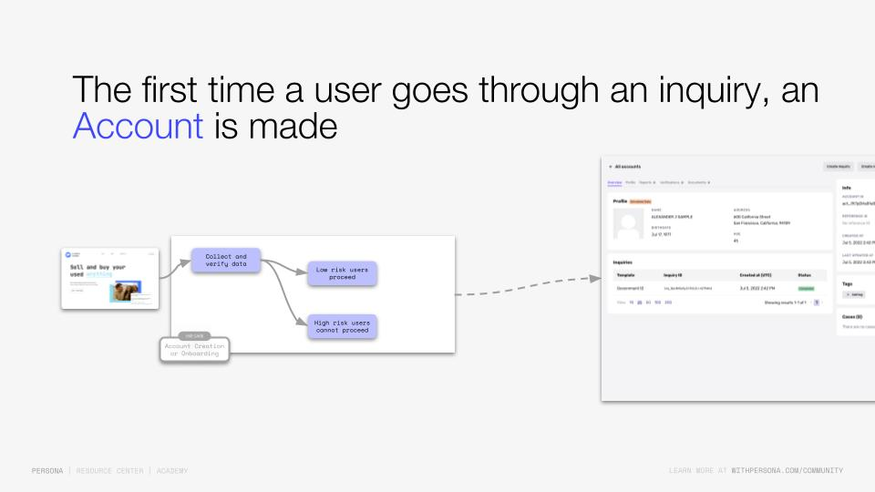
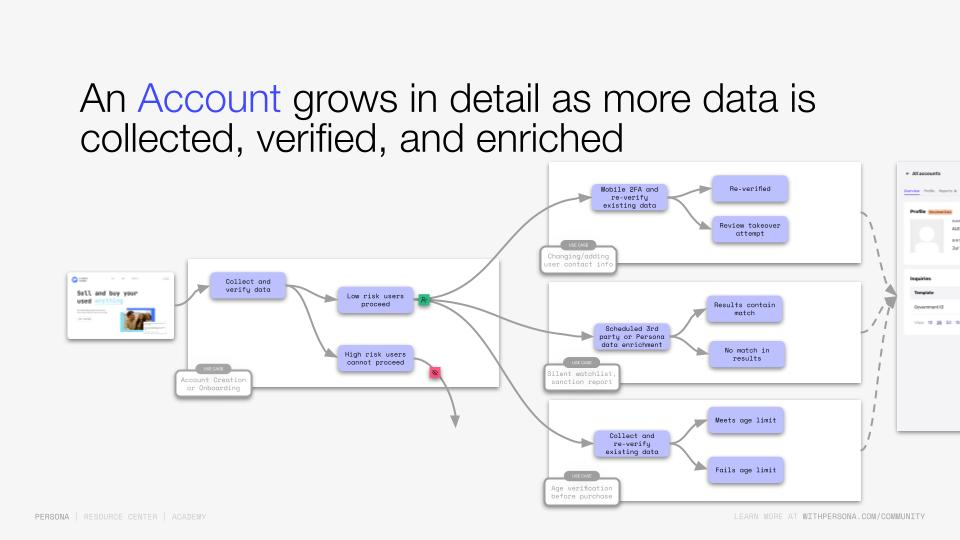

# Accounts overview

[Video: Vimeo](https://player.vimeo.com/video/857509461)

Persona's [Accounts](../articles/2gE7mjjLCIGJPnK6mTyjU9.md) is a product that enables businesses to view the comprehensive history of interactions with an individual over time.

This provides a continuous representation of an individual within the Persona system. As businesses collect more information about an individual, it aggregates to the account, tying all inquiries, documents, and reports back to a specific individual.

The ability to track all your customer’s interactions throughout their lifecycle and compare that information is what makes Accounts so powerful at Persona.

So going back to the Elephant Co. example:

They are collecting and verifying certain information from their users as part of their onboarding, when they first sign up.

Then, say 6 months from now, they’re trying to make a large withdrawal or change some sensitive information in their account.

Elephant Co. can collect and verify additional information. They would run a new inquiry, perhaps just asking them to submit a new selfie.

And through [Accounts](../articles/2gE7mjjLCIGJPnK6mTyjU9.md), they can compare and match the recently collected selfie inquiry against the initial government ID and selfie inquiry that was submitted when going through the onboarding flow 6 months ago.

Therefore, they reverify their user with a different verification type to better support the new point in the user journey.

Track your progress

You must be logged into the Persona Dashboard to track your progress on this course. Once you’ve logged in, please refresh this page.

[

Login to Dashboard

](https://app.withpersona.com/dashboard)

Track your progress

You must be logged into the Persona Dashboard to track your progress on this course. Once you’ve logged in, please refresh this page.

[

Login to Dashboard

](https://app.withpersona.com/dashboard)

## Your course progress

[

Lesson 1

To do

2 min

Accounts overview

](./verifying-users-with-persona-implementation-advanced/lesson-1.md)[

Lesson 2

To do

6 min

Embedded Flow Quickstart Guide

](./verifying-users-with-persona-implementation-advanced/lesson-2.md)[

Lesson 3

To do

5 min

Intro to Persona's User Verification Model

](./verifying-users-with-persona-implementation-advanced/lesson-3.md)[

Lesson 4

To do

4 min

Understanding Inquiry Results: Multi-Product Implementation

](./verifying-users-with-persona-implementation-advanced/lesson-4.md)[

Lesson 5

To do

6 min

Investigate Inquiry statuses and Workflow decisioning

](./verifying-users-with-persona-implementation-advanced/lesson-5.md)[

Lesson 6

To do

5 min

Automating Case Creation and Managing Cases

](./verifying-users-with-persona-implementation-advanced/lesson-6.md)[

Lesson 7

To do

5 min

Blocking known fraudsters using Lists and Workflows

](./verifying-users-with-persona-implementation-advanced/lesson-7.md)[

Lesson 8

To do

4 min

Webhooks and Persona Events

](./verifying-users-with-persona-implementation-advanced/lesson-8.md)
