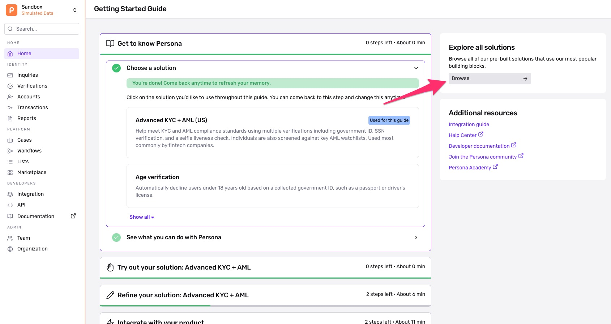

# First step: Adding a solution to your Persona instance

[Video: Vimeo](https://player.vimeo.com/video/919819622)

Welcome to our lesson on adding a solution to your Persona account. This is the first step to get you ready to start testing your solution.

A solution is a sort of a template that has some presets for identity verification.

Depending on your plan, you can create multiple solutions for KYC with more complex steps, watchlist reports, SSN, or even KYB solutions.

**Getting Started:**

Begin by logging into your Persona Dashboard. It's important to ensure you're operating within your Sandbox environment. This environment allows you to test and tweak solutions without affecting your live setup.

To switch to your Sandbox environment, use the environment selector located at the top of the dashboard.

**Navigating to Solutions:**

From the Home page, you'll see an option "Explore all solutions." Click on 'Browse' this to view the available Persona solutions tailored to various use cases.

Browse through the solutions to find the one that best fits your needs.

Each solution is designed to solve specific challenges, so take your time to understand what each offers.

**Adding a Solution:**

When you've made your choice, click on "Add to sandbox" to incorporate this solution into your environment.

This step is crucial as it enables you to test and familiarize yourself with the solution's capabilities without impacting your live operations.

**Customizing and Exploring Your Solution:**

After adding the solution, click on it to access detailed instructions for exploration and integration.

To further customize and experiment with your solution, navigate to "Inquiries" -> "Templates" from the menu.

There you can see your added solution and make any adjustments to fit your workflow better.

**Accessing Your Solution:**

Back on the Home page, under 'Explore your solutions', you will find the solution you've just added. Clicking on this solution will provide you with the instructions needed for exploration and integration, helping you make the most out of your Persona experience.

If you are on the Startup Program or Essentials plan, the solutions available will be more limited.

Contact [our sales team](../../landing/contact.md) if you're interested in additional solutions for your account.

Track your progress

You must be logged into the Persona Dashboard to track your progress on this course. Once you’ve logged in, please refresh this page.

[

Login to Dashboard

](https://app.withpersona.com/dashboard)

Track your progress

You must be logged into the Persona Dashboard to track your progress on this course. Once you’ve logged in, please refresh this page.

[

Login to Dashboard

](https://app.withpersona.com/dashboard)

## Your course progress

[

Lesson 1

To do

2 min

First step: Adding a solution to your Persona instance

](./verifying-users-with-persona-implementation-basic/lesson-1.md)[

Lesson 2

To do

2 min

How environments work in Persona

](./verifying-users-with-persona-implementation-basic/lesson-2.md)[

Lesson 3

To do

5 min

Implementation Methods

](./verifying-users-with-persona-implementation-basic/lesson-3.md)[

Lesson 4

To do

4 min

Hosted Flow Quickstart Guide

](./verifying-users-with-persona-implementation-basic/lesson-4.md)[

Lesson 5

To do

3 min

Inquiries overview

](./verifying-users-with-persona-implementation-basic/lesson-5.md)[

Lesson 6

To do

3 min

Configuring your Inquiry template

](./verifying-users-with-persona-implementation-basic/lesson-6.md)[

Lesson 7

To do

4 min

Understanding Inquiry Results: Basic Implementation

](./verifying-users-with-persona-implementation-basic/lesson-7.md)[

Lesson 8

To do

4 min

Inquiry Lifecycle and Statuses

](./verifying-users-with-persona-implementation-basic/lesson-8.md)[

Lesson 9

To do

5 min

What are Verification Checks?

](./verifying-users-with-persona-implementation-basic/lesson-9.md)[

Lesson 10

To do

3 min

Testing your Persona flow

](./verifying-users-with-persona-implementation-basic/lesson-10.md)[

Lesson 11

To do

7 min

Demo - Inquiry Flow Editor

](./verifying-users-with-persona-implementation-basic/lesson-11.md)[

Lesson 12

To do

2 min

Incorrect extraction? Learn how to report it

](./verifying-users-with-persona-implementation-basic/lesson-12.md)
