# Running reports and reviewing matches

## Overview

Persona offers a variety of [Reports](../reports/features/report-service-types.md), which allow you to supplement the information submitted by an individual via an Inquiry.

This guide covers how you might run reports and subsequently review the reports for potential matches. More specifically, we'll elaborate more on what is covered in [Creating Reports](./3qGLZYtRNreVNZHxXAZqhw.md) and walk you through the most commons ways that organizations set up a process for reviewing their reports for matches including:

-   Running a Report manually
    -   via manual input
    -   via CSV in bulk
    -   via other products
-   Run a Report automatically
    -   via Workflow after Inquiry completes
    -   Extend the Workflow to also mark Inquiry for review
    -   Extend the Workflow to also create a Case for manual review

✍🏻 The recommended way to [create Reports is through Workflows](./20fGyKJCYgiR9NMY9nlKkN.md) to ensure that you are programmatically creating them based on pre-defined business logic.

## Run a Report Manually

Running a Report manually is helpful when you only need to run Reports for special cases or on an occasional, ad-hoc basis.

### via Manual Input

You can run a Report manually via the Dashboard using the **Create report** button that is available when navigating to **Reports > All Reports**. After clicking **Create report**, enter the information about a user necessary to create a report from the desired Report template, and check for matches found.

1.  After clicking **Create report**, select the desired Report Template that you'd like to run the report from.

-   _Note: This will determine the [Report Type](./hI9YUPxjW7v46pFfyk6J1/%20%22Reports%20Overview%22.md) for the report you are trying to create._

2.  Enter the inputs (i.e. the user or entity's details) required to run a report from that Report template.

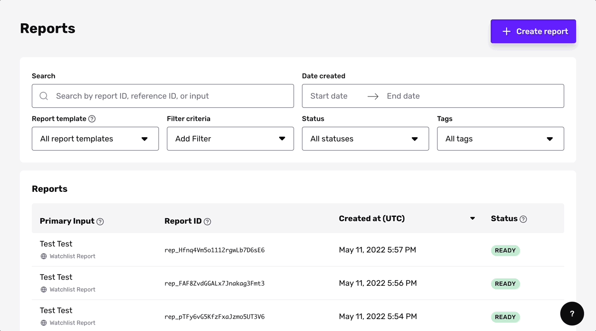

⚠️ If running a report manually, it is recommended to create a report from the specific Account page, if your organization is using the Accounts product. You can do so by navigating to and clicking Create report at the top right. By doing it this way, the Account's information allows you to initially prefills data from the Account as Report inputs for you and automatically attaches the report to the Account when the report is created.

### via CSV in bulk

You can upload a CSV of information (individual names, business names, email addresses, phone numbers, etc.) in a specified format using the **\+ Create report** button, and create reports in bulk. Learn more about the process [here](./1rzpXVJt1tTpRdhPuhaIkX.md).

### via Other products

As mentioned above, you can create additional reports in Accounts or Cases if you want more information on a given person and that person has an Account generated within Persona. Creating reports within Accounts and Cases has the added benefit of attaching it to the object that you are viewing when it is created.

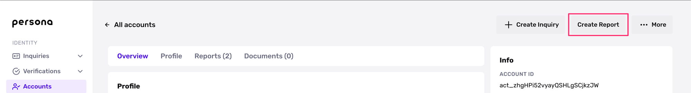

## Run a Report Automatically

### Workflow 1: Run Report after Inquiry completes

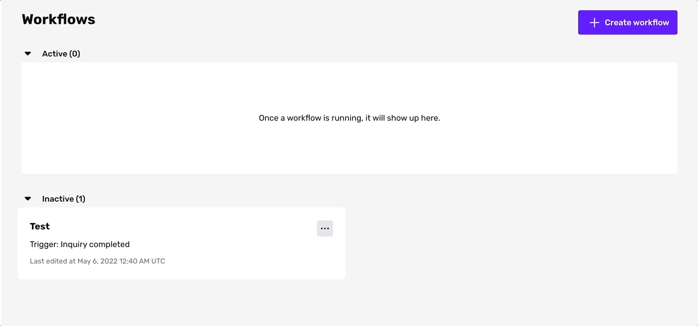

Use the **\+ Create workflow** button to begin automating Report runs. Select the Trigger type as "Event" and Trigger event as `inquiry.completed` to make this Workflow run on each completed Inquiry.

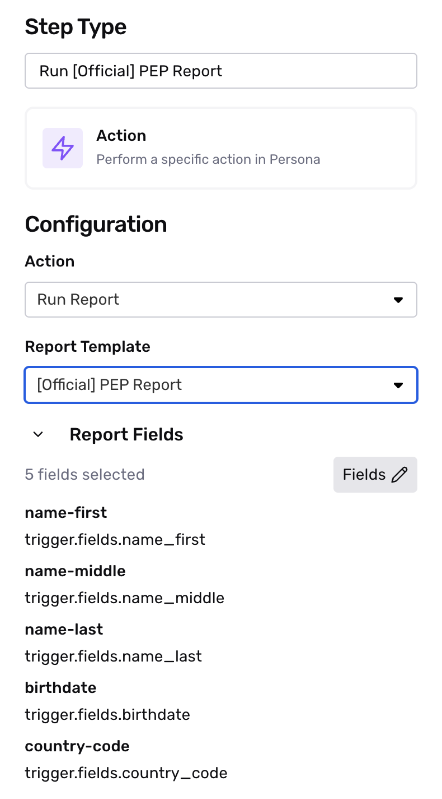

Use the Action Step in the Workflow to add “Run Report”. In this example Workflow, we run a Person Watchlist Report and a PEP Report after every completed Inquiry.

Here is what the completed Workflow looks like:

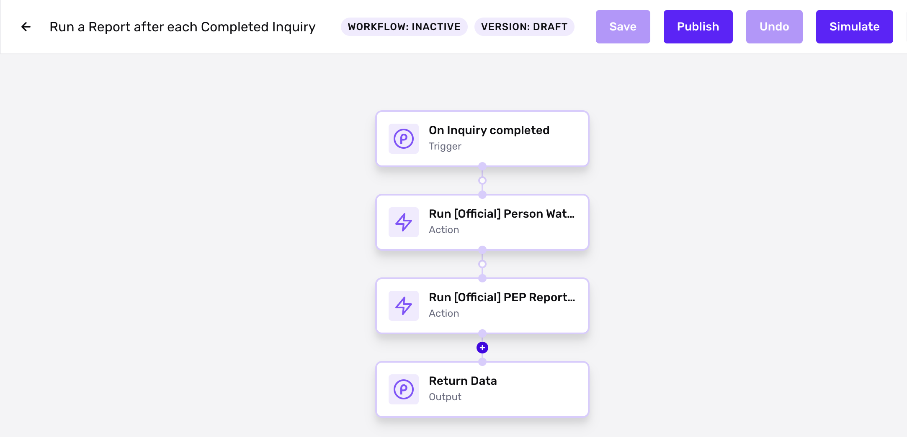

Publish the Workflow to automate running reports. You can manually check Inquiries to see if they've matched on the Report. Otherwise, you can listen for a `report/watchlist.matched` event via [Webhook](../../docs/docs/webhooks.md).

### Workflow 1.1: Mark Inquiry for review if match found

Let's take the above Workflow and extend it. Let’s mark the Inquiry for review if it a Report match is found.

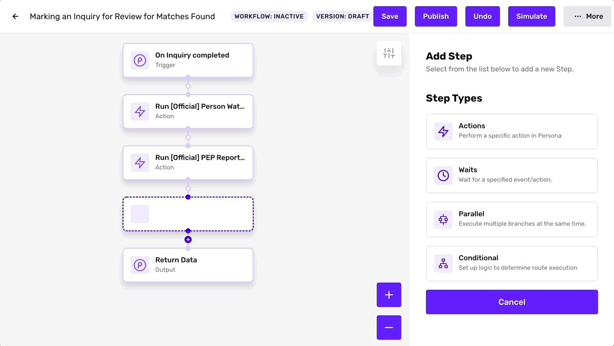

After the action step, add a Conditional Step to the Workflow, and edit the condition for Route 1 to be where report `match_found` equals `true`. Use the dropdown menus to implement this logic.

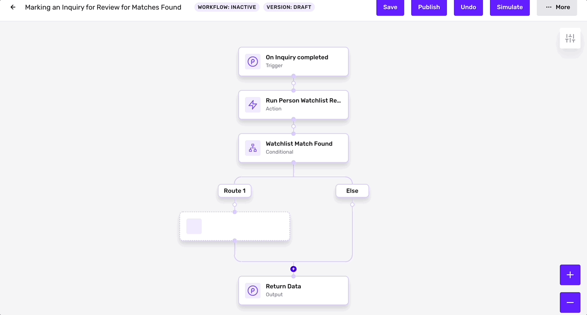

Next, we add a "Mark Inquiry for Review" Action step under Route 1.

Once the Inquiry is marked for review, you can manually approve or decline the Inquiry from the dashboard. To learn more about the Inquiry review process, see this [tutorial](./88I8H0eKR6qEh3O2OyXPl.md).

Here is what the completed Workflow looks like:

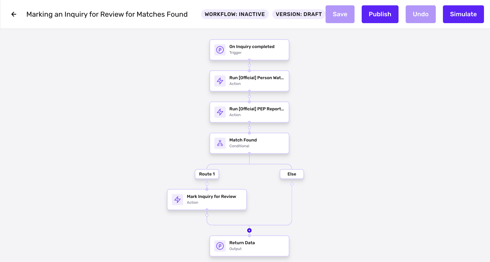

Publish the Workflow to automate running the Report and marking Inquiries for review.

### Workflow 1.2: Create Case if match found

Let's take the above Workflow and extend it again. Let's also create a Case when a Report match is found.

Creating a Case gives you a streamlined experience for reviewing Inquiries that are marked for review, especially at a high volume. Learn more about Cases [here](./1EJCOF8bL5KRx4pQESw7VB.md).

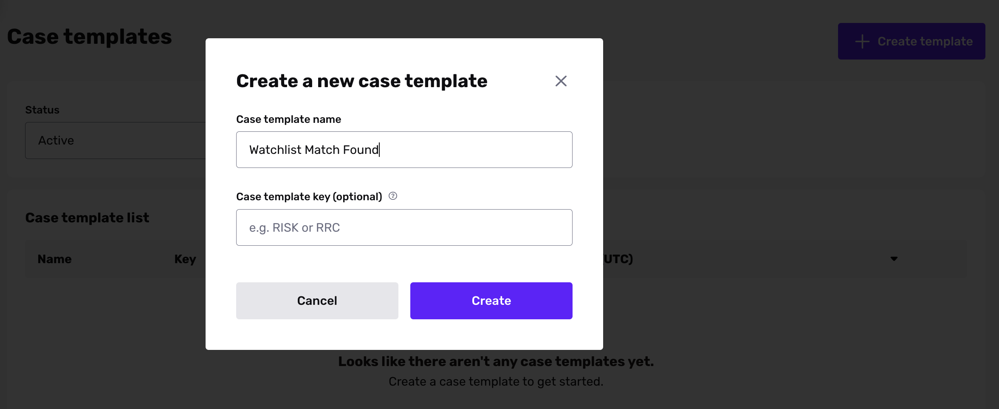

To begin, we create a new Case template from the Dashboard. Use the **Settings** button on the top right to configure Case notifications, statuses, tags, and more. Learn more about creating Case templates [here](./5WFMyVPjzgXQNljqg2xf4h.md).

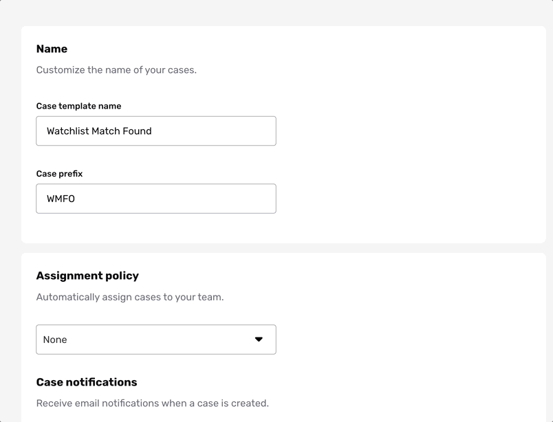

Let's start with where we left off in **Workflow 1.1**. We have an Action Step under "Route 1" to mark the Inquiry for Review.

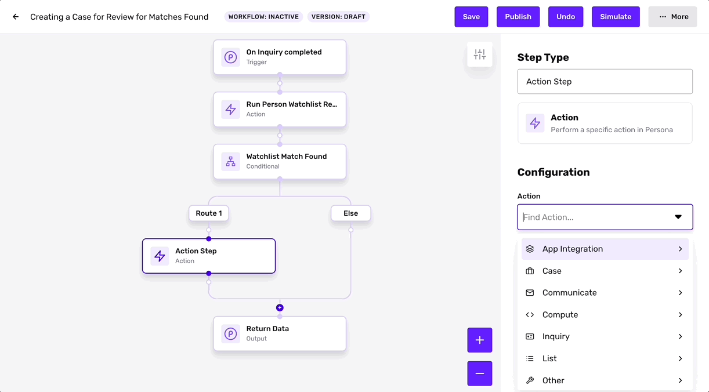

Let's add another Action Step to Route 1 to "Create Case". Select your Case Template. In the Advanced configurations, we can make sure that the Trigger Inquiry is associated with this Case.

Next, add a "Wait Step", which waits for the Case to be resolved through manual review.

After the "Wait Step", add a Conditional to the Workflow. This Conditional should have two routes: to mark the Inquiry as approved or as declined, according to the Case `state`.

-   If the Case's state is approved, set the Inquiry status to approved.
-   If the Case's state is declined, set the Inquiry status to declined.

Here is what the completed Workflow looks like:

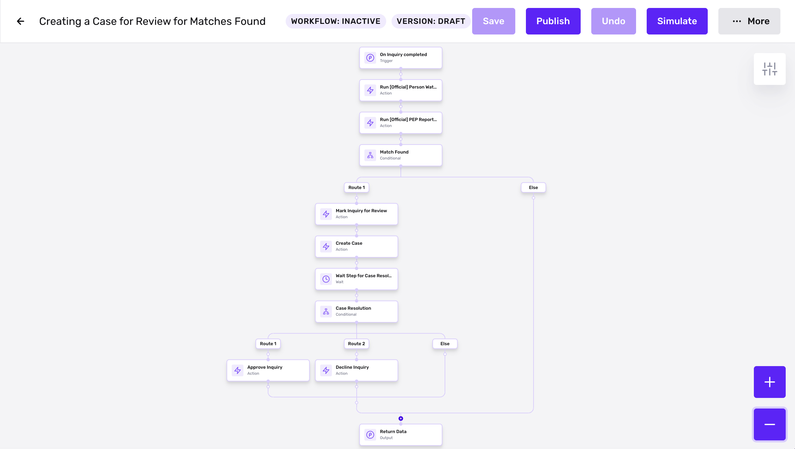

Publish the Workflow to automate running the Report and handling matches found with Cases.

## Related articles

[Reports Overview](./hI9YUPxjW7v46pFfyk6J1.md)

[Creating Reports](./3qGLZYtRNreVNZHxXAZqhw.md)

[Bulk create a Report](./1rzpXVJt1tTpRdhPuhaIkX.md)
