# Document Verification: Configuring Documents AI overview

## What is Document Verification?

Within Document AI’s suite of tools, Document Verification allows you to automate the kind of questions you’d ask to scrutinize a document, such as: "Is this a real utility bill?", "Does the name on this document match the user's ID?", and "Is this document recent enough?". This helps you rapidly answer critical questions for onboarding and compliance.

The process involves four automated steps:

1.  **Classify:** Identifies the document type (e.g., a W-2, not a passport).
2.  **Extract:** Pulls specific data you need (e.g., name, address, date) from the content.
3.  **Validate:** Runs validity and fraud detection checks.
4.  **Decide:** Issues a pass or fail result based on your rules.

You can use Document Verification within any Persona Inquiry flow and configure it to automatically ask users to retry if they submit a non-compliant document (e.g., wrong type, too old, missing information).

Recommended reading: [Document AI](./2ipL09vsPcus5OXuOXdeO9.md)

## Getting Started: Configuration Paths

How you configure Document Verification depends on your integration path.

### Path 1: Using an Inquiry Flow (Recommended)

Use this path if you are collecting documents from users through Persona's hosted Inquiry flow. _(See also: \[Link to article on Building Inquiry Flows\])_

**A) To create a new Inquiry Template:**

1.  Navigate to **Inquiries > Templates** in your Persona dashboard and click **Create template.**
2.  In the Choose a template screen, search for “document” in the search bar at the top left. This with filter and show only templates with document verification included. For this example, select “Document”.

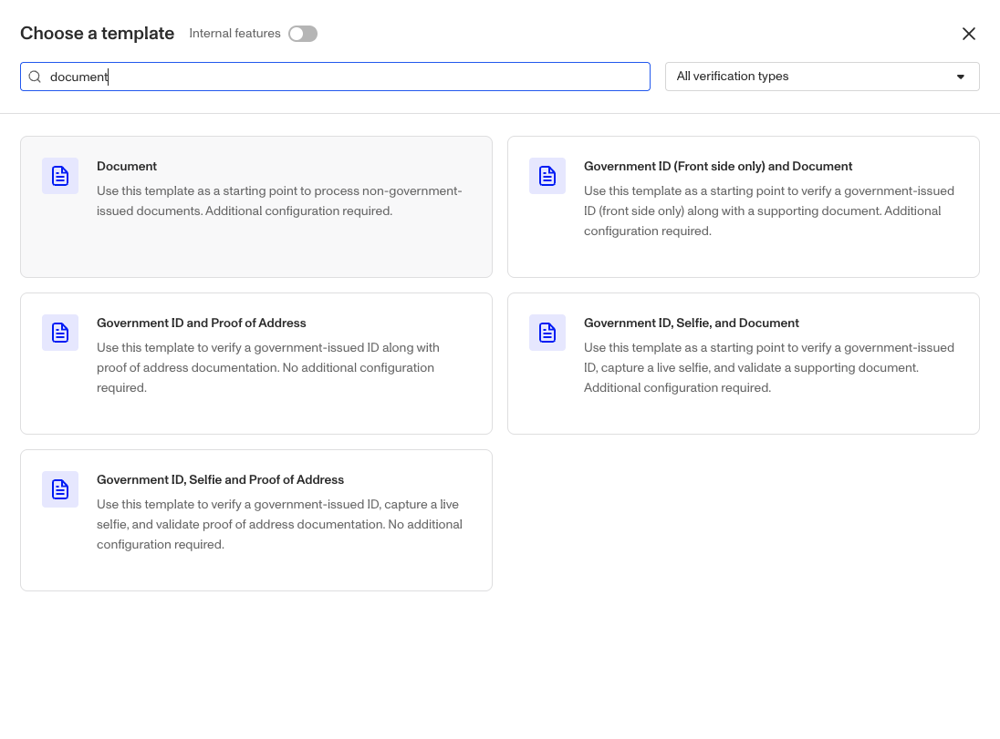 3. In the next screen you can review the default screens that are included in this template. When you’re ready to proceed, click the “Use template” button at the bottom right.  4. You’ll be brought to the FLE (Flow-Editor) with your new Document Verification AI template. 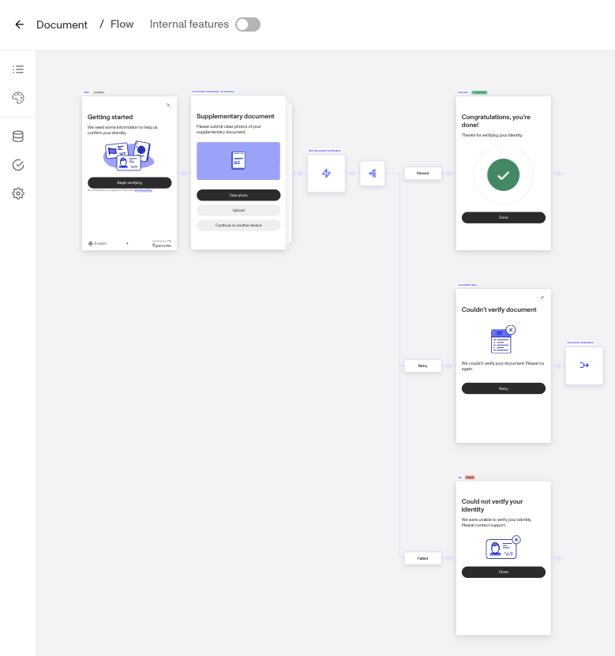

### Path 2: For Transaction-Based (API) Verifications

Use this path if you are submitting documents programmatically via the API, rather than using a Persona-hosted Inquiry flow.

1.  First, create your configuration template. In your Persona dashboard, navigate to **Verifications > Templates**.

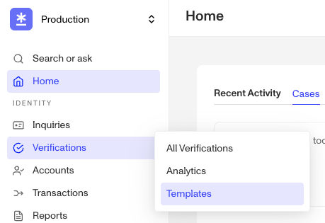 2. Click Create template and select Document Verification. 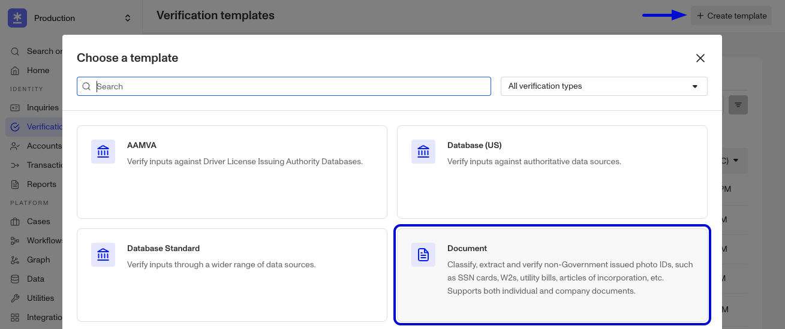 3. Give the template a descriptive name (e.g., "Proof of Address - API"). 4. Configure the template with the desired Document Groups, extractions, and checks as described in the sections below. 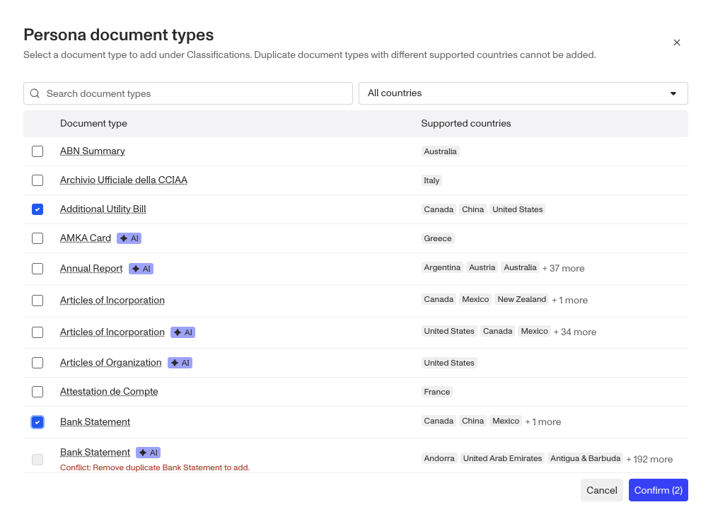 5. When creating a verification via the API, you will reference the template\_id of this template in your request.

### Reviewing Verification Results

The results of a Document Verification can be found in a few key places in the dashboard, depending on your setup:

-   **In Verifications:** Every Document Verification creates a record that can be found in the **Verifications** tab. This is the default location for all results and includes a detailed breakdown of all checks performed, data extracted, and the final pass/fail outcome.

-   **In Inquiries:** If you use an Inquiry flow to collect the document, you can also access the full Verification details directly from that **Inquiry's** detail page.
-   **In Cases:** If you have configured **Workflows**, you can automatically route verifications that meet certain criteria (like failing a specific fraud check) to **Cases** for manual review.

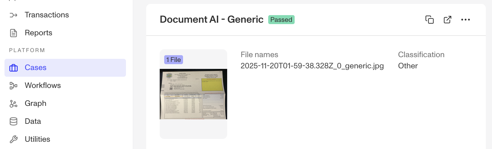

## Document Verification Template

All configuration within the template is managed using Document Groups. Document Groups allow you to create different rules for different documents, all within a single template.

The template has four main configuration sections, which you customize for each Document Group:

-   **Classifications:** Define which document types are acceptable. This is what triggers a specific Document Group.
-   **Extractions:** Specify which data fields to capture.
-   **Verification Checks:** Set rules for validity and fraud detection.
-   **Insights:** Generate summaries from or reason across document data.

## Configuring with Document Groups

Document Groups function as conditional logic for your verifications. Every Document Verification template comes with a built-in **General configuration**, and you can create additional Document Groups to handle a single document type or a group of document types. The General configuration can be renamed but not deleted. By default, it accepts any document type, and for this reason, you cannot add specific Classifications to it. This makes it a flexible tool that can be used as a fallback for specific rules or as a broad catch-all.

When a document is submitted, Persona first **classifies** it to determine its document type (e.g., Utility Bill). This **classified document type** is then checked against the list of Classifications defined in the Document Groups you have added. If a match is found, that specific Document Group is applied. This means that only the extractions, verification checks, and insights configured within that particular Document Group will be run on the document. If the document's classified type does not match the Classifications in any of the other Document Groups, the General configuration is applied as a fallback.

**Example Scenario: Using Document Groups for Different Documents**

Imagine you need to verify a user's address with specific requirements for certain documents.

-   You could create a "Utility Bill Rules" Document Group. In its Classifications section, you would add "Utility Bill". This Document Group could require the document be dated within the last 60 days and have its own specific extractions.
-   You could create a "Bank Statement Rules" Document Group. In its Classifications, you would add "Bank Statement". This Document Group might use a different set of verification checks with stricter fraud detection.
-   Your General Document Group would then act as a fallback, applying its own unique set of rules to any other accepted document type that is not a Utility Bill or Bank Statement.

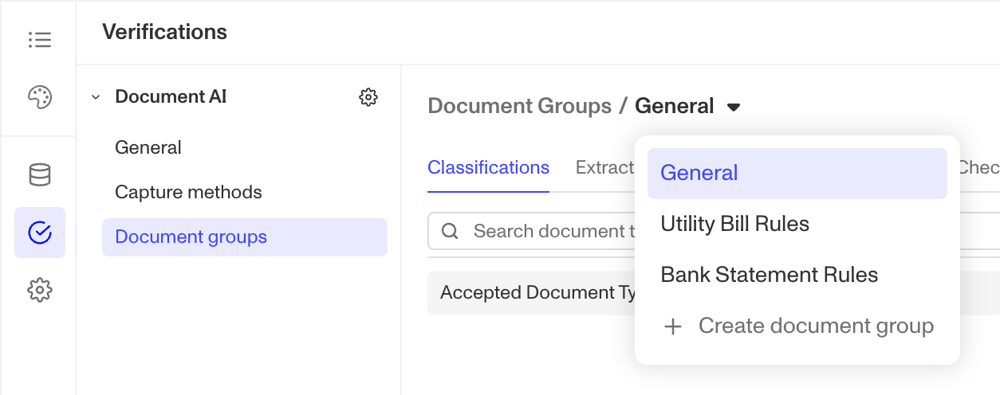

If you only want to accept specific document types and reject everything else, you can create your specific Document Groups and leave the General Document Group's configuration empty.

## Classifications

Classification is where you define which document types a specific Document Group should apply to. Adding a document type here serves as the trigger for that Document Group. _(See also: [Documents AI/Verification: Classification Configurations and Type Detection Check](./DXW6kJS3k17l4WrJfOfDu.md))_

**How to Configure:**

1.  From your Document Verification Template, click **Add Document Group** to create a new set of rules, or select an existing one.
2.  In the **Classifications** section of that Document Group, add one or more document types that should trigger these rules.

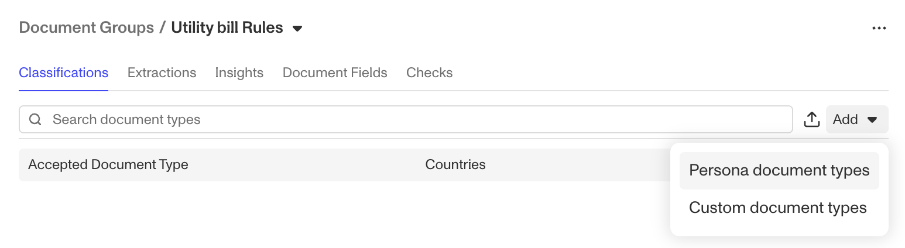 Any submitted document that is classified with one of these types will be processed with the associated Extractions, Insights, Document Fields, and Checks according to this Document Group. If a document is submitted, and is not of any document type from any Document Group, it will fail the `document_type_detection` check.

**Document Type Options:**

-   **Persona Document Types (Recommended):** Use Persona's pre-trained models for common documents like Bank Statements or Articles of Incorporation for the highest accuracy. We recommend you select the AI version.
-   **Custom Document Types:** Create your own categories using AI prompting for unique or internal documents.

## Extractions

Extractions capture specific pieces of information from a document. You define what to look for and whether it's required, all on a per-Document Group basis. _(See also: [Document AI: Extraction Configurations](./7tNoY1RqC6YvEGEV1VhSZn.md))_

**Extraction Modes:**

-   **AI extraction:** Finds and returns a value, like a name, address, or a number matching a specific pattern.
-   **Inquiry comparison:** Finds a value and compares it against data you already have, like the user's name from an earlier Government ID Verification.

**How to Create an Extraction:**

1.  From your **Document Verification Template**, select the Document Group you wish to configure.

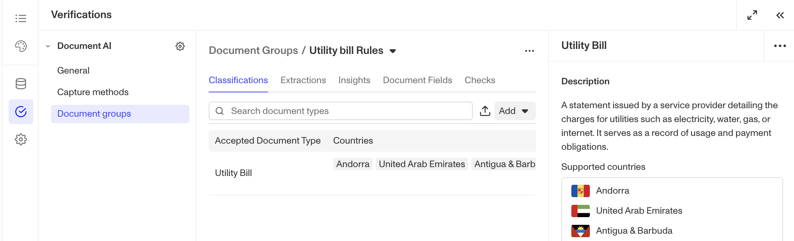 2. In the **Extractions section**, click **Add extraction**. 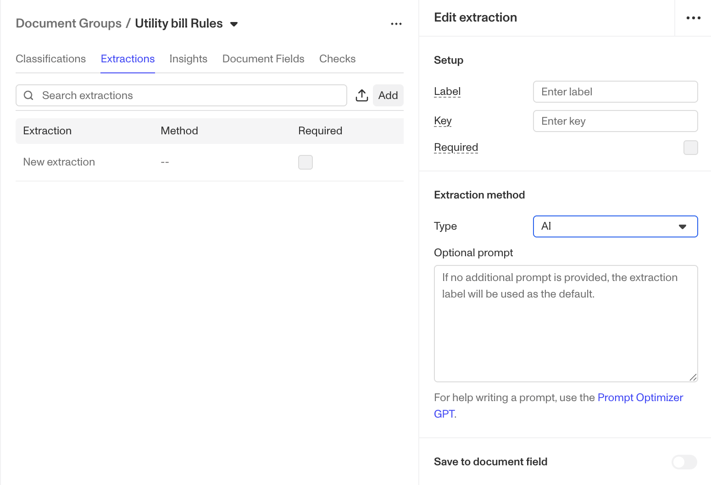 3. Define what you want to extract (e.g., "Service Address"). 4. Choose the extraction mode (AI or Comparison). 5. Add optional configurations. 6. To make this field mandatory, enable the Required toggle. This ensures the document will fail if the field is missing.

## Verification Checks

Every document is run through a series of checks for authenticity and data quality. You can customize which checks are required to pass for each Document Group. _(See also: [Document AI: Recency/Effective Detection Check](./33Fwf26bO4YWhp0k0RJaoP.md), [Document AI: Classification Configurations and Type Detection Check](./DXW6kJS3k17l4WrJfOfDu.md), and [Document AI: Expired Detection Check](./2iV2kP8Nl0duaXEZVvKiCq.md))_ 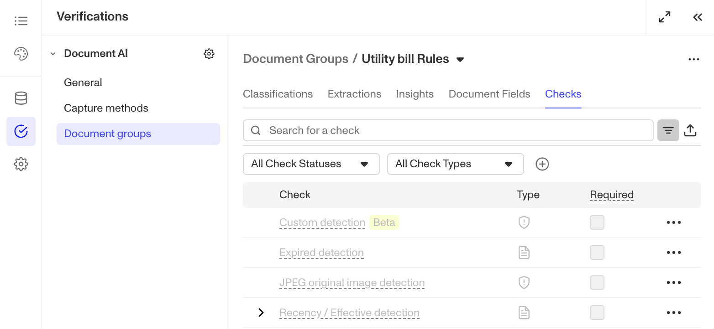 **Common Validity Checks:**

-   **Type detection:** Does the document match the Classification criteria of any of the accepted doc types added to the (non-General Config) Document Groups?
-   **Extracted properties detection:** Does the document contain all required fields (e.g., a name and address) set up via Extractions?
-   **Recency/Expiration:** Is the document recent enough and not expired?

**Common Fraud Checks:**

-   **PDF Editor Detection:** Surfaces signals consistent with editing based on PDF metadata.
-   **PDF Abnormal Font Detection:** Surfaces signals that fonts may have been inserted or modified after original creation.
-   **Image Inconsistent Timestamp Detection:** Surfaces signals of modification or irregular timestamps.
-   **Image Suspicious Metadata Detection:** Surfaces signals that editing tools may be present in EXIF/metadata.

Persona provides tools and signals to help companies address identity challenges. It is up to each business to define its risk tolerance and compliance requirements, configure thresholds and rules appropriately, and determine outcomes. Checks and Insights surface indicators of potential risk and tampering; they are not definitive proof of fraud. Consult your legal and compliance advisors as needed.

## Insights

Insights go beyond simple data extraction by performing a deeper analysis across the entire document. They are designed to answer complex questions that require understanding context and relationships within the content, rather than just pulling out a single value. This saves reviewers from significant manual analysis. _(See also: \[Link to dedicated article on Insights\])_

**Example Insights:**

-   **Bank Statement:** Instead of just extracting individual transactions, an Insight can analyze all of them to provide an insight such as if more than 1 name is listed on a bank account.
-   **Business Document:** An Insight can read through a lengthy document to identify the corporation type (e.g., S-corp) and count the number of beneficial owners listed.

You can enable specific Insights within each Document Group to get these automated analyses.

## Deployment Flexibility

-   **Automated decisioning:** Use inquiries and workflows to automatically approve, reject, or prompt a user to retry based on the verification's outcome and which checks passed or failed.
-   **Manual review routing:** Automatically send verifications that meet certain criteria— like failing a specific fraud check or missing specific fields —to a Case for manual review by your team.
-   **Hybrid approach:** Combine automation and manual review. For example, a Workflow can be configured to auto-approve verifications that pass all checks while routing all others to a reviewer.

## Related articles

[Document AI](./2ipL09vsPcus5OXuOXdeO9.md)
