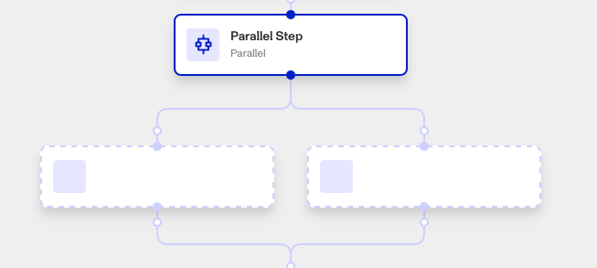
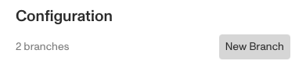

# Workflows: Parallel step

# What is the Parallel step?

**Parallel** is a Workflow step that allows you to split your Workflow into parallel workflow routes that will all execute synchronously.

The Parallel step is useful for conducting several operations in tandem, such as running several different security reports on an Inquiry.

Each branch funnels into the same shared next step, which can be informed by the results of the parallel steps.

⚠️ The Parallel step is not conditional, which means all of its parallel branches proceed and execute simultaneously.

To add a conditional statement where only certain branches will execute depending on the conditions, use the Conditional step instead.

# How do you add a Parallel step?

1.  Navigate to the Dashboard, and click on **Workflows** > **All Workflows**.
2.  Find and click on the workflow you want to edit, or **Create** a new workflow.
3.  Click on **+** when hovering over a circle to add a **Parallel** step.

4.  (Optional) Click New Branch to add another parallel branch to your Workflow.

5.  Close the Step, then add further steps to each parallel branch by clicking on the dashed-outline boxes in your Workflow. You’ll have to **Save** and **Publish** the workflow to begin using it.

# Plans Explained

## Parallel step by plan

|  | Startup Program | Essential Plan | Growth Plan | Enterprise Plan |
| --- | --- | --- | --- | --- |
| Parallel Step | Limited to pre-configured solutions | Available | Available | Available |

[Learn more about pricing and plans.](./6oZbzp7jb7AWGClF5vpY3K.md)
