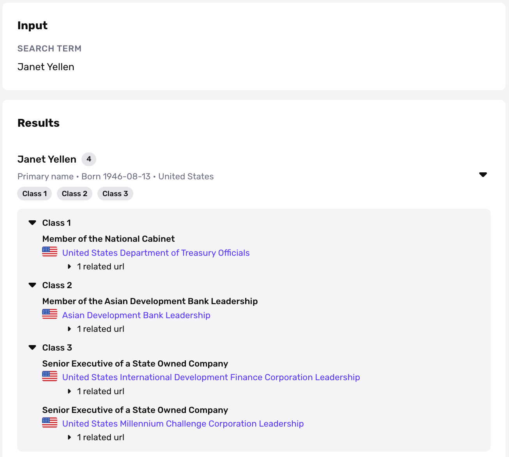

# Politically Exposed Person Report

## Overview

The Politically Exposed Person (aka PEP) report screens an individual to determine if they have been entrusted with or are a current candidate for a prominent function by a local, regional, national or international governmental body. If someone is identified as a politically exposed person, they have a greater risk for financial institutions with regard to AML and CFT (Anti-Money Laundering/Combating the Financing of Terrorism) measures. Additionally, the PEP report can surface matches against relatives and close associates of prominent individuals, as these are also viewed as a potential source given their connections with the PEPs.

PEP screening is a critical part of customer due diligence for many organizations, particularly financial institutions. Please be aware of PEP regulations applicable in your jurisdiction to implement appropriate AML measures.

## Report Features

### Search Inputs

-   Name of individual (required)
-   Birthdate (optional) - the report will surface PEPs that match that birthdate OR any PEPs that do not have a birthdate associated with them
-   Country of individual (optional)

The inputs are typically collected during a KYC Inquiry. The individual’s first and last names, are set as the main search terms, while birthdate and country inputs can be derived from a government ID verification or Inquiry form input.

### Report Outputs

**`Position`**

Within a given class section, all the positions associated with an individual are listed. If the individual is a relative or close associate, these positions will be listed at the same class level as the person they are related to.

**`Class`**

Each position a PEP holds is categorized by a risk level. The risk level for each type of position is listed below and follows the stated classification system:

**High risk: Class 1 PEPs**

-   Heads of state and government
-   Members of government (national and regional)
-   Members of parliament (national and regional)
-   Heads of military, judiciary, law enforcement
-   Board members of central banks
-   Top-ranking officials of political parties

**Medium risk: Class 2 PEPs**

-   Senior officials of the military, judiciary, and law enforcement agencies
-   Senior officials of other state agencies and bodies and high ranking civil servants
-   Senior members of religious groups
-   Ambassadors, consuls and high commissioners

**Medium risk: Class 3 PEPs**

-   Senior management and board of directors of state owned business and organizations

**Low risk: Class 4 PEPs**

-   Mayors and members of local, country, city and district assemblies
-   Senior officials and functionaries of international or supranational organizations

## Interpreting the API response

**`result`**

Result is a list of person hits that come back as politically exposed

**`positions`**

Positions is a list of relevant positions that are flagged as having some kind of risk level. A single item in this list has the following attributes:

-   **name:** the name of this position
-   **pep-class:** the risk level of this position
-   **source-key:** a slug that maps to a key in `sources`

**`sources`**

The `sources` object is a map in which the key is a value from `source-key` in the `positions` object and the value is an object with the following attributes:

-   **url:** the url of this source
-   **name:** the name of this source e.g. UK Parliament
-   **flag-code:** the associated country of this source

### Notifications

The best way to be notified immediately of a match on the PEP Report is to set up a webhook listening for the event types: `report/politically-exposed-person.matched` fires whenever a match is found; `report/politically-exposed-person.ready` fires whenever the report runs, regardless of match status.

## **Configuration options**

Configuration options for PEP Report are view-only. By default, PEP templates are set up in our recommended setting:

-   PEP class type: Class 1 & 2 Only
-   Name match requirement: “Strict”. To learn more, refer to [this guide](./1FOJzuI3uMFmcDuR5zkged.md)
-   Allow Relatives & Close Associates - OFF
-   Allow sources with no URLs - ON
-   Allow matches for current US candidates - OFF

Please [contact the Persona support team](https://app.withpersona.com/dashboard/contact-us) to make changes to your report configurations.

## Continuous Monitoring

Just because a person is not a "bad actor" today does not mean that they cannot be a "bad actor" 2 months down the line. Therefore, it's critical for organizations to monitor individuals continuously and to make sure there is no negative news or unfavorable information on a given person. To learn more, refer to [this guide](./7LRMBbxLshF7sCcLhfhwF4.md).

## Plans Explained

|  | Startup Program | Essential Plan | Growth and Enterprise Plans |
| --- | --- | --- | --- |
| PEP Report | Available to Fintech Cohort | Available | Available |

[Learn more about pricing and plans](./6oZbzp7jb7AWGClF5vpY3K.md)

# FAQ

### How often are lists updated?

We check our PEP sources for updates once per day.

# Disclaimer

_Persona is not a consumer reporting agency and the services (and the data provided as part of its services) do not constitute a ‘consumer report’ for the purposes of the Federal Fair Credit Reporting Act (FCRA). The data and reports we provide to you may not be used, in whole or in part, to: make any consumer debt collection decision, establish a consumer’s eligibility for credit, insurance, employment, government benefits, or housing, or for any other purpose authorized under the FCRA. If you use any of any of our services, you agree not to use them, or the data, for any purpose authorized under the FCRA or in relation to taking an adverse action relating to a consumer application._
