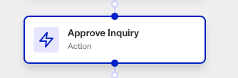

# Workflows: Approve Inquiry step

# What is the Approve Inquiry step?

**Approve Inquiry** step is a Workflow Action step that approves a specified Inquiry.

A Persona Inquiry represents a single instance of an individual attempting to verify their identity. Inquiries are created when the individual begins to verify their identity, and contains the information collected from the submitted verifications, the results of those verifications, and passively-collected contextual data like IP address that can be used to identify suspicious activity.

If the necessary verifications are passed and a manual review is not required, an Inquiry can be officially approved - some users refer to this as auto-approving. The Approve Inquiry step is useful for automatically triggering Inquiry approval after certain checks have been passed and business logic is conducted within your Workflow.

# How do you add an Approve Inquiry step?

1.  Navigate to the Dashboard, and click on **Workflows** > **All Workflows**.
2.  Find and click on the workflow you want to edit, or **Create** a new workflow.
3.  Click on **+** when hovering over a circle to add an **Action**.

4.  Use the **Find Action** select box to click on **Inquiry > Approve Inquiry**.
5.  Select an Inquiry to approve from elsewhere in your Workflow.
6.  (Optional) Click the **Continue on error** box if you want the Workflow to continue running even if this Action raises an error.
7.  **Close** the Action. You’ll have to **Save** and **Publish** the workflow to begin using it.

# Plans Explained

## Approve Inquiry step by plan

|  | Startup Program | Essential Plan | Growth Plan | Enterprise Plan |
| --- | --- | --- | --- | --- |
| Approve Inquiry Step | Not Available | Available | Available | Available |

[Learn more about pricing and plans.](./6oZbzp7jb7AWGClF5vpY3K.md)

# Learn more

[Learn more about Inquiries.](../../docs/docs/inquiries.md)
