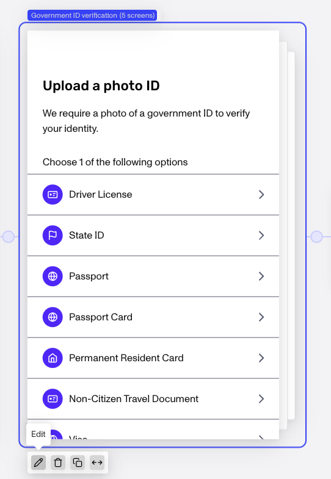
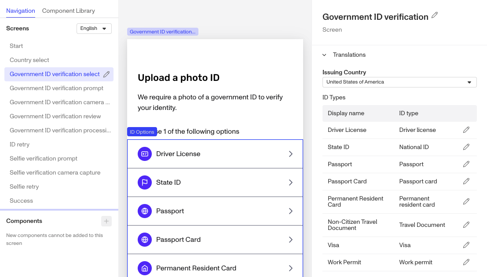
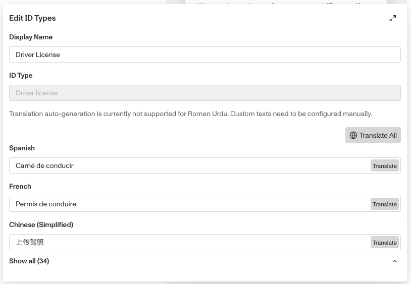

# Modify Gov ID names & country specific localization

# Gov IDs & country specific localization

Governments call their various types of Gov IDs by different names and you can modify your Gov ID verifications with their proper names and localize then for various languages.

### Steps:

1.  Open the inquiry template you want to configure.
2.  Find the Government ID verification module and click **Edit**.

3.  In the individual screens, Select the ID Type you want to modify. Example: Driver License

4.  NOTE in the right properties bar the “Issuing Country” dropdown. In the example screenshot it’s set to “United States of America”. The settings in the ID Types section below it will only affect the currently selected country. Select the country you wish to configure.
5.  Click the **Edit** icon to the right of the ID Type you want to modify.
6.  Edit the name of the Display Name field to the name of that country’s ID Type name. Then click the **Translate All** button to localize it for all languages.

7.  Repeat with each Screen, Country, and ID Type you wish to modify from the default names.
