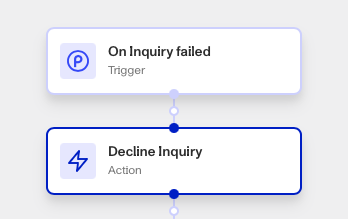

# Workflows: Decline Inquiry step

# What is the Decline Inquiry step?

**Decline Inquiry** is a Workflow Action step that declines a specific Inquiry.

A Persona Inquiry represents a single instance of an individual attempting to verify their identity. Inquiries are created when the individual begins to verify their identity, and contains the information collected from the submitted verifications, the results of those verifications, and passively-collected contextual data like IP address that can be used to identify suspicious activity.

If necessary verifications are not passed and manual review is not required, an Inquiry can be officially declined - this is commonly referred to as auto-declining. The Decline Inquiry step is useful for automatically triggering Inquiry denial after certain checks have failed in your Workflow.

# How do you add a Decline Inquiry step?

1.  Navigate to the Dashboard, and click on **Workflows** > **All Workflows**.
2.  Find and click on the workflow you want to edit, or **Create** a new workflow.
3.  Click on **+** when hovering over a circle to add an **Action**.

4.  Use the **Find Action** select box to click on **Inquiry > Decline Inquiry**.
5.  Select an Inquiry to decline from elsewhere in your Workflow.
6.  (Optional) Click the **Continue on error** box if you want the Workflow to continue running even if this Action raises an error.
7.  **Close** the Action. You’ll have to **Save** and **Publish** the workflow to begin using it.

# Plans Explained

## Decline Inquiry step by plan

|  | Startup Program | Essential Plan | Growth Plan | Enterprise Plan |
| --- | --- | --- | --- | --- |
| Decline Inquiry Step | Not available | Available | Available | Available |

[Learn more about pricing and plans.](./6oZbzp7jb7AWGClF5vpY3K.md)

# Learn more

[Learn more about Inquiries.](../../docs/docs/inquiries.md)
