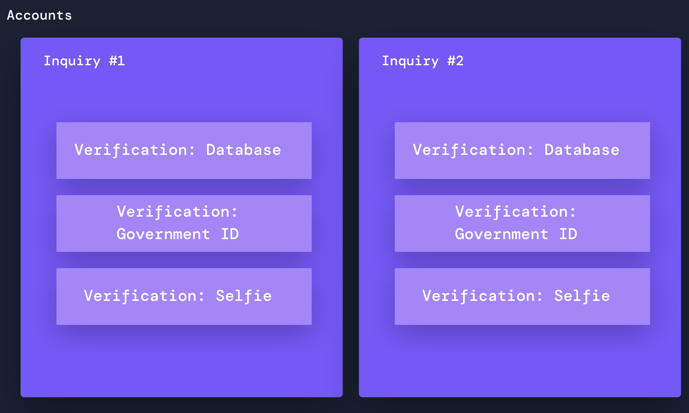

# Key Concept: Inquiry, Verification, and other terms

## Overview

This guide defines key concepts that help you understand Persona. It covers:

-   Inquiries, Verifications, and attempts
-   Accounts and reference IDs
-   Templates and Themes
-   Development environments: Sandbox and Production

## Inquiries, Verifications, and attempts:

-   **Inquiry:** A Persona Inquiry represents a single instance of an individual going through an identity verification flow and providing information required to complete identity verification.
    -   A single Inquiry contains one or more types of Verifications.
    -   Each Inquiry has a lifecycle. Each step of the lifecycle is assigned a status. This status reflects where an individual is in the identity verification process. To learn more about Inquiry statuses, check out our [documentation on Inquiry lifecycle](../../docs/docs/models-lifecycle.md).
-   **Verification**: An Inquiry contains one or more Verifications.
    -   A Verification is a series of checks run against the information entered by the end user of an Inquiry. If the information entered passes the required checks, the Inquiry passes the verification process.
    -   Each Verification check can be configured to be [required or non-required](./7IAy61dAMRDQ1Q77ugwpcA.md).
    -   The Verifications required in a given Inquiry are defined by an Inquiry Template.
-   **Verification type**: Persona offers many types of Verifications, such as Government ID Verification, Selfie Verification, and Database Verification. Persona allows you to choose which Verification types to use, and to configure which specific Verification checks to require for each Verification type.
-   **Attempts:** Each verification allows the end user who is being verified to make one or more "attempts" at passing that verification. If the user cannot pass a Verification after the allowed number of attempts, the Verification fails.
    -   By default, each Verification allows for multiple attempts. You can configure the number of attempts.

## Accounts and reference IDs

-   **Account:** An Account represents a single end user of Persona.
    
    -   Use case: You may ask an individual in your system to verify their identity in different ways at different times, which will generate multiple Inquiries. You can connect these Inquiries for the same end user and aggregate them into a single Account.
    -   See **[Accounts overview](./2gE7mjjLCIGJPnK6mTyjU9.md)** to learn more.
-   **Reference ID:** A reference ID is the unique ID you use to identify a single end user of Persona.
    
    -   You can associate a reference ID to an Inquiry. All Inquiries with the same reference ID will be consolidated under a single Account in Persona.
        
    -   It's convenient to set the reference ID for an end user of Persona to be the same ID that uniquely identifies that end user in your own systems. (This might, for example, be a UUID for an that user in your systems, or that user's email address.)
        
    -   Example usage: You can associate a reference ID with an Inquiry by appending a reference ID to an Inquiry as a parameter. You can then easily find the associated Inquiry for a given user by searching by reference ID.
        

## Templates and themes

The identity verification flow your end users experience is a combination of logic—the verifications you choose to run; and appearance—the visual design of the flow.

By default in new Persona organizations today, logic is configured in a Template and appearance is configured in the Theme Editor.

-   **Template**: A Template defines the sequence of verifications, and the configurations of each of those verifications, that will be required in a given Inquiry. It also defines the UI that the end user of the verification flow sees, including visual elements such as logos, color, fonts, buttons, and text. Each Inquiry is generated from a specific Template. A Persona organization can have multiple Templates. 
-   **Theme:** A Theme dictates the visual elements of the Persona UI that can be customized to match your brand (e.g. logo, color, font, buttons, text, etc). Each Template is associated with a Theme. By default, Templates all have the same default Theme. An organization can have multiple Themes.

## Development environments

Persona offers two environments: Sandbox and Production. You can toggle between these two environments using the switch at the top left hand corner of the Dashboard.

-   **Sandbox environment:** The Sandbox environment can be used to test your end user flow and  to test integration with your app. **Real verifications are not performed within Sandbox.**
    -   You do not incur charges for actions performed within Sandbox.
-   **Production environment:** In your Production environment, you run real production Inquiries and Verifications.
    -   You incur charges to your organization in accordance with your [Persona plan](../../landing/pricing.md).
    -   If you are a customer and production is not activated, please contact our [support team](https://app.withpersona.com/dashboard/contact-us) or your Persona customer success contact and we will make sure Production is enabled for you.

For more information, see [Sandbox vs. Production Environments](./6I2kGhfPvSuUjYq4z6tpmB.md).

## Related articles

[Key Concept: Enabled vs Disabled and Required vs. Non-required Verification checks](./MBqBUj2HlXY34i5SJIRaz.md)
