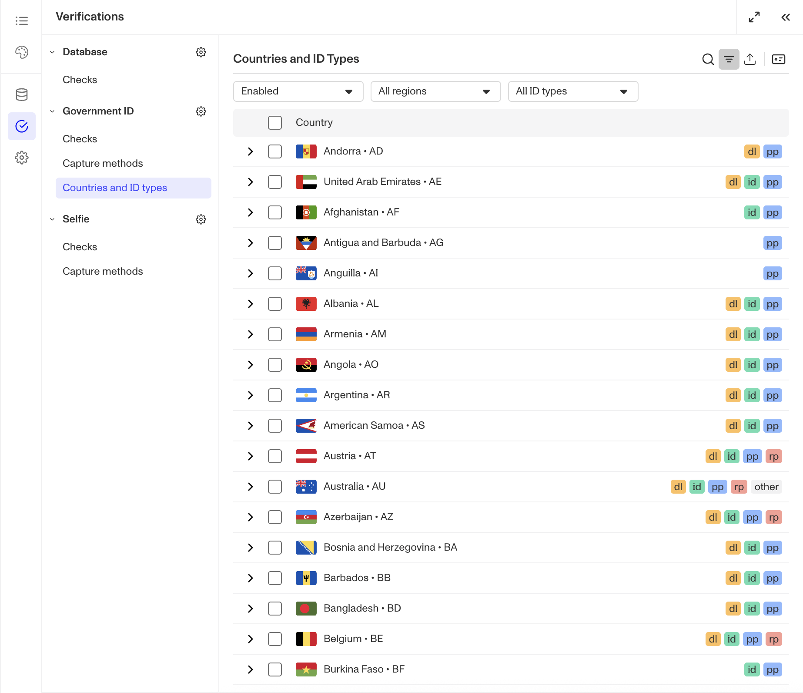
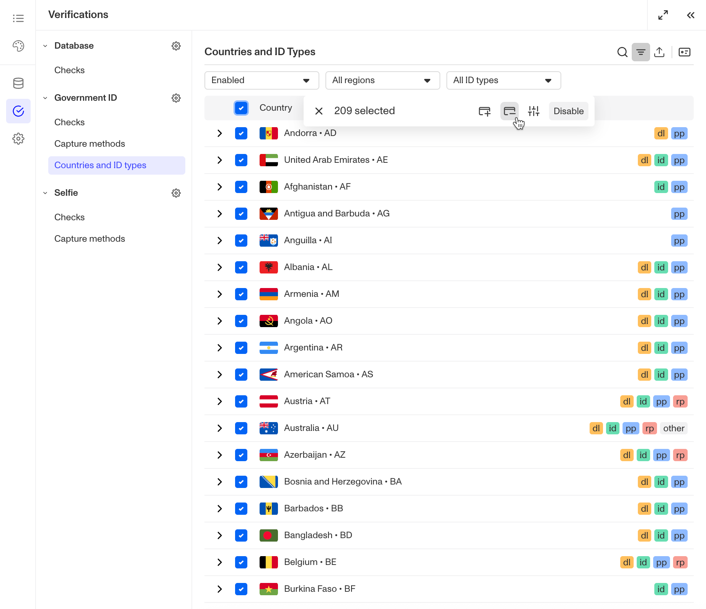
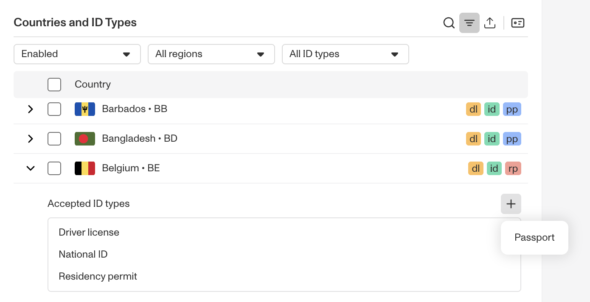

# Bulk Configure Allowed Gov IDs

⚠️ This question came from a member of the Persona Community - an product manager for an automotive reseller. This question is useful for those looking to quickly configure which Gov ID types are allowed.

## Question

For my Government ID verification, how can I only allow Passports for enabled countries while including Driver's Licenses for Canada and the United States without having to individually configure each country?

## Answer

There's a quick method to bulk configure accepted IDs for Government ID verifications. Let's walk through the example configuration outlined above.

Within your Inquiry Template, use the Left Panel to head to Verifications.

From the Government ID verification, select `Countries and ID types`.

Make sure the first filter is set to Enabled to display only enabled countries. Select all countries by clicking the checkbox in the table header. In the floating action bar, click the Remove ID icon.

In the Remove IDs modal, select all ID types except for Passport. Click confirm.

You can verify that Passport is allowed in every enabled country by checking the stickers. The Passport sticker is blue and displays 'pp' as the shorthand. If any countries are missing Passport, you can:

1.  Select these countries using the checkbox on the left
2.  Click the Add ID icon in the floating action bar
3.  Select Passport and click confirm

Alternatively, you can click the chevron to the left of an individual country's name and click the + button next to Accepted ID Types to add and remove ID types one by one.

To add Driver's License to Canada and the USA, click the Search button in the table actions. Search for Canada or the USA.

Click the chevron to the left of the country's name, then click the + button next to Accepted ID Types and select Driver's License from the dropdown. By clicking on the ID type, you can configure ID-specific requirements. Repeat these steps for the other country.

📌 This answer was last updated on Dec 10, 2025 by Ryan Cole, a content manager at Persona. FAQs, unlike other articles, are written to provide Persona Community members more specific answers to common questions. While we periodically review responses and answers, please note when this FAQ was last updated as information may have changed since then.
