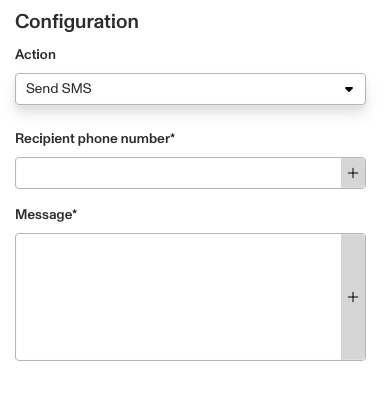

# Workflows: Send SMS step

# What is the Send SMS step?

**Send SMS** is a Workflow Action step that sends a message to a user in an SMS message.

Phone numbers and messages can be pulled from other Workflow steps, triggers, or hardcoded to a specific value. This lets you automate communications such as updates and notifications to your users, as part of a Workflow.

⚠️ We recommend formatting your SMS message content for clarity. For example, use brief and precise language, and include any action needed from the user.

The Send SMS step is particularly useful when you need your user to take action, or when they should know that a critical process has completed or failed. It will often get a recipients attention faster than the Send Email step will.

It's common to use the Send SMS step sparingly and only when proper consents from users are collected.

# How do you add a Send SMS step?

1.  Navigate to the Dashboard, and click on **Workflows** > **All Workflows**.
2.  Find and click on the workflow you want to edit, or **Create** a new workflow.
3.  Click on **+** when hovering over a circle to add an **Action** step.

4.  Use the **Find Action** select box to click on **Communicate** > **Send SMS**.
5.  Add a recipient phone number, either manually or from another **Object** by clicking **+**.
6.  Add or edit the message to be sent along with the link, either manually or from another **Object** by clicking **+.**
7.  (Optional) In ‘Advanced Configuration’, click the **Continue on error** box if you want the Workflow to continue running even if this Action raises an error.
8.  **Close** the Action. You’ll have to **Save** and **Publish** the workflow to begin using it.

# Plans Explained

## Send SMS step by plan

|  | Startup Program | Essential Plan | Growth Plan | Enterprise Plan |
| --- | --- | --- | --- | --- |
| Send SMS Step | Not Available | Not Available | Available | Available |

[Learn more about pricing and plans.](./6oZbzp7jb7AWGClF5vpY3K.md)

# Learn more

Emails can be sent using the Send Email step instead. There are also designated Workflow action steps for sending links via SMS, such as Send Inquiry Link SMS.
