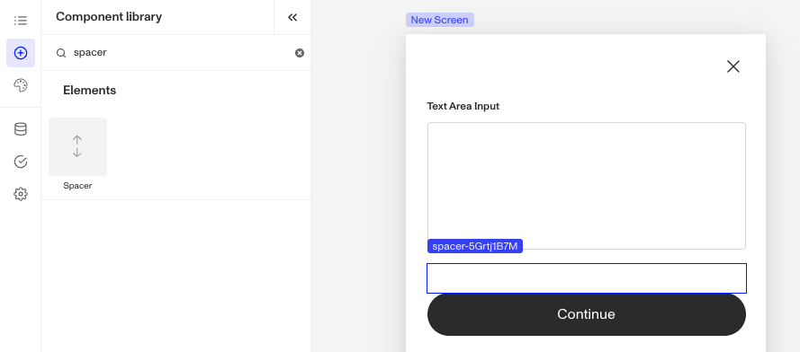
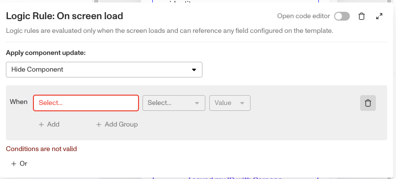

# Inquiries: Spacer component

# What is the Inquiry Spacer component?

**Spacer** is an Inquiry screen component that adds a spacing block to the screen. You can customize its appearance and define logic that governs when it appears.

The Spacer component adds white space to create separation between elements. For example, you can include a space between a header and body text to provide some “breathing” room or add a spacer between buttons to prevent accidental taps. Spacers help ensure a clean and visually appealing design.

# How do you add an Inquiry Spacer component?

1.  Navigate to the Dashboard, and click on **Inquiries > Templates**.
2.  Find and click on the Inquiry template you want to edit, or **Create** a new template.
3.  Hover over a screen and click the **Pencil** icon, or double-click the screen to open it in the Screen Editing View.

4.  In the Left Panel, click Component Library and search for ‘**Spacer**’.
5.  Drag and drop the Spacer component into your screen, and reposition it by dragging it around.
6.  (Optional) In the **Styles** tab, you can edit the **Spacer’s** height. You can read more about **Styles** below.
7.  (Optional) In the **Logic** tab, you can add rules that govern when the component appears, and when it does not. You can read more about **Logic** below.
8.  **Close** the step. You’ll have to **Save** and **Publish** the template to begin using it.

# Styles

You can customize how your component appears to users in the Styles tab, modifying elements like spacing.

## Spacing

You can customize the **Height** of the Spacer. This will increase or decrease the white space added by the Spacer component.

# Logic

Persona provides you with the ability to add logic to a Spacer component. For example, a component may only become visible to a user if certain conditions are met. There are two options for logic rules:

-   **On screen load**: Logic rules are evaluated only when the screen loads. They can reference any field configured on the template.
-   **On screen update**: Logic rules are evaluated in real time. They can only reference inputs on the current screen.

## Logic Rules

Logic rules consist of three main components:

1.  **Field**: The object that will have a condition linked to it.
2.  **Condition**: How the field is compared to the value (e.g., equals, does not equal).
3.  **Value**: The value to test against.

### Creating Logic Rules

-   **AND Statements**: Combine multiple conditions that must all be true for the rule to pass. Add these using the **"Add"** button.
-   **OR Groups**: Combine conditions where only one needs to be true for the rule to pass. Create these by clicking **"Add OR Group"**.

## How to use Logic Rules

1.  Click on the Spacer component, and go to **Logic** in the Right Panel.
    1.  Choose either “On screen load” or “On screen update” and click **Add.**
    2.  Choose what **Component Update to apply**. This determines what happens to the component when the logical rules are met.
    3.  Create a logical rule by filling in the three boxes following **When**, which correspond to an object, its condition, and its value being assessed, respectively. When that logical rule passes, the component update is applied.
    4.  (Optional) Add additional logical rules by clicking either **\+ Add** (if you want to add 'AND' rules, where all must be passed to continue) or **\+ Or** (if you want to add 'OR' rules, where one must be passed to continue). You can also nest a group of OR statements within an AND statement by clicking **\+ Add Group**.
    5.  (Optional) To edit the logic directly, you can open the **code editor**.

# Plans Explained

### Spacer component by plan

|  | Startup Program | Essential Plan | Growth Plan | Enterprise Plan |
| --- | --- | --- | --- | --- |
| Spacer component | Available | Available | Available | Available |
| Logic for Spacer component | Not Available | Not Available | Available as part of Inquiries Enhanced | Available as part of Inquiries Enhanced |

[Learn more about pricing and plans](./6oZbzp7jb7AWGClF5vpY3K.md).

# Learn more

[Learn more about Inquiries.](../../docs/docs/inquiries.md)
