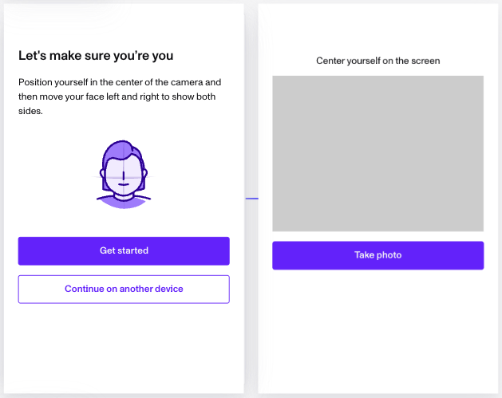

# What to Expect When Verifying Your Identity with Persona

# What is Persona?

Trusted worldwide, [Persona](./huT4RcIBnrAulAHamu6Gz.md) is the leading secure identity verification platform trusted by organizations across industries. We empower companies to confirm identities quickly and securely, so you can access the services you need. Millions of people around the world have used Persona to verify their identity for banks, government agencies, technology companies, and more.

# How does Duo work with Persona?

[Duo](https://duo.com/) and Persona have teamed up to provide a secure and smooth identity verification experience. This allows Duo to maintain high safety, compliance, and user experience standards by using Persona’s verification tools.

# Why am I being redirected to Persona?

You’re seeing Persona because the company you’re using would like to verify your identity. This helps keep your account secure, prevent fraud or social engineering, and ensure regulatory compliance. The process is designed to be fast, secure, and user-friendly.

# What will happen next?

After you’re redirected to Persona, you’ll be guided through a few simple steps:

1.  Upload a government-issued ID (like your driver’s license or passport).

2.  Take a selfie to confirm you’re the person on the ID.

3.  (Optional) Complete additional steps such as verifying your phone number or email, depending on the requirements of your organization.

Persona’s interface will provide clear instructions and guidance at every step. If you run into any issues, you can find helpful troubleshooting tips in our [end-user help section](../for-end-users.md).

# How is my data handled?

Your privacy and security are our top priorities:

-   **Data Protection**: Persona is GDPR and CCPA compliant. We use industry-best security practices to protect your information.
-   **Transparency**: Only the company that requested your verification can access your information. Persona does **not** sell your data or share it with third parties for any reason.
-   **Retention**: The company you’re verifying with controls how long your data is stored. You can request deletion of your data at any time through them or via our [privacy resources](../../landing/legal/privacy-policy.md).
-   **Certifications**: Persona meets strict [security standards](../../landing/security.md) and undergoes regular audits.

# Frequently Asked Questions

Q: What if I have trouble completing my verification?

A: Visit our [troubleshooting guide](../for-end-users/troubleshooting.md) for help with common issues like uploading photos or expired links.

Q: Who can I contact for support?

A: If you need assistance with verification, please reach out to the organization that referred you to Persona. For general help, see visit our [end-user resources](../for-end-users/troubleshooting.md).

Q: How do I know this is safe?

A: Your data is protected with industry-leading encryption and security standards. That’s why trusted companies around the world use Persona.

# Need more help?

For more information about how Persona works, visit our [Help Center](../for-end-users.md). If you have questions about your specific verification, please contact the company that requested it.

---

Note: This article is intended for individuals completing a Persona verification flow after being redirected from Duo. For more technical or configuration questions, please refer to our Help Center or contact your service provider.
