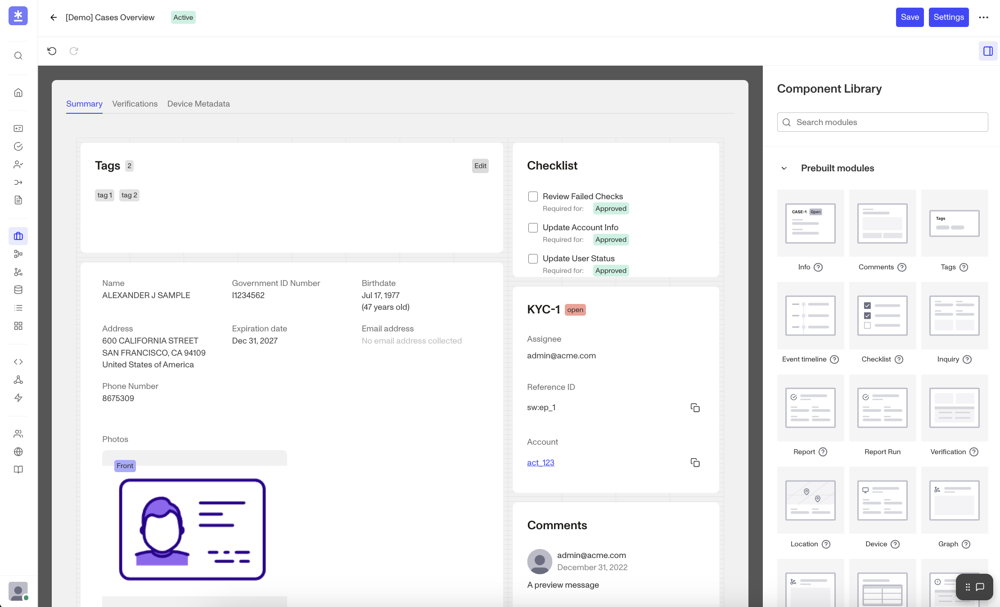
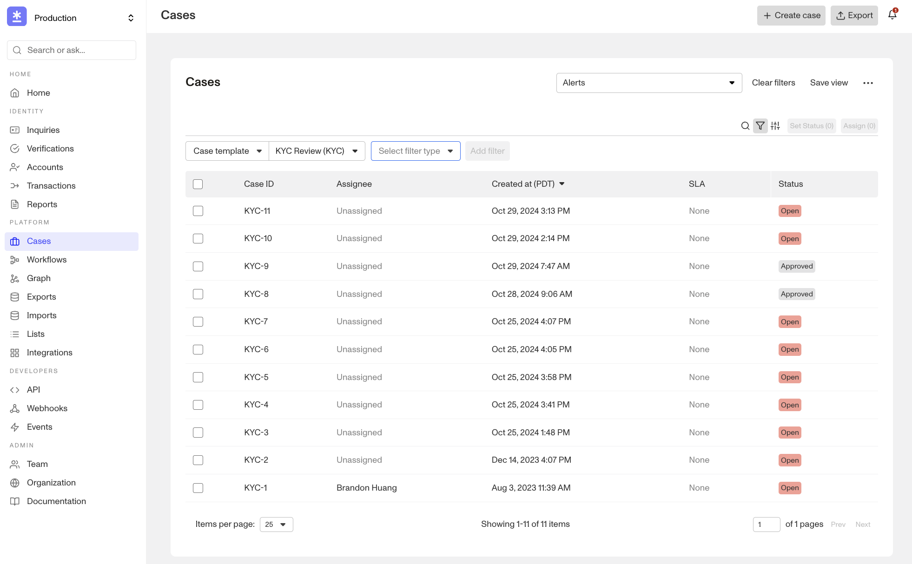
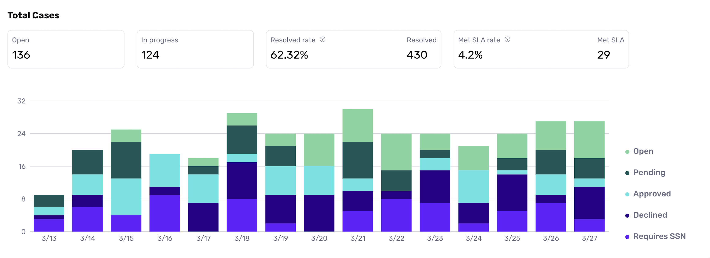

# Cases Overview

## Overview

Cases is an identity investigation center that enables you and your ops team to build a more robust and efficient review operational process. It is highly customizable based on the use case of your organization, and is intended as a single place for your team to review, investigate, and decide on users. Cases and Workflows are seamlessly integrated, working in tandem to optimize your operational efficiency. For example, Cases offers valuable insights into your case resolution trends to help you fine-tune your automation processes.  

### Key Benefits:

**Resolve more cases in less time with highly-tailored processes**

Easily triage inquiries that are flagged for review and delegate them to specific team members for approval or decline. Surface key information quickly with case templates built for your user types, risk thresholds, and review needs. Prevent cases from sitting in a review queue with SLA deadline tracking and seamless case escalation. 

**Get all the context you need in one place**

Pair Cases with Persona-collected data across Dynamic Flow, Verifications, Reports, and Graph. Then, enrich your understanding of the user or business by bringing in third-party data via custom integrations with tools like Intercom or Salesforce.

**Built with compliance in mind**

Our out-of-the-box solution helps you meet compliance requirements easily with comprehensive audit logging, checklists, and comments. Manage PII access securely with role-based permissions and export data so you can maintain accurate audit trails.
