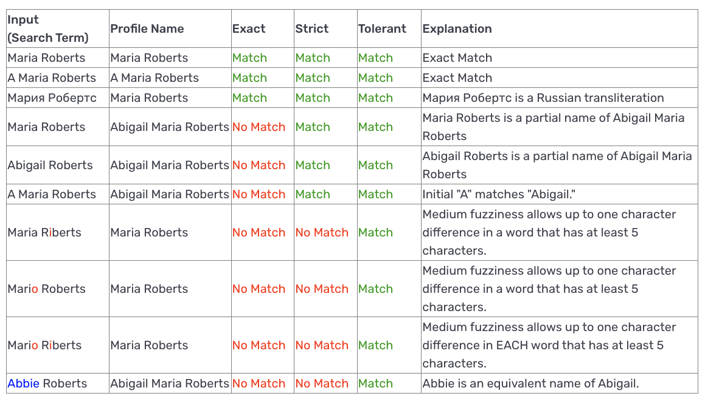

# Name Match Requirements for Reports

✍🏻 This feature mainly applies to:

-   Watchlist (person)
-   PEP
-   Adverse Media (person & business)

Not all Reports have the same configurability in Name Matching (e.g. Profile Report). Please contact the Persona support team to learn more.

## Overview

Depending on your use case or needs, you may require very strict or very liberal matching parameters. Persona offers customization for you to have more control over what matches you receive, and how often you receive them (false positives).

## Name Matching

The following table shows examples of how the options are used:

Each matching option includes preset logics that define the matching criteria. The table below illustrates the presets associated with each matching option:

|  | Exact | Strict | Tolerant | Custom |
| --- | --- | --- | --- | --- |
| Exact name | ✔️ | ✔️ | ✔️ | ✔️ |
| AKAs | ✔️ | ✔️ | ✔️ | custom |
| Partial names | ❌ | ✔️ | ✔️ | custom |
| Joined names | ❌ | ✔️ | ✔️ | custom |
| First last names | ❌ | ✔️ | ✔️ | custom |
| Equivalent names | ❌ | ❌ | ✔️ | custom |
| Fuzziness (typos) | ❌ | ❌ | medium | custom |

### Terminology

**Exact name**: exact name takes the primary name and determines whether there is a match. Primary name refers to the name that is considered a hit in the article or website. There are no allowances for typos in an exact match setting.

-   Example: Search term = John Smith, result = John Smith **only**

**AKAs**: AKAs setting includes exact name match, in addition to an alias. An alias is another name that the person is known by. This is still an exact match. There are no allowances for typos.

**Partial names**: partial names setting includes partial name matching in addition to AKAs and exact name match.

-   Subset name matches: a match on a subset name matches on all of the subset of the words.
    -   Example: Search term = John Smith, Profile matched = John Bob Smith
-   Initial matches: a match on an initial matches on entities that only have an initial for one or more of the words.
    -   Example: Search term = John Bob Smith, Profile matched = J.B. Smith

**Equivalent names**: equivalent names setting includes partial names, AKAs, and exact name matches. Equivalent names also includes alternates for the name passed in. This can included hypocorisms and homophones.

-   Hypocorism: nicknames
    -   Example: Search term = Bob Smith, Profile matched = Robert Smith
-   Homophones: names that sound the same as the matched name
    -   Example: Search term = Jon Smith, Profile matched = John Smith

**Joined names**: attempts to match by comparing only the letters in the order provided (ignoring punctuation and whitespace).

-   Example: Search term = John Mc.Smith, Profile matched = John McSmith

**First/Last names**: attempts to match by comparing only the first and last terms.

-   Example: Search term = John Jacob Jingleheimer Smith, Profile matched = John Smith

**Fuzziness**: fuzziness has many different components and is a custom setting. For the majority of Report types, if typos are allowed, the types of typos allowed are phonetic substitutions - meaning a typo on a vowel.

-   Watchlist when "Partial Names" is NOT selected
    -   Low - 1 typo allowed on entire name at a minimum of 18 characters
    -   Medium - 1 typo allowed on entire name at a minimum of 10 characters
    -   High - 1 typo allowed on entire name at a minimum of 3 characters
-   Watchlist when "Partial Names" is selected
    -   Low - 1 typo allowed per word at a minimum of 18 characters
    -   Medium - 1 typo allowed per word at a minimum of 5 characters
    -   High - 1 typo allowed per word at a minimum of 3 characters

For the Watchlist report specifically, fuzziness and typos can also include additions, subtractions, and substitutions. Below are examples based on the original name: Thomas Henry Jefferson

-   Addition: means that an extra letter is mistakenly added to a name.
    
    Match addition example #1: Thoomas Henry Jefferson Match addition example #2: Thomas Henryy Jefferson
    
-   Subtraction: means that a letter that should be in the name, is mistakenly removed from the name.
    
    Match subtraction #1: Tomas Henry Jefferson Match subtraction #2: Thomas Henry Jeferson
    
-   Substitution: means that a letter in a name is replaced/substituted mistakenly for another letter.
    
    Match substitution #1: Thomis Henry Jefferson Match substitution #2: Thomas Henri Jefferson
    

## Related articles

[Configure a Watchlist Report](./3gcpePErNfB1lPrMAcLjeI.md)
