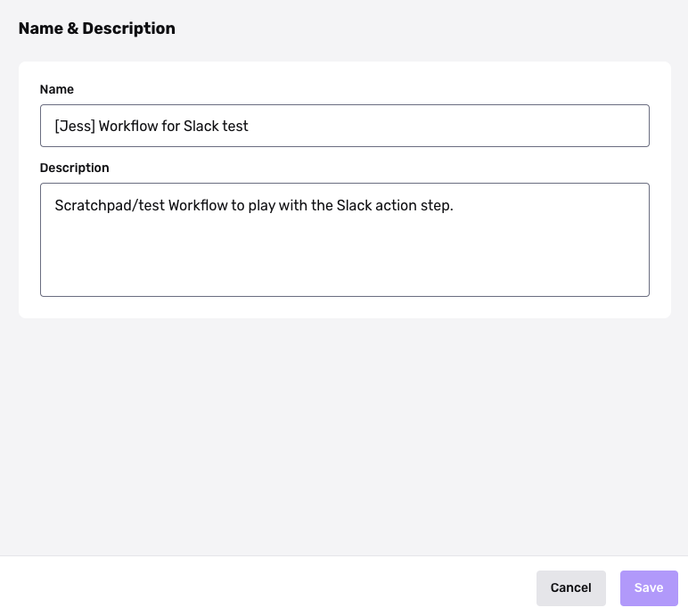

# Editing Workflow name and description

## Overview

Each Workflow has a name and description field.

Use these fields to document and communicate the purpose of each Workflow—for teammates, and for yourself.

## Steps

1.  Navigate to the [All Workflows page](https://app.withpersona.com/dashboard/workflows).
2.  Select **Edit** on a Workflow.
3.  On the Workflow Editor page, select the config icon in the upper right.  
    
4.  In Configurations, select the **Name & Description** section. 
5.  Enter a name and description.  
    
6.  Click **Save**.
