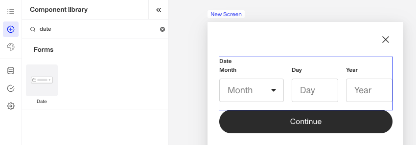
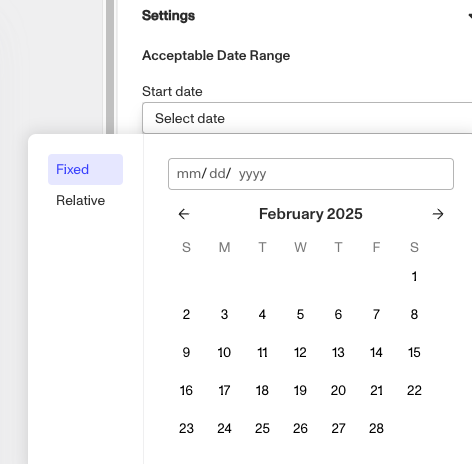
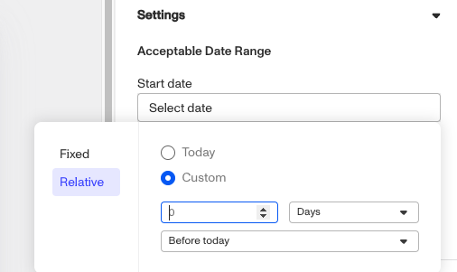

# Inquiries: Date component

# What is the Inquiry Date component?

**Date** is an Inquiry screen component that allows a user to select or enter a date in a structured format.

The **Date** component is useful for capturing birthdates, expiration dates, ID issue dates, and scheduling information.

# How do you add an Inquiry Date component?

1.  Navigate to the Dashboard, and click on **Inquiries > Templates**.
2.  Find and click on the Inquiry template you want to edit, or **Create** a new template.
3.  Hover over a screen and click the **Pencil** icon, or double-click the screen to open it in the Screen Editing View.

4.  In the Left Panel, click **Component Library** and search for ‘**Date**’.
5.  Drag and drop the Date component into your screen, and reposition it by dragging it around.
6.  Click on the Date component, and go to **Properties** in the Right Panel.
    1.  (Optional) Under **Settings**, you can customize an **Acceptable Date Range.** The Date component allows you to define an acceptable date range to control user input. You can read more about **Customizing Date Ranges** below.
    2.  (Optional) Under **Settings**, you can customize **Validations.** Default validations are included to only allow dates within the **Acceptable Date Range** set above as input. You can learn more about adding additional **Validations** below.
    3.  (Optional) Add customized **labels** and **placeholders** for month, day, and year, as well as **translations**:
        1.  Edit the text in the **Label** boxes. The **Label** is a text element displayed above the Date component to describe its purpose, such as “Month”, “Day”, or “Year” helping users understand what information to provide.
        2.  Edit the text in the **Placeholder** boxes. The **Placeholder** displays temporary text inside the Date component, such as “Month” offering an example or guidance on the expected format until the user enters their own input.
        3.  Add translations for the text by clicking **Edit translations.** You can **Translate All** or **Translate** individual languages, manually or automatically. If you don’t set translations, you’ll be prompted to do so upon **Publishing** the template.
7.  In the **[Fields](./5rT2Llik2kUvJTXKapZb8c.md)** tab, you can set up and customize the behavior of the Date component.
    1.  **Required**: Choose whether the field is mandatory (**Yes)**, optional (**No**), or based on conditions (**Conditional**). If you choose **Conditional** you will need to set a Logic rule, you can read more about **Logic** below.
    2.  **Field:** Select which field will store the date value. For example, choose the “Birthdate” field if users will be entering their birthdate.
8.  (Optional) In the **Logic** tab, you can add rules that govern when the component appears, and when it does not. You can read more about **Logic** below.
9.  **Close** the step. You’ll have to **Save** and **Publish** the template to begin using it.

# Customizing Date ranges

You can customize Start Date & End Date. This allows you to define the date range users can select from. You can set the Default User Timezone. This ensures the date is displayed in the user’s local timezone.

Two options are available for date ranges: Fixed Range or Relative Range. These options ensure users can only select valid dates based on the predefined criteria, improving accuracy and user experience. If you select invalid date ranges, you will receive a warning.

## Fixed range

A fixed range sets specific calendar dates for the Start Date and End Date, limiting users to selecting dates within that exact period (e.g., January 1, 2025 – December 31, 2025). This is ideal for events, application deadlines, or scenarios requiring strict date selection.

## Relative range

A relative range sets the date to “Today” or “Custom.” Custom will allow you to adjust dates dynamically based on the current date, letting you set a range that moves forward or backward in time (e.g., "30 days from today" or "1 year before today"). This works well for scheduling appointments, setting expiration dates, or creating rolling date windows.

# Validations

Validation rules can be set on a Date component to ensure that the entered date is a properly formatted and is valid. This can prevent errors such as an incomplete date or values outside of acceptable ranges. This ensures that only valid dates are submitted.

The **Error message** can be edited to provide the user with more information on why the Date is not valid. Translations for the error message can be added by clicking **Edit translations.** You can **Translate All** or **Translate** individual languages, manually or automatically. If you don’t set translations, you’ll be prompted to do so upon **Publishing** the template.

## Validation Rules

Validation rules consist of three main components:

1.  **Field**: The object that will have a condition linked to it.
2.  **Condition**: How the field is compared to the value (e.g., equals, does not equal).
3.  **Value**: The value to test against.

### Creating Validation Rules

-   **AND Statements**: Combine multiple conditions that must all be true for the rule to pass. Add these using the **"Add"** button.
-   **OR Groups**: Combine conditions where only one needs to be true for the rule to pass. Create these by clicking **"Add OR Group"**.

## How to use Validation Rules

1.  Click on the Date component, and go to **Logic** in the Right Panel.
    1.  Create a validation rule by filling in the three boxes following **When**, which correspond to an object, its condition, and its value being assessed, respectively. When that validation rule passes, the component update is applied.
    2.  (Optional) Add additional validation rules by clicking either **\+ Add** (if you want to add 'AND' rules, where all must be passed to continue) or **\+ Or** (if you want to add 'OR' rules, where one must be passed to continue). You can also nest a group of OR statements within an AND statement by clicking **\+ Add Group**.
    3.  (Optional) To edit the validation directly, you can open the **code editor**.

# Translations

Persona can automatically translate new text into other languages in the component’s **Properties** tab. You can also customize the translation for any particular language.

To configure available languages for your template, click the **Gear** icon in the Left Panel to access **Settings**, then select languages under the **General** tab.

# Logic

Persona provides you with the ability to add logic to a Date component. For example, a component may only become visible to a user if certain conditions are met. On the **Logic** tab, there are two options for logic rules:

-   **On screen load**: Logic rules are evaluated only when the screen loads. They can reference any field configured on the template.
-   **On screen update**: Logic rules are evaluated in real time. They can only reference inputs on the current screen.

For form components a field can be labeled as required under specific conditions.

-   **Require field**: Logic rules are evaluated in real time referencing inputs on the current screen. They can only reference inputs on the current screen.

## Logic Rules

Logic rules consist of three main components:

1.  **Field**: The object that will have a condition linked to it.
2.  **Condition**: How the field is compared to the value (e.g., equals, does not equal).
3.  **Value**: The value to test against.

### Creating Logic Rules

-   **AND Statements**: Combine multiple conditions that must all be true for the rule to pass. Add these using the **"Add"** button.
-   **OR Groups**: Combine conditions where only one needs to be true for the rule to pass. Create these by clicking **"Add OR Group"**.

## How to use Logic Rules

1.  Click on the Date component, and go to **Logic** in the Right Panel.
    1.  Choose either “**On screen load**” or “**On screen update**” and click **Add.**
    2.  Choose what **Component Update to apply**. This determines what happens to the component when the logical rules are met.
    3.  Create a logical rule by filling in the three boxes following **When**, which correspond to an object, its condition, and its value being assessed, respectively. When that logical rule passes, the component update is applied.
    4.  (Optional) Add additional logical rules by clicking either **\+ Add** (if you want to add 'AND' rules, where all must be passed to continue) or **\+ Or** (if you want to add 'OR' rules, where one must be passed to continue). You can also nest a group of OR statements within an AND statement by clicking **\+ Add Group**.
    5.  (Optional) To edit the logic directly, you can open the **code editor**.

# Plans Explained

## Date component by plan

|  | Startup Program | Essential Plan | Growth Plan | Enterprise Plan |
| --- | --- | --- | --- | --- |
| Date component | Available | Available | Available | Available |
| Validations for Date component | Available | Available | Available | Available |
| Translations for Date component | Available | Available | Available | Available |
| Logic for Date component | Limited | Limited | Limited | Available |

[Learn more about pricing and plans](./6oZbzp7jb7AWGClF5vpY3K.md).

# Learn more

[Learn more about Inquiries.](../../docs/docs/inquiries.md)
