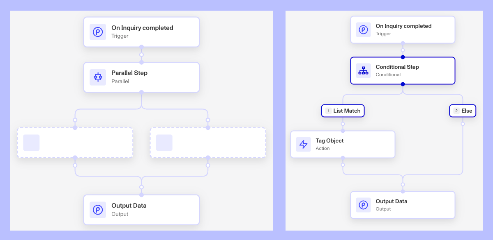

# Workflows FAQs

## What happens if I set up a Workflow with multiple if / then conditions?

During the workflow run, all steps will be processed sequentially along each branching path in the workflow. With a Conditional branch, only one of the paths will be followed. In the case of Parallel Step, each of the parallel paths will be followed.

## Can I manually run a workflow?

Yes. There are use cases for manually triggering a run of a workflow. You might need to rerun, resume, or create a new run of a workflow. You’ll still need to select a trigger object.

You can learn more on the process here - [Rerun, Resume, or Run New Workflows with Manual Triggers](./59bQ0AVwLaOTr9TGHTyEzb.md)

## Can I set up a workflow to be recurring or can I schedule a workflow?

Yes. There is a Workflow step called “Schedule Workflow” that allows you to schedule a workflow to run a set about of time in the future relative to when the step is executed. You can learn more here - [Workflows: Schedule Workflow step](https://www.notion.so/2cdef6bcb0fd80a6a51de72a5ea9bcc7?pvs=21)

## Are Workflows retroactive?

No, Workflows are not retroactive for inquiries created before the Workflow was started. Workflows will only impact inquiries created after the Workflow starts running.

You can manually trigger workflows with older inquiries by creating new workflow runs and selecting the inquiry as the trigger object. The [create new runs](./59bQ0AVwLaOTr9TGHTyEzb.md#creating-new-runs) feature allows you to also batch new workflow runs with multiple inquiries, each getting their own run.

## Can I have multiple Workflows that are triggered on the same event?

Yes, you can have multiple workflows that are triggered on the same event. You could for example create two workflows that both trigger off the same inquiry template run reaching the “Completed” status. They would both treat the triggering inquiry as their trigger object and the workflows would start at the same time.

For one trigger object, you can also have separate workflows for each desired event or status change. For example, you could have separate workflows that trigger when the inquiry is `Created`, `Pending`, `Expired`, `Completed`, and `Failed`. You may even have use for workflows that trigger for an inquiry’s `Approved`, `Declined`, and `Marked for Review` status.

## Can I set a single workflow to trigger off of multiple templates?

Yes. You can set the trigger criteria to have a template trigger off of 1 template or multiple templates. And if you set not trigger criteria, that the workflow will trigger off of all active templates in your organization. So we suggest setting some limits on the scope of your workflows with the trigger criteria.

### Can I run one Workflow version in one environment, and run a different version of the Workflow in another environment at the same time?

No. Currently, the new version of a Workflow must be published to all environments at the same time.

Note that you can set a different state for each environment when you publish a new version. For example, you can have Sandbox set to active—so that the new version begins to run in Sandbox, and Production set to inactive—so that the Workflow does not run at all in Production.

## Can I test how a workflow will perform?

Yes, with the Simulate feature. Learn more here: [Test Workflows with Simulate](./2MsjIjgahao6eq2tOZ6vVG.md)

## Related articles

[Rerun, Resume, or Run New Workflows with Manual Triggers](./59bQ0AVwLaOTr9TGHTyEzb.md)

[Workflows: Schedule Workflow step](./7GpG4JS4xu4IMSe88rVBM8.md)

[How to trigger Workflow Runs with Inquiry Created?](./67ZwVOeicXh9xQdlyKqNRu.md)

[How to trigger Workflow Runs with Inquiry Created?](./67ZwVOeicXh9xQdlyKqNRu.md)

[Trigger Events and Step Types in Workflows](./4q44atlPvZvBNZAbYJzi3f.md)
