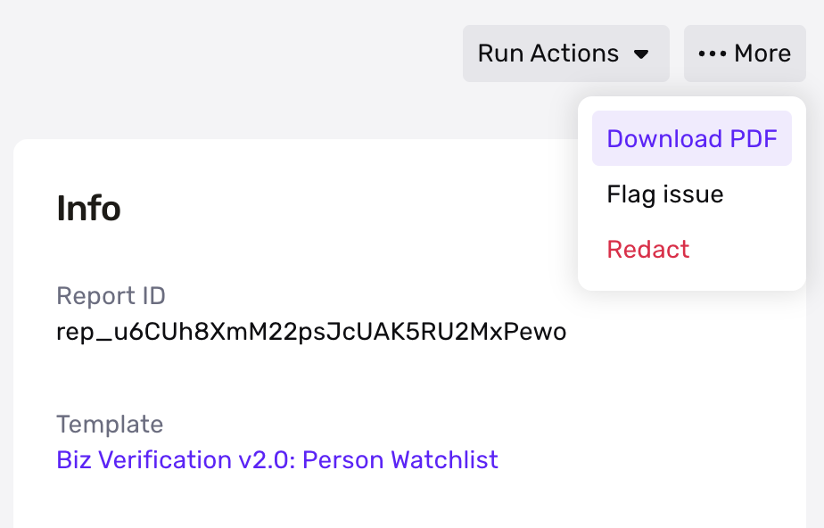
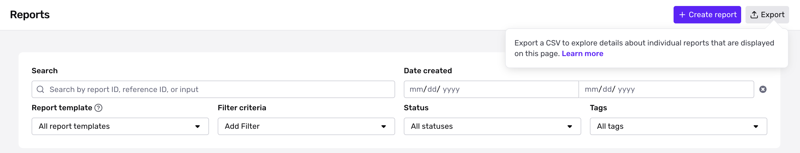

# Export Report Results

## Export PDF of a Single Report

✍🏻 This feature only applies to Person Watchlist and PEP.

To export a PDF of the Report and all associated information, click into the Report in question and select “Download PDF”. Dismissed content will be indicated in the PDF file as well.

## Export Group Reports

Reports can be exported as CSV files if you need a summary of all reports (up to 10k reports at a time), as well as individual reports and hits for [Watchlist](./UQGaDEhkQ7TLAMJsjuXiX.md), [Adverse Media](./7K0LSbrfPvUsuBHGCjUhsr.md), [Email Risk](./4IqHs9oWE6ihGakWUzYCcL.md), [Phone Risk](./6MsSJ5GQjHhtIN0xxLLeby.md), and [PEP Reports](./116MoqsoZ0B5FYkdR8Hufp.md). Note that report types not listed here will appear in the summary, but individual reports and hits will not be exported. Redacted reports will be listed in the export, but with redacted data removed.

Exports will follow the filters applied in the dashboard. Once the export is complete, an email notification will be sent, and the file can be downloaded from the Exports page on dashboard. With this feature, you can answer questions like:

-   How many reports were created within X?
-   How many reports are currently recurring?
-   How many and how often do watchlist reports return a match?
-   How often do Adverse Media reports return a match?
-   How many identity matches does a watchlist report with hits tend to return?
-   How many articles are associated with an identity match in Adverse Media reports?
-   Which email addresses and domains tend to be more suspicious?
-   Which watchlist or adverse media entities tend to get a lot of hits?

### Export Information

-   Columns
    -   Identifiers
        -   Report ID
        -   Report Link (link to the report on your dashboard)
        -   Report Template ID
        -   Reference ID
    -   Columns for each export type
        -   Report Export (`report_summary.csv`) should have the following fields. One row per report.
            1.  ID (the report token) (type: identifier)
            2.  Report Link (type: identifier)
            3.  Report Template (type: identifier)
            4.  Reference ID (type: identifier)
            5.  Status (type: status, possible values: pending, ready, errored, redacted)
            6.  Tags (type: list)
            7.  Created At (type: timestamp)
            8.  Last Run At (updated at, relevant for recurring reports) (type: timestamp)
            9.  Type (type: report type, possible values: all report types)
        -   Watchlist Export 1 (`report_watchlists.csv`) should have the following fields. One row per report.
            1.  ID (the report token) (type: identifier)
            2.  Report Link (type: identifier)
            3.  Report Template (type: identifier)
            4.  Reference ID (type: identifier)
            5.  Status (type: status, possible values: pending, ready, errored, redacted)
            6.  Tags (type: list)
            7.  Created At (type: timestamp)
            8.  Last Run At (updated at, relevant for recurring reports) (type: timestamp)
            9.  Matched (whether or not there was a match) (type: boolean)
            10.  Recurring (type: boolean)
            11.  Recurrence Cadence (Days) (type: integer)
            12.  Hit Count (type: integer)
            13.  Dismissed Hit Count (type: integer)
            14.  Total Hit Count (type: integer)
        -   Watchlist Export 2 (`report_watchlists_hits.csv`) should have the following fields. One row per hit.
            1.  ID (the report token) (type: identifier)
            2.  Report Link (type: identifier)
            3.  Report Template (type: identifier)
            4.  Reference ID (type: identifier)
            5.  Status (type: status, possible values: pending, ready, errored, redacted)
            6.  Tags (type: list)
            7.  Created At (type: timestamp)
            8.  Last Run At (updated at, relevant for recurring reports) (type: timestamp)
            9.  Primary Names (type: list)
            10.  Birthdates (type: list)
            11.  Sexes (type: list)
            12.  Aliases (type: list)
            13.  Titles (type: list)
            14.  Emails (type: list)
            15.  Phone Numbers (type: list)
            16.  Nationalities (type: list)
            17.  Birthplaces (type: list)
            18.  Residencies (type: list)
            19.  Citizenships (type: list)
            20.  Sanctions (type: list)
            21.  Warnings (type: list)
        -   Adverse Media Export 1 (`report_adverse_media.csv`) should have the following fields. One row per report.
            1.  ID (the report token) (type: identifier)
            2.  Report Link (type: identifier)
            3.  Report Template (type: identifier)
            4.  Reference ID (type: identifier)
            5.  Status (type: status, possible values: pending, ready, errored, redacted)
            6.  Tags (type: list)
            7.  Created At (type: timestamp)
            8.  Last Run At (updated at, relevant for recurring reports) (type: timestamp)
            9.  Matched (type: boolean)
            10.  Recurring (type: boolean)
            11.  Recurrence Cadence (Days) (type: integer)
            12.  Hit Count (type: integer)
            13.  Media Count (type: integer)
        -   Adverse Media Export 2 (`report_adverse_media_hits.csv`) should have the following fields. One row per hit.
            1.  ID (the report token) (type: identifier)
            2.  Report Link (type: identifier)
            3.  Report Template (type: identifier)
            4.  Reference ID (type: identifier)
            5.  Status (type: status, possible values: pending, ready, errored, redacted)
            6.  Tags (type: list)
            7.  Created At (type: timestamp)
            8.  Last Run At (updated at, relevant for recurring reports) (type: timestamp)
            9.  Name (type: string)
            10.  Aliases (type: list)
            11.  Birthdates (type: list)
            12.  Relevance (type: list)
            13.  Countries (type: list)
            14.  Categories (type: list)
            15.  Media Links (type: list)
        -   Email Risk Export 1 (`report_email_address.csv`) should have the following fields. One row per report.
            1.  ID (the report token) (type: identifier)
            2.  Report Link (type: identifier)
            3.  Report Template (type: identifier)
            4.  Reference ID (type: identifier)
            5.  Status (type: status, possible values: pending, ready, errored, redacted)
            6.  Tags (type: list)
            7.  Created At (type: timestamp)
            8.  Last Run At (updated at, relevant for recurring reports) (type: timestamp)
            9.  Matched (whether or not there was a match) (type: boolean)
            10.  Email Address (type: string)
            11.  Suspicious (type: boolean)
            12.  Email Reputation (type: low, medium, high)
            13.  Email Domain Reputation (type: low, medium, high)
            14.  Spam (type: boolean)
            15.  Blocklisted (type: boolean)
            16.  Reference Count (type: integer)
            17.  Deliverable (type: boolean)
            18.  Free Provider (type: boolean)
            19.  Domain Age (days) (type: integer)
            20.  First Seen (days ago) (type: integer)
            21.  Disposable (type: boolean)
            22.  Domain (type: string)
            23.  Domain Exists (type: boolean)
            24.  Valid Mx (type: boolean)
            25.  Recent Malicious Activity (type: boolean)
            26.  Recent Email Leak (type: boolean)
        -   Politically Exposed Person Export 1 (`report_politically_exposed_person.csv`) should have the following fields. One row per report.
            1.  ID (the report token) (type: identifier)
            2.  Report Link (type: identifier)
            3.  Report Template (type: identifier)
            4.  Reference ID (type: identifier)
            5.  Status (type: status, possible values: pending, ready, errored, redacted)
            6.  Tags (type: list)
            7.  Created At (type: timestamp)
            8.  Last Run At (updated at, relevant for recurring reports) (type: timestamp)
            9.  Matched (type: boolean)
            10.  Recurring (type: boolean)
            11.  Hit Count (type: integer)
        -   Politically Exposed Person Export 2 (`report_politically_exposed_person_identity_matches.csv`) should have the following fields. One row per hit.
            1.  ID (the report token) (type: identifier)
            2.  Report Link (type: identifier)
            3.  Report Template (type: identifier)
            4.  Reference ID (type: identifier)
            5.  Status (type: status, possible values: pending, ready, errored, redacted)
            6.  Tags (type: list)
            7.  Created At (type: timestamp)
            8.  Last Run At (updated at, relevant for recurring reports) (type: timestamp)
            9.  Name (type: string)
            10.  Birthdates (type: list)
            11.  Locations (type: list)
            12.  Sex (type: string)
            13.  Positions (type: list)
            14.  Associates (type: list)
            15.  Aliases (type: list)
            16.  Match Types (type: list)
        -   Phone Number Export 1 (`report_phone_number.csv`) should have the following fields. One row per report.
            1.  ID (the report token) (type: identifier)
            2.  Report Link (type: identifier)
            3.  Report Template (type: identifier)
            4.  Reference ID (type: identifier)
            5.  Status (type: status, possible values: pending, ready, errored, redacted)
            6.  Tags (type: list)
            7.  Created At (type: timestamp)
            8.  Last Run At (updated at, relevant for recurring reports) (type: timestamp)
            9.  Matched (type: boolean)
            10.  Phone Number (type: string)
            11.  Phone Type (type: phone type, possible values: FIXED\_LINE, MOBILE, PREPAID, TOLL\_FREE, VOIP, PAGER, PAYPHONE, INVALID, RESTRICTED\_PREMIUM, PERSONAL, VOICEMAIL, OTHER)
            12.  Phone Carrier (type: string)
            13.  Risk Level (type: risk level, possible values: high risk, medium to high risk, medium risk, low to medium risk, low risk)
            14.  Risk Recommendation (type: risk recommendation, possible values: block, allow, flag)
            15.  Risk Score (type: integer)
            16.  Risk Sim Swap (type: string)
