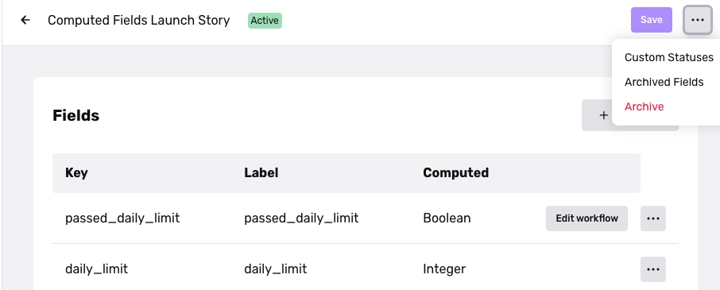
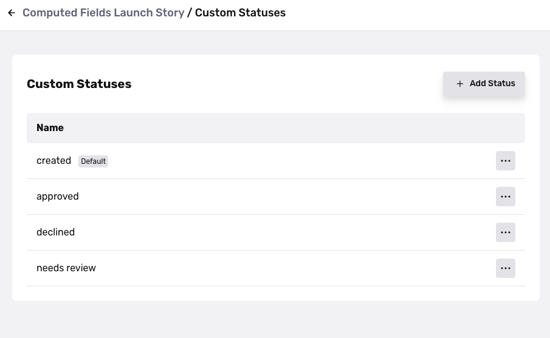

# Transactions statuses and lifecycle

# Transaction Statuses

The only default status Persona reserves for Transactions is **created**.

You can also set custom statuses within the dashboard view of each Transaction to track various parts of the user journey, which is detailed below.

To view developer documentation around Transactions, visit [here](../../docs/docs/transactions-model-lifecycle.md).

## Transactions Statuses in the context of the Transaction Lifecycle

Transactions statuses track the progression of a user or entity. Customers can use these status to track the user lifecycle, take action at specific moments, or compile metrics. Workflows make status updates to the Transaction.

When a transaction is created or when a status is updated, an event in Persona is created. We will be able to report back the user journey your transaction is modeling based on these transactions events and the timestamps associated with them.

We recommend starting with the below as statues in most use-cases. Alternately, you can map your custom statuses to the following, which is then treated as a lifecycle.

-   Created
-   Completed
-   Approved
-   Declined
-   Needs Review (for Transactions and Workflows that may involve manual review or the Cases product)

## Setting custom statuses

1.  Navigate to the Transaction Types page in your Dashboard (under **Transactions > Transaction Types**) and click your desired transaction where you want to set custom statuses.
2.  Click the breadcrumbs in the upper right hand corner.

 3. You'll then be prompted to add your Custom Statuses. 
