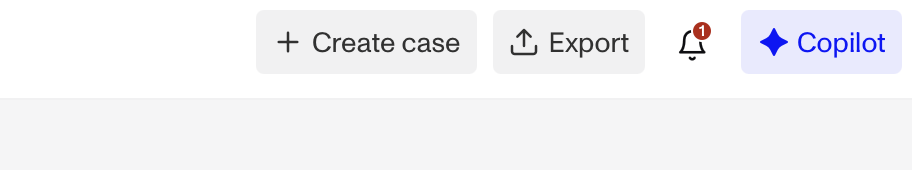
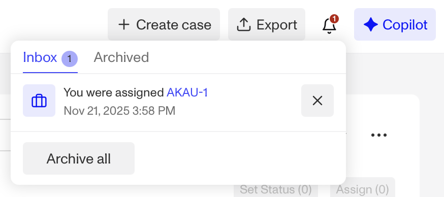
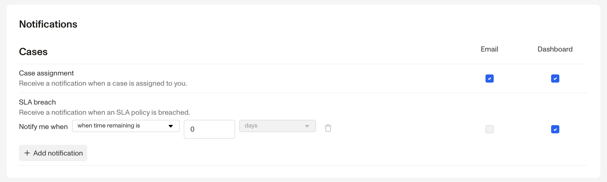
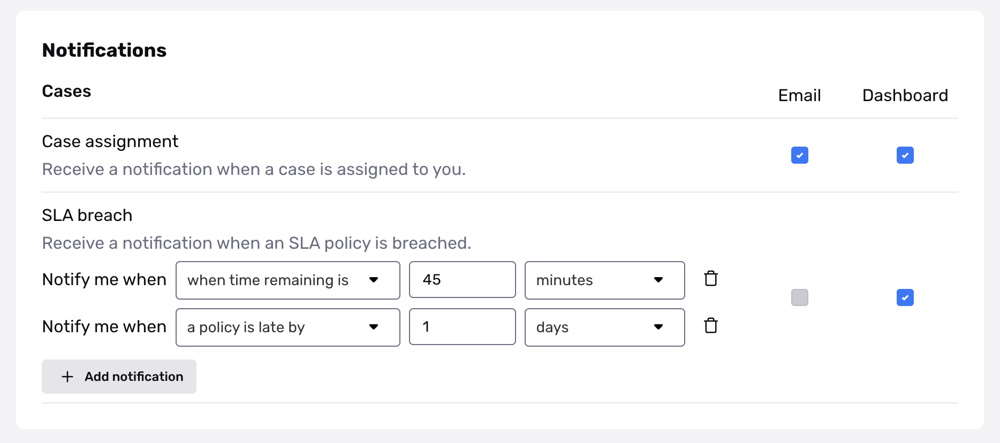

# What are Case Notifications?

# Overview

Case Notifications alert you when something changes in a Case you’re responsible for. You can receive a notification when:

-   A Case is assigned to you.
-   A Case that is assigned to you has an [SLA breach](./5JQzBlB1uHQkyXLpysk1W1.md).
-   You are tagged in a Case comment.

Notifications appear in your Dashboard and/or email based on your personal notification settings.

There is a separate notification setting for when any new Case is created using a specific Case Template. See [Cases Template](./5WFMyVPjzgXQNljqg2xf4h.md) to learn more.

# Where can you view Cases Notifications?

You can receive Case Notifications in two places:

## Dashboard Notifications

In the Persona Dashboard, a red badge appears on the **Notifications** icon in the top-right of the `All Cases` view.

Clicking on the icon allows you to:

1.  Click `Inbox` to view all new notifications. Within your inbox:
    1.  Tag certain notifications as **archived** by clicking the `X` icon.
    2.  Click `Archive all` to move all notifications in your Inbox to Archived status.
2.  Click `Archived` to view all archived notifications. From this tab, click the `Unread` icon to move a notification back to the Inbox tab.

## Email Notifications

You can turn email notifications on or off for specific Case events.

# Configure your Case Notification settings

To manage which Case actions notify you:

1.  Click your profile image **\> Profile**.
2.  Go to the **Notifications** tab.
3.  Select which Case actions should trigger the Dashboard or email notifications.
4.  Use `+ Add notification` to create custom SLA breach notifications.
    1.  These allow you to define when you want to be notified if an SLA is late or a set amount of time passes.

