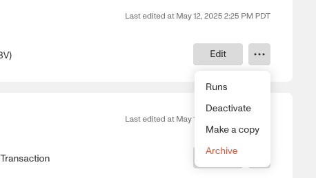

# Duplicating a Workflow

To create a second copy of a Workflow, follow these steps.

1.  Navigate to Workflows in you Persona Dashboard
2.  Click on the overflow menu represented by **...** on the far right of the Workflow card
3.  Click **Make a copy**

4.  Rename your Workflow and proceed
5.  Once created, review and ensure that all the logic and steps within your new Workflow are adjusted before publishing.

## Related articles

[Copying steps from one Workflow to another](./6HOcIrINXAFVIZWOBCzNuw.md)
