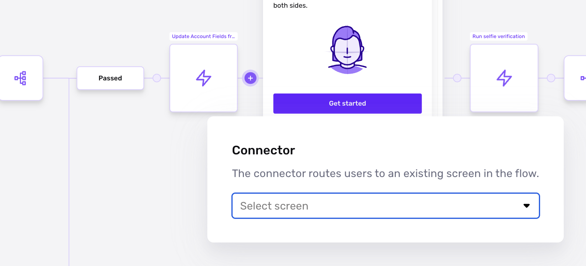
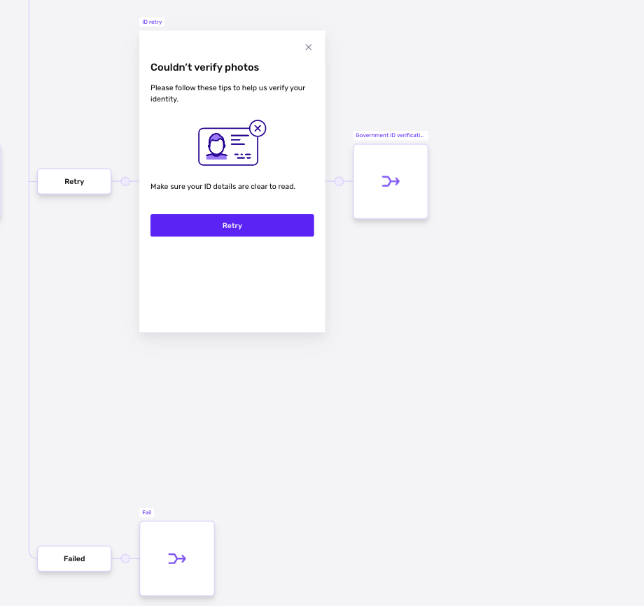

# Connector Steps in Inquiries

# What is a Connector Step?

Connector Steps provide a way to jump from one part of a flow to any screen within the same flow.

## Where do you find Connector Steps?

1.  To access this feature, navigate to **Inquiries > Templates** from the left nav and select any Inquiry template.
2.  A Connector Step can be added by clicking the plus sign where you'd like to route users within a flow to another Screen Step.

## What can you do with Connector Steps?

### Save time and effort

With Connector Steps, you can route back to screens that you've already spent time customizing or to screens that start Modules (such as Verifications). This allows you to configure those original pieces of functionality in detail, route back to them, and build your Inquiry Flow without building something more than once.

### Enable retry logic for users

Connector Steps, when paired with Branching Steps, can enable retry logic for Verifications. his is commonly used to address user input errors or non-ideal captures of images needed for Verifications. This helps businesses balance user ease of use while ensuring the highest quality information for verifying individuals.

## Examples by Plan

The following examples reference an Inquiry Flow that utilizes two Connector Steps alongside a Branching Step.

### Allow users to retry Verification attempts with a Connector Step

In the upper route of the Branching Step shown in the example, users who failed the Government ID Verification see a retry screen (if they have not failed too many times as per the business logic within the Branching Step). After the retry screen, if the user clicks 'Retry', they are directed back to the start of the Government ID collection step where they can attempt to verify again.

### Reuse existing screens and save time with Connector Step

In the lower route of the Branching Step, users move down this route if they have attempted to verify their Government ID too many times. This is a common setup for Modules with many customers choosing to customize the business logic further or add additional levels of verification. In this scenario the Connector Step routes to a Failed Screen. The failed screen only needs to be designed once and can then be reused multiple times with the help of Connector Steps.

# Plans Explained

## Connector Step access by plans

|  | Startup Program | Essential Plan | Growth Plan | Enterprise Plan |
| --- | --- | --- | --- | --- |
| Connector Step Availability | Limited to pre-configured solutions | Available | Available | Available |

[Learn more about pricing and plans](./6oZbzp7jb7AWGClF5vpY3K%20%22Pricing%20Overview%22.md).

## Related articles

[Action Steps in Inquiries](./aBe34oNwaa0YskUd5U5HZ.md)

[Branching Steps in Inquiries](./6NyDb8wHpzSCVW5fnV3iHi.md)

[Screen Steps in Inquiries](./2WWzr0d6rEOIlyXjtHSCgC.md)

[Inquiry Template Steps](./1z8F1l9Q28qNxQFtKoMfY3.md)
