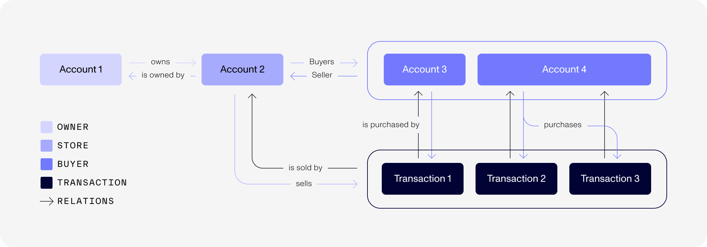
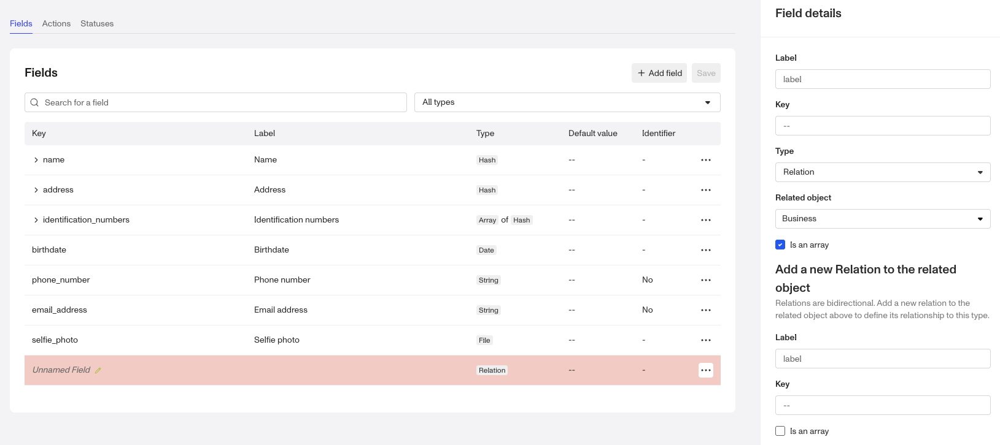
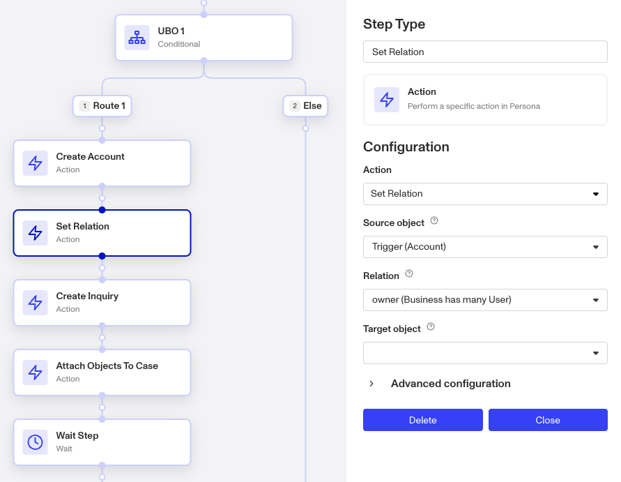
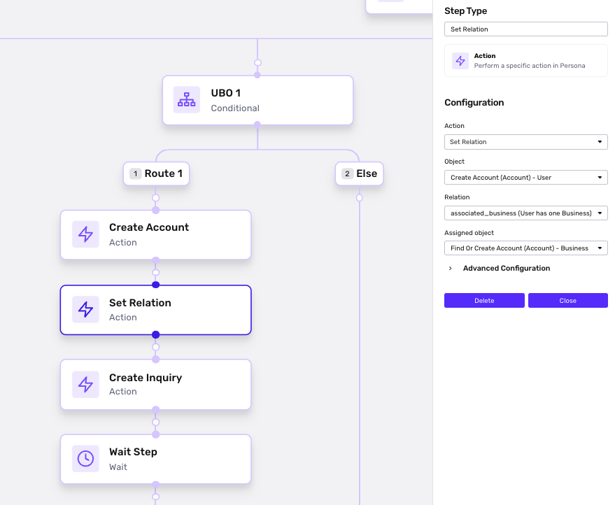

# Creating an Account Relation

# What is a Relation?

A Relation represents a real-world association between different entities.

Relations can represent many different types of real-world relationships. Each relation can be named and accessed by its name, giving you more precision and context than simply attaching objects to an account. To give examples, in the context of a marketplace business:

-   There are two account types - `User` and `Store`
-   A `User` account can have a relation called `store`, which links it to a `Store` account owned by that user. From the `Store` account’s perspective, this same association is represented by the relation `owner`, indicating the user who owns the store.
-   A `Store` account can have a relation called `buyers`, representing a list of `User` accounts that have made purchases from that store.
-   If purchases are represented by Transactions, you can establish a relationship between a `buyer` account and its corresponding `Purchases` transactions. You can also use the same relation name - `purchases` - for the association between a `Store` account and its transactions, since relations are defined per account type.

# Examples of Account relations

Common scenarios in which you may find relations helpful include:

## KYB (Know Your Business)

**Organizations want to be able to track relationships between individuals or associated people and businesses.**

A business might wish to track relationships between individuals and businesses. To achieve this, the business would create a Relation between the Ultimate Beneficial Owners ([UBOs](../../landing/blog/understanding-ultimate-beneficial-owner-ubo-checks.md)) Account type and the respective business entity’s Account type, reflecting their real-life business relationship.

## AML (Anti-Money Laundering)

A business might seek to monitor transactions linked to a particular individual for fraud detection purposes. To facilitate this, the business would create a Relation between the user Account type and the relevant Transaction type.

## Transaction-first verifications (API)

For API-first verifications, a business might want to see all Verifications transactions related to an account. To do so, they would establish a Relation between the Verifications Transaction type and the Account type.

# Create an Account Relation

### Open the fields settings tab of an Account type.

-   When hovering over **Accounts** in the Dashboard navigation bar, click **Types** to view all Account Types.
-   Click on an Account Type to which you want to add a Relation, then click on the Fields tab.

## Create a new Relation

### Step 1: Add a relation to this account type

-   Click **\+ Add field** in the upper right corner of the Fields tab.
    
-   In the **Name** field, enter a name for the Relation. It can have spaces and numbers, but **it must begin with a letter**. Enter a name for the Relation. It can have spaces and number, but it must begin with a letter. Choose a name that defines the purpose of the relationship with the other entity.
    
    🚨 The relation key auto-generates from the label. However, you can edit the relation key.
    
-   Click the **Type** dropdown and select **Relation** ~as the field Type~.
    
-   To establish the relationship between an account of this account type and one or more accounts/transactions of another Account or Transaction type, click the **Related object** dropdown and select the Account Type or Transaction Type you want to relate to this field. It is possible to select the same Account type.
    
    When you choose a related object, more input fields will appear below, allowing you to set up an accompanying field on the related object.
    
-   Determine whether the relationship is one-to-one or one-to-many.
    
    If the relationship is one-to-one (one account is always linked to exactly one other account), no action needed - this is the default. If the relationship is one-to-many (one account is linked to multiple accounts), select the “Is an array” option.
    
    For example, if the relation represents a buyer and their purchases, select this option to make it an array.
    

### Step 2: Set up an accompanying relation on the related object

Because relations represent bidirectional associations, you must create two relations - one on each related object. Setting up the relation on the second object is the final step. Simply repeat the process from Step 1 to create the corresponding relation on the other side. You may choose to give both relations the same name or different names, depending on the use case.

# **Use Relations within workflows**

After creating a Relation, you can configure Workflows to relate objects automatically.

After creating a transaction or account, you can add an Action step to an existing Workflow to relate objects automatically, using the following steps:

1.  Add a step to your workflow and choose **Action** as the type.
2.  In the Find Action… dropdown, search for and choose “Set Relation.”
3.  Using the Source object dropdown, set it to the object from which the relation originates.
4.  Using the Relation dropdown, choose the relevant Relation.
5.  Using the Target object dropdown, set it to the object being linked to the source object through the specified relation.

You can also use “Unset Relation” to sever an existing relationship.

### **Save your changes**

When relations have been configured and your Workflow has new runs, you can see the Relations module within an account or transaction record. Users can click on the account / transaction tokens to view associated records.

## How to access relations in Workflows

In Workflows, you may want to access and condition off of a relation for a given account. You can access using `account.relations.<key>`.
