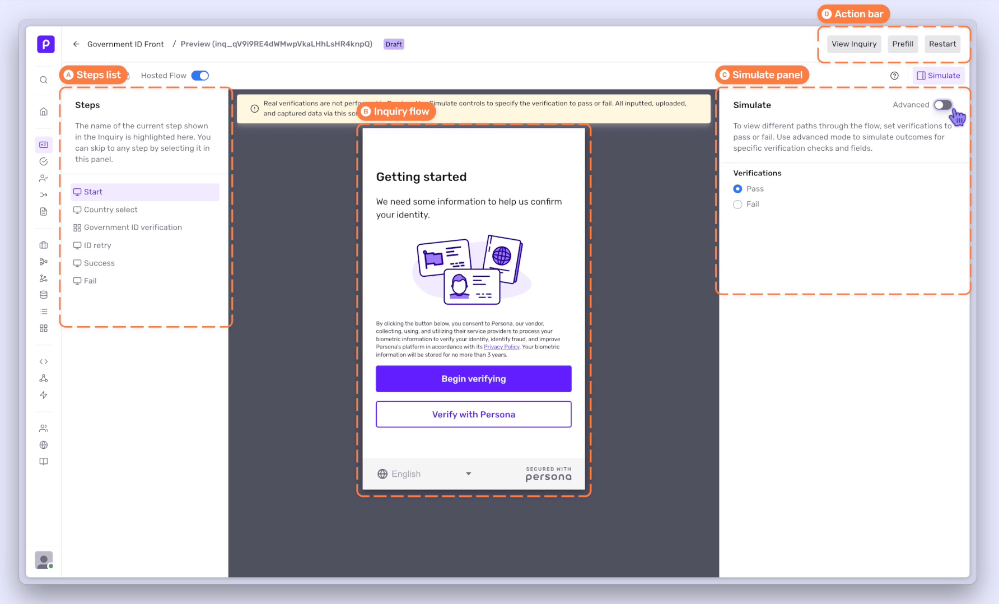
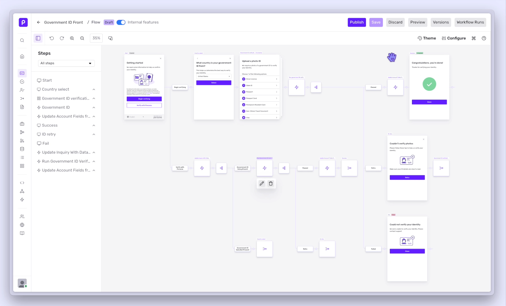
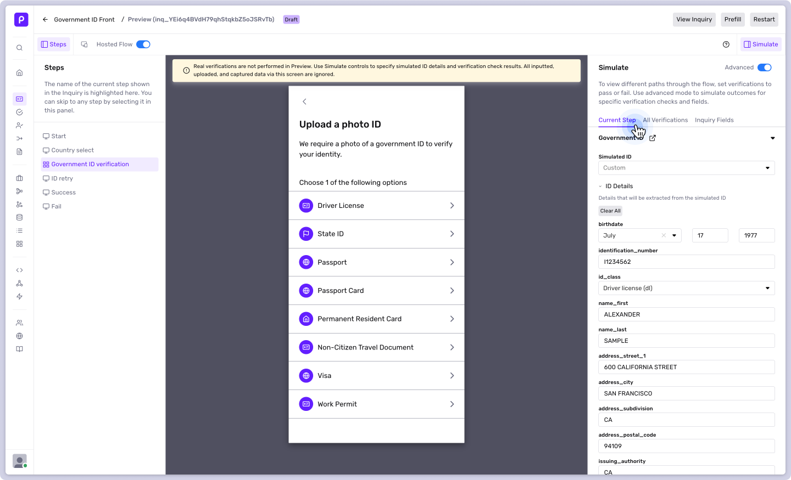
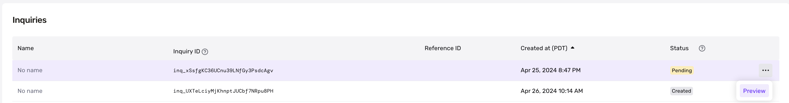

# Testing your Inquiry Template

# Why testing matters

At Persona, we recommend that all of our customers test each Inquiry Template for the common scenarios described below before putting it into production. It’s quick, it has no stakes, and it can help you find and fix errors before they reach your end users.

Confused or frustrated customers will often abandon the flow without telling you when something is wrong. When you test your Inquiry template, you see exactly what they see, giving you a chance to find and fix issues before your template gets published.

It’s good practice to use test your Inquiry template **every time** you edit your inquiry or workflow, to ensure the best experience for your users.

# You can test 3 different aspects of your inquiry template

1.  You can simulate the user experience of your inquiry flow in Sandbox
2.  You run a real inquiry to see it work in real time in Production
3.  You can test that your integrations are working properly by creating an inquiry and ensuring that you can retrieve its decisioned status via API

👀 This article will guide you through testing in Sandbox, testing in Production, and API testing with example scenarios. **As you read, pretend that the following is true for your company:**

-   During onboarding onto your platform, each user must undergo a Persona inquiry (Government ID and Selfie)
-   If the user passes both verifications, the inquiry will be in \`completed\` state, and a Watchlist report will run in a post-inquiry workflow. If there’s a Watchlist hit, the inquiry will move into \`needs-review\` state and a case will be created. The user will be shown a pending screen in your application until the inquiry is decisioned.
-   If the Government ID fails all verification attempts, the inquiry will be in a **failed** state and (then **declined** via a workflow). No reports will run at all, and the user will be unable to proceed within your application.

## Testing in Sandbox vs. in Production

This section focuses on testing in Sandbox using Simulate, Persona’s inquiry preview tool. Testing in Sandbox is different from testing in Production:

-   **When you test in Sandbox, Simulate shows you exactly what users see in an inquiry flow given specific inputs, including verification failure.** Simulate helps you try out failure conditions you can’t personally reproduce—for example, even if you don’t have an expired ID to test with, you can tell Simulate to _pretend_ that you’re a user with an expired ID and see how the flow responds.
    
    🚨 **Real verifications don’t run in Sandbox Simulate.** Sandbox simulations respond to you setting the inquiry’s verification checks to pass or fail.
    
-   **By contrast, testing in Production tests how the inquiry responds to real user inputs.** If you wanted to test whether an Inquiry template will successfully fail a user based on an expired ID, you’ll need to have an expired ID on hand to submit in your inquiry.
    

| **What you learn by using Simulate in Sandbox** | **What you learn by testing in Production** |
| :-- | :-- |
| View the inquiry template as a user, set conditions that will cause verifications to pass or fail, and see how the inquiry template responds to users with those same conditions. | Run a real inquiry to experience how the inquiry template responds to the PII you provide. |
| Test that when a user fails the Selfie to ID Comparison check, they are shown a retry and then a failure screen | Test that a user will fail Persona’s Selfie to ID Comparison check if the submitted selfie does not match the ID portrait |
| Test that when a user is detected as under 17, they get routed through an “Underage” flow | Test that Persona will correctly detect that a user is under 17 by extracting the birthdate off their ID |
| Test that a case is created when a Watchlist Report returns a match | Test that a specific name will generate a hit on the Watchlist report |

## Explore Simulate, the Sandbox tool for testing inquiries

1.  **Steps list of your inquiry.** You can use this to skip around to different steps to see what certain pages look like.
2.  **Inquiry flow:** The screens that your user will see in the inquiry, in order of appearance.
3.  **Simulate panel:** Here, you can edit the verifications check results, extracted details, and the pass/fail results for the Inquiry that you’re testing.
4.  **Action menu**
    -   **View Inquiry:** This takes you to a page where you can see information collected from the user in the inquiry, any verifications, etc.
    -   **Pre-fill:** If you pass along fields when creating the inquiry (i.e information you already have on the user) in your application, you can similarly add those fields here.
    -   **Restart:** This creates a new, unfilled inquiry to simulate.

# Simulate your inquiry template with different failure conditions

## Simulate an inquiry failure

🧩 **Key method:** Set required checks to fail

### _Why_ should I simulate an inquiry failure?

Simulate an inquiry failure to see how an inquiry that fails all Government ID attempts will take on a `failed` status, then trigger a post-inquiry workflow that leads to a `declined` status.

---

### Steps

1.  In the upper right corner of the right-side Simulate panel, **toggle on `Advanced` mode.**
    
2.  Click through the flow until you reach the **Government ID Verification** screen (shown below).
    
3.  Open the **Check Results** section and select any of the required checks — for example, Compromised submission. This tells Persona to fail the Compromised submission check, with the failure reason displayed below it. 
    
4.  Proceed through the inquiry and **complete the ID submission.**
    
    You can submit _any_ photo as the ID in Sandbox because that the inquiry’s response is determined by the Check Results you just set.
    
    When the **ID retry screen** appears, click **View Inquiry** to see that the verification failed whichever verification check you picked in Step 3.
    
    
    
5.  If you continue to fail required checks, you will eventually exhaust all of your allotted attempts and fail the inquiry.
    
6.  Verify that your expected workflows, such as one that declines failed inquiries, are triggered when the inquiry moves to `failed` status.
    

## Simulate a Watchlist match

🧩 **Key method:** Simulate the extraction of a Watchlisted name from a Government ID.

---

To test this in Sandbox, we need to set a name for the person completing the Simulate inquiry that will be certain to trigger a Watchlist hit. We’ll use a name from the OFAC Watchlist, **Kim Jong Un**, for this exercise—see [Trigger a Reports Hit for testing](./56sLAbSytkmI57zpbug3xc.md) for a full list of terms you can use to test different Watchlists in Sandbox.

### _Why_ should I simulate a Watchlist match?

By simulating Watchlist matches in Sandbox, you can see firsthand how manual review Cases are created when a user’s information matches a Watchlist profile.

### Steps

1.  **Turn on Simulate advanced mode.**
    
    In the upper-right corner of the Simulate panel, toggle on **Advanced mode**. Click through the inquiry until you reach the Government ID selection screen, shown below.
    
    Under the **Current step** tab in the Simulate panel is a group of fields whose values that represent the PII that Persona will pretend to extract from this inquiry’s verification checks. (By default, the inquiry will extract the name “Alexander Sample” from all Simulate inquiries.)
    

2.  **Set the** `name_first` **&** `name_last` **extraction values.**
    
    🧠 This time, as opposed to setting the verification check results, you will set the **ID Details** to a name on the OFAC Watchlist. This will allow you to see what the Inquiry does when Persona sees a match.
    
    Change the `name_first` value to “Jong Un” and the `name_last` value to “Kim.” Although you can change other values, only the user’s name matters for this scenario.
    
    
    
3.  **Complete the rest of the inquiry.**
    
    Don’t set any verification check results here—we want all of the verifications to be **set to pass**, which is the default.
    
4.  **Review the outcome and any triggered workflows.**
    
    Verify that the following statements are true:
    
    1.  The Report had a match
    2.  The inquiry is [marked for review](https://www.notion.so/Test-your-inquiry-template-4574f52816994038a0912fca7bbf0b81?pvs=21)
    3.  A case was created for the inquiry
    4.  When the case is resolved, it resolves the inquiry appropriately
    
    🔧 Although this is a typical Workflow setup, the exact series of events depends on your exact Workflow.
    

# API & integration testing

Integration testing tells you whether the integration points between your application and Persona are set up correctly.

To complete integration testing, you need to do two things:

1.  Test that when an inquiry is created, applicable data is passed correctly into Persona
2.  Test that you are able to retrieve the decisioned inquiry status, so that you can
    1.  Mark the user as verified or not in your system
    2.  Save any other inquiry information your application needs

---

## Create the inquiry via API

There are two ways to create inquiries via API.

1.  If you’re creating inquiries **via Server API**, use your Sandbox API key instead of your Production API key.
2.  If you’re using the `template-id` parameter to create inquiries **via SDK,** use your Sandbox `environment-id` [parameter](../../docs/docs/embedded-flow-parameters.md).

## Simulate inquiry results via API

You’ll want to test that you can ingest inquiry results as they update (via webhooks or polling) and proceed with the user accordingly. Use the following documentation and endpoint to guide you:

| Documentation | Endpoint |
| :-- | :-- |
| [Inquiries integration testing guide](../../docs/docs/integration-testing.md#simulate-actions) | [Perform actions on an inquiry in Simulate](../../docs/reference/inquiries-perform-simulate-actions.md) |

### Common scenarios to test via API

1.  `start_inquiry` → `approve_inquiry` → user has been verified and is allowed to continue
2.  `start_inquiry` → `decline_inquiry` → user has been declined and is not allowed to continue
3.  `start_inquiry` → `mark_for_review_inquiry` → user is pending manual review and cannot continue until the inquiry is `approved`

# Put it all together: end-to-end testing

By testing your flow and under multiple failure conditions and performing integration testing, you can reproduce the following scenarios during the journey from your company’s app into a Persona inquiry, then back again to your app:

| **Scenario 1** | The user is allowed to proceed with after their inquiry is `approved` |
| :-- | :-- |
| **Scenario 2** | The user is not allowed to proceed if their inquiry is `declined` |
| **Scenario 3** | The user is shown a waiting screen if their inquiry is `needs-review` |

You can test Scenario 1 and Scenario 2 without touching the Persona dashboard; each SDK shows a pass/fail toggle when a Sandbox inquiry is rendered. You can use this toggle to set the verifications to pass or fail (and therefore reach the desired terminal status).

Since Scenario C likely involves setting the name extracted off the ID (to simulate a report hit), you’ll want to do the following:

1.  Create and surface the sandbox inquiry in your application
    
2.  Find the newly-created inquiry in your dashboard (it should be near the top). Right click on the menu and select **Preview**.
    
    
    
3.  [Follow the steps above](https://www.notion.so/Test-your-inquiry-template-4574f52816994038a0912fca7bbf0b81?pvs=21) to set the extracted ID name to trigger the watchlist hit (the configuration will auto-save on every update)
    
4.  Finish the inquiry in your application and verify that when the `needs-review` status is reached, your application behaves as expected
    

### Test case creation via inquiry tags

If your workflow is orchestrated in a way such that you’re decisioning based off tags applied, you can also simulate those paths by adding those tags manually to the inquiry before it’s completed. For example, if the workflow creates a case off the presence of a `WATCHLIST HIT` tag on the inquiry, you can add this tag to your inquiry (in the dashboard or via API) before it completes to also simulate the case creation.

# Next steps

After you’re satisfied with your sandbox testing, you’re ready to go live! We recommend running a few production tests as best practice, but you can be confident of the production behavior since you’ve tested it thoroughly in Sandbox.

🤞🏽 **Remember for next time** We recommend testing via Simulate every time you make a major change to your inquiry or workflow, to ensure the best experience for your users.
