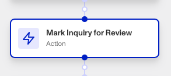

# Workflows: Mark Inquiry For Review step

# What is the Mark Inquiry For Review step?

**Mark Inquiry For Review** is a Workflow Action step that changes the status of Inquiry to Needs Review.

A Persona Inquiry represents a single instance of an individual attempting to verify their identity. Inquiries are created when the individual begins to verify their identity, and contains the information collected from the submitted verifications, the results of those verifications, and passively-collected contextual data like IP address that can be used to identify suspicious activity.

Inquiries are usually automatically `approved` or `declined` based on a workflow. Manual review, as set by the Mark Inquiry For Review step, allows your team to manually assess an inquiry to determine next steps, such as approving or declining it.

This action is typically part of a workflow that automates the decision-making process on whether a manual or automatic review is appropriate, ensuring that inquiries meeting certain conditions are reviewed by a human for accuracy or compliance.

# How do you add a Mark Inquiry For Review step?

1.  Navigate to the Dashboard, and click on **Workflows** > **All Workflows**.
2.  Find and click on the workflow you want to edit, or **Create** a new workflow.
3.  Click on **+** when hovering over a circle to add an **Action**.

4.  Use the **Find Action** select box to click on **Inquiry > Mark Inquiry For Review**.
5.  Choose the **Inquiry** to mark for review.
6.  (Optional) In ‘Advanced Configuration’, click the **Continue on error** box if you want the workflow to continue running even if this step raises an error.
7.  **Close** the step. You’ll have to **Save** and **Publish** the workflow to begin using it.

# Plans Explained

## Mark Inquiry For Review step by plan

|  | Startup Program | Essential Plan | Growth Plan | Enterprise Plan |
| --- | --- | --- | --- | --- |
| Mark Inquiry For Review step | Limited to pre-configured solutions | Available | Available | Available |

[Learn more about pricing and plans.](./6oZbzp7jb7AWGClF5vpY3K.md)

# Learn more

[Learn more about Inquiries.](../../docs/docs/inquiries.md)
