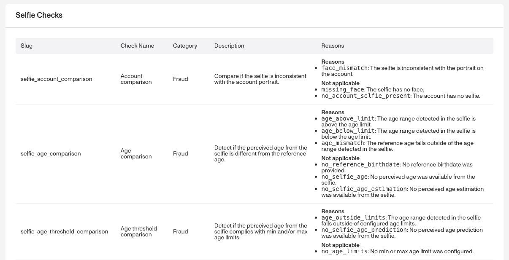
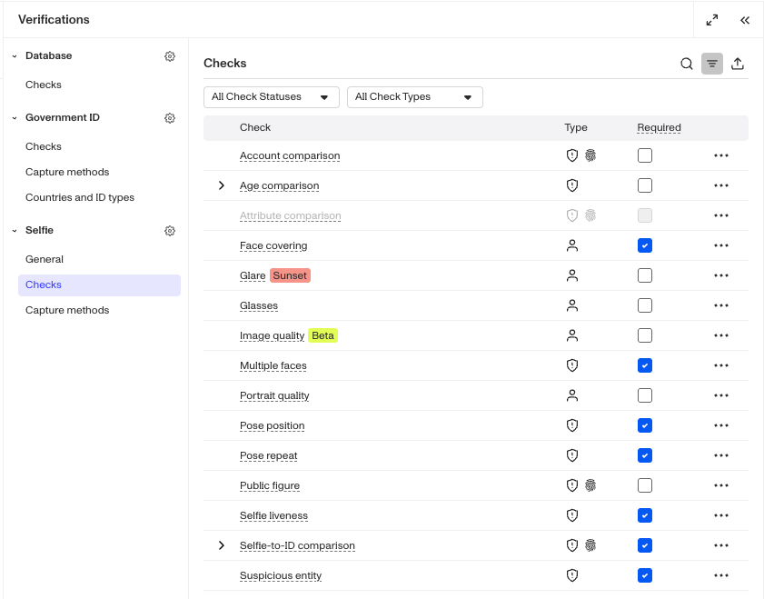
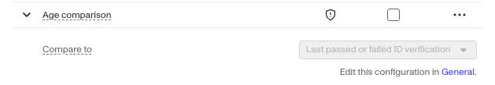
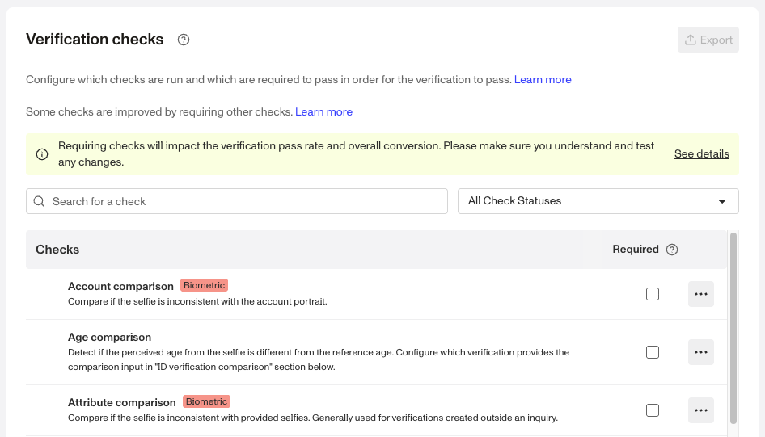

# Configuring Selfie Verification checks

# Overview

Below, we'll guide you through choosing and configuring a [Selfie Verification](./1l0WTbR5UsfiggNDPWbnUp.md). We'll walk through each of these steps:

1.  Review possible Verification checks
2.  Choose which Verification checks to require
3.  Choose Selfie settings
4.  Edit required checks
5.  Configure Capture methods

Each step is important. The first two steps help you decide what information and checks best support your use case. The remaining steps walk through how to configure those choices.

The Selfie Verification offers a variety of configurations such as required or un-required verification checks, verification check sub-configurations, and if used in conjunction with Inquiries, collection-specific configurations like device hand-off functionality and the option to configure center-only checks or the full three-point composite.

## Step 1: Review possible Verification checks

Navigate to **Documentation > [Verification Checks](https://app.withpersona.com/dashboard/resources/verification-checks/)** reference in the Dashboard. Find the section for Selfie checks. The table includes all possible checks to choose from.

## Step 2: Choose which Verification checks to require

The Verification checks you choose to require will depend on your organization's specific needs. There is no one-size-fits-all configuration for these checks, but the following guidelines can help you optimize your setup:

**Consider the business goals of the Inquiry Template**. For example:

-   Do you want to prioritize avoiding false positives (people passing verification who should not), or avoiding false negatives (people failing verification who should not)? The more strict your verification needs are, the more checks you may want to require.
-   Some checks are more fraud oriented while others are more conversion oriented.

Use the [Verification check reference](https://app.withpersona.com/dashboard/resources/verification-checks/) to see which checks are more suitable for your business.

**Monitor and iterate**. Keep in mind that you can adjust Verification checks as your needs change. For example, you can start with the defaults, then change one check to see how it impacts your Inquiry pass rates. You can use [Inquiry Analytics](./6wdZdwn9m4T8eY7EfqWRmB.md) to help you decide if it was an improvement.

## Step 3: Choose Selfie settings

Selfie settings control how the selfie is captured and what it is compared against. These settings directly affect fraud resistance and which Verification checks can run.

### Pose to capture

This setting determines how many facial poses an end user is prompted to capture during the Selfie Verification.

-   Left, center and right: Captures three posts
-   Center only: Captures a single, forward-facing image

### Compare to

This setting determines which Government ID Verification is used when running comparison-based checks such as Selfie-to-ID and Age comparison.

-   First passed ID verification: Uses the earliest successfully passed Government ID Verification in the Inquiry.
-   Last passed ID verification: Uses the most recent successfully passed Government ID Verification.
-   Last passed or failed ID verification: Uses the most recent Government ID Verification attempt, regardless of outcome.

## Step 4: Edit required checks

Once you decide which Verification checks to require, you can [add or remove a required Verification](./5Tc5tsWfBX03AHRkr2vqv2.md).

**For Selfie Verification Templates within an Inquiry Template:**

1.  In the Persona Dashboard, navigate to **Inquiries > Templates**. Select a template that uses Selfie Verification.
2.  Once you are in the Flow Editor, use the Left Panel to head to Verifications.
3.  Select the Selfie Verification template.
4.  Navigate to Checks.

5.  Some checks have additional options. Click the arrow to expand the check and modify its requirements.

The following is available on Enterprise Plans

**For Selfie Verification Templates used alongside a Transaction, Workflow, or via API:**

1.  In the Persona Dashboard, navigate to **Verifications > Templates**. Select a template that uses Selfie Verification.
2.  Here you can review Verification checks.

## Step 5: Configure Capture methods

Capture methods determine how users can submit their Selfie during verification. Capture methods are configured separately for desktop web, mobile native submissions, and can be found under Verifications in the Inquiry Flow Editor. To learn more, see [Capture Methods](./7JQ78WDWLj5L63qXEu7AqJ.md).

-   Guided capture: Provides on-screen instructions to help users correctly capture their ID.
-   Device handoff: Allows users continue the capture process on a mobile device, which may offer better camera quality.
    -   Send Email: Sends a link to the user’s email address.
    -   Scan QR code: Displays a QR code the user can scan with their mobile device.

## Related articles

[Selfie Verification](./1l0WTbR5UsfiggNDPWbnUp.md)

[Understanding Selfie Verification results](./4BTlLMW5TdKym0zoDzhVV9.md)

[How can I modify an Inquiry template to collect the user’s Selfie even after a GovID failure?](./57JARCJM8LRmWYjnrJiFpJ.md)

[Verifying Age: Selfie Age Estimation](./45UrKCZtpwW5Z7DJ0JW0vM.md)
