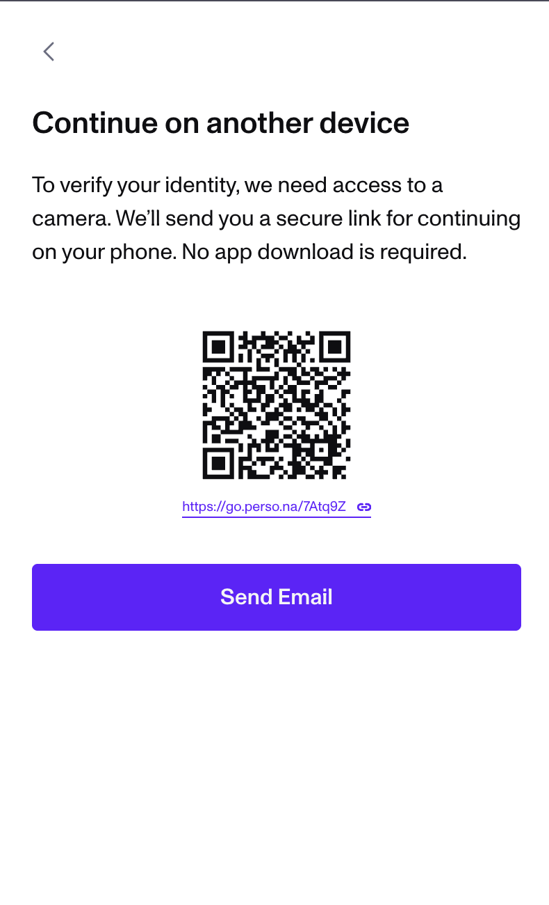

# Device handoff: continue verification on another device

⚠️ Note: This guide is for individuals going through a Persona-powered identity verification flow. While we’ve included helpful tips, the verification was set up by the business, service, or organization that asked you to verify. They use Persona as a tool, and they ultimately decide what’s required and can assist with your specific situation, if you’re having trouble.

# Overview

In your Persona verification flow, you may have the option to continue your verification on another device. This guide provides tips on how to complete this handoff.

## QR Code and Shortlink

If you select the QR code option, you can use your mobile device’s camera to scan the QR code and continue the flow on your phone. For added convenience, there is a short link provided directly below the QR code. You can copy and paste this link into your mobile browser to complete the verification.

⚠️ If your device can NOT scan the QR code, we recommend using the short link or opting for the email handoff method instead.

## Email

If you choose the Email option, Persona will email you at an email address you provide. Visit the link in the email to complete your verification.

If you do NOT receive the email, see [Troubleshoot: Receiving email](./53WY3rZJTvEMRCpbVLnWD6.md).
