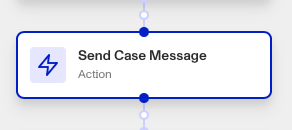
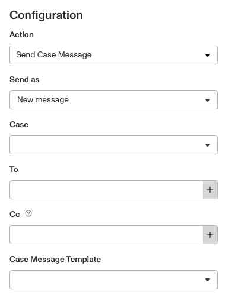

# Workflows: Send Case Message Step

# What is the Send Case Message step?

**Send Case Message** is a Workflow Action step that allows you to automatically send a message to a user. For a case, if the template has the Cases Email Module, a message can be sent manually by a reviewer on your team. The Send Case Message step in Workflows, allows you to do this automatically.

Cases are Persona products that collect together data on an end user to allow for manual investigation and decisioning on. Your organization may need to investigate this user for a variety of reasons:

-   **Onboarding**: Should this user be allowed to onboard to the platform?
-   **Account takeover investigation**: If a user is claiming that their account has been taken over, is there enough information to validate their claim?
-   **Fraudulent activity**: Are there suspicious signals associated with this user that require further action (e.g. account freezing, sending a follow-up inquiry for verification, etc.)?
-   **Transaction monitoring review**: Are there suspicious transactions associated with this user that require further investigation?

The Send Case Message step allows you to automate sending messages to users associated with the case, such as sending an update to the affected customer when the case is resolved.

## How to create or edit a Case message template

Since the Send Case Message step occurs within Workflow runs, the step does not allow you to customize message contents or formatting. Instead, you need to set those up within **Dashboard > Cases > Templates > Select the desired Case Template and navigate to the Email Case module within the template to add or edit Case Message Templates.**

The Case Message template feature is part of the [Cases Email Module](./qcQ5CqIFeDQaS8TJt0JUD.md), which enables organizations to streamline their communication processes by sending and receiving emails within the dashboard. This module supports email drafts, templates, and the inclusion of embedded inquiry links, making it easier to request additional documentation or communicate updates to customers.

Once you’ve set up a Case message template, you can automatically send it to other Workflow steps with the Send Case Message step.

# How do you add a Send Case Message step?

1.  Navigate to the Dashboard, and click on **Workflows** > **All Workflows**.
2.  Find and click on the workflow you want to edit, or **Create** a new workflow.
3.  Click on **+** when hovering over a circle to add an **Action**.

4.  Use the **Find Action** select box to click on **Case** > **Send Case Message**.

5.  Choose whether to send as a **New message** or Reply to existing message.
    1.  If ‘New message’, select the **Case** this message is about.
    2.  If ‘Reply to existing message’, select the prior **Case Message** that this message is replying to.
6.  Choose where the message is sent **To**. You can manually enter an email address, or choose one elsewhere in your workflow by clicking ‘**+**’.
7.  (Optional) Add any emails that should be **cc’d** to this message, either manually or from elsewhere in your workflow.
8.  Choose the **Case Message Template**.
9.  (Optional) In ‘Advanced Configuration’, click the **Continue on error** box if you want the workflow to continue running even if this step raises an error.
10.  **Close** the step. You’ll have to **Save** and **Publish** the workflow to begin using it.

# Plans Explained

## Send Case Message step by plan

|  | Startup Program | Essential Plan | Growth Plan | Enterprise Plan |
| --- | --- | --- | --- | --- |
| Send Case Message step | Not Available | Available | Available | Available |

[Learn more about pricing and plans](./6oZbzp7jb7AWGClF5vpY3K.md).

# Learn more

Learn more about Cases [here](../../docs/v2022-09-01/docs/cases.md).
